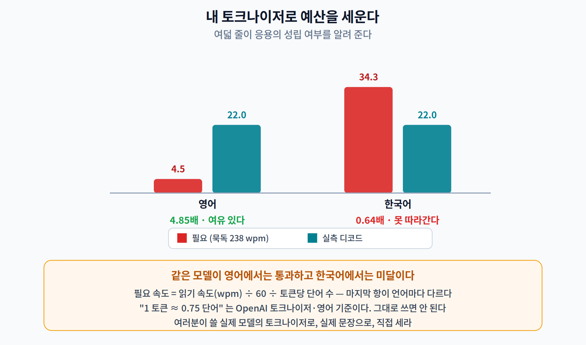

# 10주차 3교시. 내 노트북에서 LLM을 쪼개서 재 보기

> **오늘의 질문** — 1·2교시의 숫자는 전부 측정이었다. 그 측정을 직접 하자. GPU 도, API 키도, 인터넷 연결도(모델을 한 번 받고 나면) 필요 없다. 오늘 짜는 것은 **`generate()` 를 부르는 코드가 아니라, `generate()` 가 감추고 있는 것을 열어 보는 코드**다.

---

## 실험 설계

| | 내용 |
|---|---|
| **가설** | ① LLM 추론은 성질이 다른 두 단계로 나뉘고 처리량이 한 자릿수 이상 차이 난다 ② 디코드는 대역폭에 묶여 있으므로 **모델 바이트를 줄이면 빨라진다**(9주차와 반대) ③ 필요한 디코드 속도는 **언어에 따라 다르다** |
| **측정 대상** | TTFT · TPOT · 프리필/디코드 처리량 · 양자화 전후 · KV 캐시 · 단어당 토큰 |
| **필요한 것** | `transformers`, `torch`. **GPU 불필요.** 모델 약 270 MB 내려받기 |
| **타당성 위협** | ① 절대값은 기기·코어 수·다른 프로세스에 따라 크게 흔들린다 ② 135M 모델의 결과가 7B 모델로 그대로 확장되지는 않는다 ③ 대역폭 환산은 루프라인의 단순화이며 캐시 계층을 무시한다 |

> **절대값이 아니라 구조를 보라.** 이 문서를 만들며 여러 번 돌린 값이 프리필/디코드 비 **18~24배**, 양자화 이득 **1.57~1.72배** 사이에서 흔들렸다. 재현해야 하는 것은 **"프리필이 한 자릿수 이상 빠르다 · 양자화가 디코드를 빠르게 한다 · 한국어는 못 따라간다"** 라는 구조다.

---

## 3.1 프리필과 디코드를 갈라 놓는다 (18분)

### 준비

```bash
pip install transformers torch
```

```python
import time
import numpy as np
import torch, torch.nn as nn
from transformers import AutoTokenizer, AutoModelForCausalLM

torch.set_num_threads(2)                      # 2주차 이후로 늘 하던 것
MID = "HuggingFaceTB/SmolLM2-135M-Instruct"
tok = AutoTokenizer.from_pretrained(MID)
m   = AutoModelForCausalLM.from_pretrained(MID, dtype=torch.float32).eval()

cfg   = m.config
BYTES = sum(p.numel() * p.element_size() for p in m.parameters())
print(f"파라미터 {sum(p.numel() for p in m.parameters()):,} · 가중치 {BYTES/1e6:.1f} MB (FP32)")
print(f"층 {cfg.num_hidden_layers} · hidden {cfg.hidden_size} · "
      f"질의 헤드 {cfg.num_attention_heads} · KV 헤드 {cfg.num_key_value_heads}")
```

```
파라미터 134,515,008 · 가중치 538.1 MB (FP32)
층 30 · hidden 576 · 질의 헤드 9 · KV 헤드 3
```

**`.eval()` 을 잊지 말자.** 1주차 실습에서 이것 하나로 답이 갈리는 것을 봤다.

### 왜 `generate()` 를 안 쓰는가

```python
# 이렇게 재면 아무것도 알 수 없다
t0 = time.perf_counter()
out = m.generate(ids, max_new_tokens=24)
print((time.perf_counter() - t0) * 1000, "ms")     # ← 한 숫자. 무엇의 합인가?
```

이 한 숫자 안에 프리필 한 번과 디코드 24번이 섞여 있다. 9주차에서 `nms=False` 로 내보내야 NMS 비용을 잴 수 있었던 것과 **정확히 같은 상황**이다.

### 두 단계를 직접 돌린다

```python
@torch.no_grad()
def split_measure(n_prompt=128, n_new=24):
    base = tok("The quick brown fox jumps over the lazy dog. ", return_tensors="pt").input_ids
    ids  = base.repeat(1, n_prompt // base.shape[1] + 2)[:, :n_prompt]

    t0   = time.perf_counter()                          # ── 프리필: 한 번에
    out  = m(input_ids=ids, use_cache=True)
    ttft = (time.perf_counter() - t0) * 1000
    nxt, cache = out.logits[:, -1:].argmax(-1), out.past_key_values

    steps = []                                          # ── 디코드: 하나씩
    for i in range(n_new):
        t0  = time.perf_counter()
        out = m(input_ids=nxt, past_key_values=cache, use_cache=True,
                cache_position=torch.tensor([n_prompt + i]))
        steps.append((time.perf_counter() - t0) * 1000)
        cache, nxt = out.past_key_values, out.logits[:, -1:].argmax(-1)
    return ttft, float(np.median(steps)), n_prompt
```

세 곳을 짚어 두자.

| 코드 | 왜 |
|---|---|
| `use_cache=True` | 이걸 빼면 매 스텝 전체 문맥을 다시 계산한다. **KV 캐시가 없으면 디코드는 훨씬 느려진다.** |
| `input_ids=nxt` (길이 1) | 디코드는 **토큰 하나만** 넣는다. 이 한 줄이 행렬×벡터를 만든다. |
| `cache_position` | 지금 만드는 토큰이 문맥의 몇 번째인지 알려 준다. 안 주면 위치 인코딩이 어긋난다. |

```python
split_measure(64, 3)                                    # 워밍업 — 1주차에서 배운 것
ttft, tpot, np_ = split_measure()
print(f"프리필 — {np_} 토큰을 {ttft:.1f} ms 에  →  {np_/(ttft/1000):.0f} tok/s")
print(f"디코드 — 토큰 하나에 {tpot:.2f} ms  →  {1000/tpot:.1f} tok/s")
print(f"처리량 차이 {(np_/(ttft/1000))/(1000/tpot):.0f}배")
print(f"대역폭 환산: {(1000/tpot) * BYTES / 1e9:.2f} GB/s")
```

```
프리필 — 128 토큰을 308.4 ms 에  →  415 tok/s
디코드 — 토큰 하나에 44.10 ms  →  22.7 tok/s
처리량 차이 18배
대역폭 환산: 12.20 GB/s
```

**마지막 줄이 1교시의 가설이다.** 디코드가 정말 대역폭에 묶여 있다면 이 12.2 GB/s 는 이 기계의 실제 메모리 대역폭에 가까워야 한다. 다음 단계에서 검증한다.

> 한 줄 정리: `generate()` 한 줄을 두 조각으로 여는 데 20줄이면 된다. 그 20줄이 **18배짜리 격차**를 드러낸다.

---

## 3.2 대역폭 가설을 검증한다 (14분)

가설이 맞다면 **모델 바이트를 줄이면 디코드가 그만큼 빨라져야 한다.**

```python
q = torch.ao.quantization.quantize_dynamic(m, {nn.Linear}, dtype=torch.qint8).eval()

import io
buf = io.BytesIO(); torch.save(q.state_dict(), buf); BQ = buf.tell()

m_fp32, m = m, q            # 잠시 바꿔 끼운다 (split_measure 가 전역 m 을 쓴다)
split_measure(64, 3)
ttft_q, tpot_q, _ = split_measure()
m = m_fp32

print(f"FP32  {BYTES/1e6:6.1f} MB | TPOT {tpot:6.2f} ms | 디코드 {1000/tpot:5.1f} tok/s")
print(f"INT8  {BQ/1e6:6.1f} MB | TPOT {tpot_q:6.2f} ms | 디코드 {1000/tpot_q:5.1f} tok/s")
print(f"→ 바이트 {BYTES/BQ:.2f}배 감소 · 속도 {tpot/tpot_q:.2f}배 향상")
```

```
FP32   538.1 MB | TPOT  44.10 ms | 디코드  22.7 tok/s
INT8   248.1 MB | TPOT  25.57 ms | 디코드  39.1 tok/s
→ 바이트 2.17배 감소 · 속도 1.72배 향상
```

**가설이 방향은 맞혔고 배수는 못 맞혔다.** 2.17 대 1.72다.

> **여기서 멈추고 생각할 것.** 27% 의 차이는 실패가 아니라 **다음 질문**이다. 모형이 무시한 것이 무엇인가? — 역양자화 비용, FP32 로 남은 임베딩과 정규화층, 양자화 대상이 아닌 KV 읽기, 캐시 계층. 이 중 어느 것이 지배적인지는 **측정으로만** 알 수 있고, 그것이 선택 과제 A다.

그리고 이 결과를 **9주차 2.2 와 나란히** 놓자.

| | 파일 크기 | 속도 |
|---|---|---|
| 9주차 · YOLO11n 탐지 (합성곱) | 3.52배 ↓ | **1.52배 느려짐** |
| **10주차 · SmolLM2 디코드 (선형)** | 2.17배 ↓ | **1.72배 빨라짐** |

**같은 아이디어, 같은 API, 반대 결과.** 바뀐 것은 기법이 아니라 **작업이 무엇에 묶여 있는가**다.

> 한 줄 정리: 양자화는 **"모델을 빠르게 하는 기법"이 아니라 "메모리 트래픽을 줄이는 기법"** 이다. 이 실습은 그 문장을 두 줄의 표로 증명한다.

---

## 3.3 KV 캐시와 내 언어의 예산 (14분)

### KV 캐시는 계산으로 안다

```python
hd = cfg.hidden_size // cfg.num_attention_heads          # 헤드 차원
per_token = 2 * cfg.num_hidden_layers * cfg.num_key_value_heads * hd * 4
print(f"토큰당 {per_token/1024:.1f} KB (FP32)")
for seq, bsz in [(2048, 1), (2048, 8), (8192, 1), (8192, 32)]:
    kv = per_token * seq * bsz
    print(f"문맥 {seq:5d} · 배치 {bsz:2d} → {kv/1e6:8.1f} MB  ({kv/BYTES:5.2f}× 가중치)")
```

```
토큰당 45.0 KB (FP32)
(2 × 층 30 × KV헤드 3 × 헤드차원 64 × 4바이트)
문맥  2048 · 배치  1 →     94.4 MB  ( 0.18× 가중치)
문맥  2048 · 배치  8 →    755.0 MB  ( 1.40× 가중치)
문맥  8192 · 배치  1 →    377.5 MB  ( 0.70× 가중치)
문맥  8192 · 배치 32 →  12079.6 MB  (22.45× 가중치)
MHA 였다면 3배였을 것이다
```

`2 ×` 는 K 와 V, `× 4` 는 FP32 바이트다. **KV 헤드가 3 이지 9 가 아니라는 점**이 GQA 의 이득 전부다.

> **실측으로 확인해 보라.** `out.past_key_values` 안의 텐서 크기를 직접 더해 위 계산과 맞는지 보는 것이 필수 과제 3번이다. 계산과 실측이 안 맞으면 **둘 중 하나가 틀린 것이고, 어느 쪽인지 알아내는 것이 실력**이다.

### 내 언어로 예산을 세운다



```python
EN = ("On-device inference removes the round trip to the server. The model runs "
      "where the data is produced, so the answer does not have to travel.")
KO = ("온디바이스 추론은 서버까지 다녀오는 왕복을 없앤다. 모델이 데이터가 만들어지는 "
      "곳에서 돌기 때문에 답이 이동할 필요가 없다.")

wpt = {}
for tag, s in [("영어", EN), ("한국어", KO)]:
    nt, nw = len(tok(s).input_ids), len(s.split())
    wpt[tag] = nw / nt
    print(f"{tag} 단어 {nw} · 토큰 {nt} → 단어당 토큰 {nt/nw:.2f}")

for tag in ["영어", "한국어"]:
    need, got = 238 / 60 / wpt[tag], 1000 / tpot      # Brysbaert 2019, 묵독 비소설
    print(f"{tag} 필요 {need:5.1f} tok/s · 실측 {got:5.1f} tok/s → "
          f"{got/need:.2f}배 {'여유 있다' if got >= need else '못 따라간다'}")
```

```
영어   단어  25 · 토큰  30 → 단어당 토큰 1.20
한국어  단어  16 · 토큰 145 → 단어당 토큰 9.06

묵독 238 wpm 을 따라가려면 (Brysbaert 2019)
영어   필요   4.8 tok/s · 실측  22.7 tok/s → 4.76배 여유 있다
한국어  필요  35.9 tok/s · 실측  22.7 tok/s → 0.63배 못 따라간다
```

**여덟 줄짜리 코드가 여러분의 응용이 성립하는지 아닌지를 알려 준다.**

> **이 계산을 남의 숫자로 하지 말 것.** "1 토큰 ≈ 0.75 단어"는 OpenAI 토크나이저·영어 기준이다. 여러분이 쓸 **실제 모델**의 토크나이저로, 여러분 응용의 **실제 문장**으로 세라. 위 두 문단만으로도 1.20 대 9.06 이 나온다.

> 한 줄 정리: KV 캐시는 **계산으로 알 수 있고 실측으로 검증해야 한다.** 그리고 필요한 디코드 속도는 여덟 줄로 구할 수 있으며, **한국어에서는 이 모델이 미달**이다.

---

## 3.4 과제 (4분 안내)

### 필수 과제 — 「내 응용의 토큰 예산」

**IMRaD 형식 2~3쪽.** 실행 로그와 코드를 부록에.

1. **프리필과 디코드를 갈라 재라.** 프롬프트 길이를 최소 4가지(예: 64·256·1024·2048)로 바꿔 가며 TTFT·프리필 처리량·TPOT 를 표로 제시하라. **TPOT 가 문맥 길이에 따라 어떻게 변하는지** 관찰하고 그 원인을 설명하라.
2. **대역폭 가설을 검증하라.** 양자화 전후의 바이트 비와 속도 비를 비교하고, **두 값이 다른 이유를 최소 세 가지** 대라.
3. **KV 캐시를 계산하고 실측으로 확인하라.** `past_key_values` 의 실제 텐서 크기를 합산해 3.3 의 공식과 대조하라. 안 맞으면 왜 안 맞는지 밝혀라.
4. **여러분의 응용을 하나 정하고 토큰 예산을 세워라.** 실제 사용할 문장 500단어 이상으로 단어당 토큰을 재고, 목표 응답 시간(TTFT)과 목표 생성 속도(TPOT)를 정한 뒤, **현재 모델이 그 예산 안에 드는지 판정**하라. 안 든다면 무엇을 바꿔야 하는지 정량적으로 제시하라.
5. **타당성 위협을 최소 세 개** 적어라.

### 선택 과제 A — 「27%는 어디로 갔나」

3.2 에서 바이트 2.17배 감소가 속도 1.72배 향상으로만 이어졌다. 그 차이를 **분해하라.**

가설을 세우고 하나씩 검증하라. (가) 임베딩·정규화층이 FP32 로 남았다 — 양자화된 파라미터의 바이트 비중을 세어 보라. (나) 역양자화 오버헤드 — 선형층만 따로 떼어 마이크로벤치마크하라. (다) KV 읽기는 안 줄었다 — 문맥 길이를 바꿔 가며 이득 배수가 변하는지 보라. **각 가설이 설명하는 몫을 퍼센트로 제시하고, 남는 부분은 남는다고 쓰라.**

### 선택 과제 B — 「토크나이저를 바꿔 보라」

한국어의 단어당 토큰 9.06 은 **모델의 성질이 아니라 토크나이저의 성질**이다.

한국어를 더 잘 다루는 토크나이저를 가진 소형 모델(예: Qwen2.5-0.5B 계열)로 같은 측정을 하라. 단어당 토큰이 얼마나 줄어드는가? 그 모델의 **디코드 속도**까지 함께 재서, **"토큰이 줄어든 이득"과 "모델이 커진 손해"의 순효과**를 계산하라. 어느 쪽이 이기는가?

### 평가 기준

| 항목 | 배점 |
|---|---:|
| 프리필/디코드를 정확히 갈라 재고 문맥 효과를 관찰했는가 | 25 |
| 대역폭 가설의 검증과 **불일치의 해석** | 25 |
| KV 캐시 계산과 **실측 대조** | 20 |
| 토큰 예산의 구체성 (실제 문장·실제 목표·판정) | 20 |
| 타당성 위협의 구체성 | 10 |

---

## 3교시 정리
- `generate()` 는 프리필 한 번과 디코드 N 번을 **한 숫자로 뭉갠다.** 20줄이면 열 수 있다.
- `use_cache=True` · 길이 1 입력 · `cache_position` — 이 셋이 디코드를 디코드답게 만든다.
- 실측 구조 — 프리필 **415 tok/s**, 디코드 **22.7 tok/s**, **18배**, 대역폭 환산 **12.2 GB/s**.
- 양자화 — 바이트 **2.17배 ↓**, 속도 **1.72배 ↑**. **9주차에서는 같은 기법이 1.52배 느려지게 만들었다.**
- KV 캐시 **토큰당 45.0 KB**. 계산으로 알고 **실측으로 검증**해야 한다.
- 필요한 디코드 속도 — 영어 4.8 · **한국어 35.9 tok/s**. 실측 22.7 로 **한국어는 미달(0.63배)**.
- **절대값은 기기마다 다르다.** 재현해야 하는 것은 구조다.

> **교수님을 위한 Tip** — 3.1 을 시작하기 전에 **`generate()` 한 줄로만 재는 코드를 먼저 보여 주십시오.** "이 숫자로 무엇을 알 수 있습니까?"라고 물으면 학생들이 곧 "모르겠다"에 도달합니다. 그 상태에서 20줄을 열면 됩니다. 그리고 3.3 의 한국어 줄은 **학생이 직접 자기 문장을 넣게** 하십시오 — 자기가 쓴 문장이 145 토큰으로 쪼개지는 것을 보는 경험이 표를 읽는 것보다 훨씬 오래 남습니다.

### 더 읽어보기
- [3] L. Ben Allal *et al.*, "SmolLM2: When smol goes big — Data-centric training of a fully open small language model," in *Conf. Language Modeling (COLM)*, 2025. — 모델은 **Apache-2.0**. 9주차의 AGPL 문제 없이 캡스톤에 쓸 수 있다.
- [4] J. Lin *et al.*, "AWQ: Activation-aware weight quantization for on-device LLM compression and acceleration," in *Proc. MLSys*, vol. 6, 2024.
- [6] M. Brysbaert, "How many words do we read per minute? A review and meta-analysis of reading rate," *J. Memory and Language*, vol. 109, art. 104047, 2019.
- [15] G. Gerganov and the ggml authors, *llama.cpp: LLM inference in C/C++*, MIT License, 2023–. [Online] — **논문이 없다. 소프트웨어로 인용하되 커밋 해시나 릴리스 태그를 반드시 적을 것** — 매일 바뀌므로 그것 없이는 벤치마크가 재현되지 않는다.
