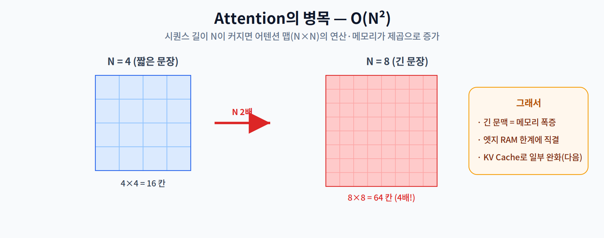
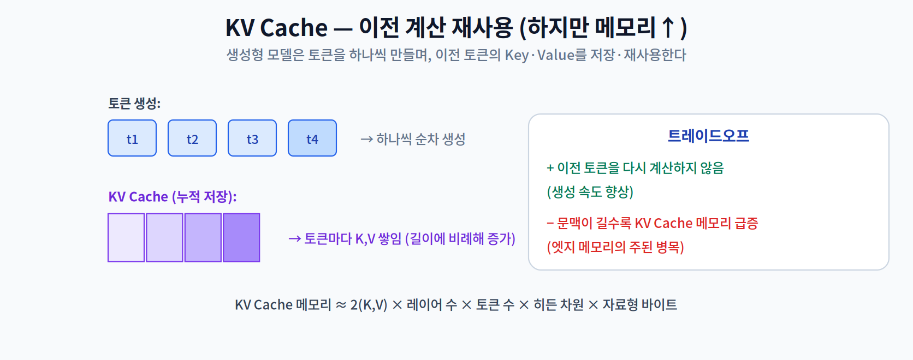
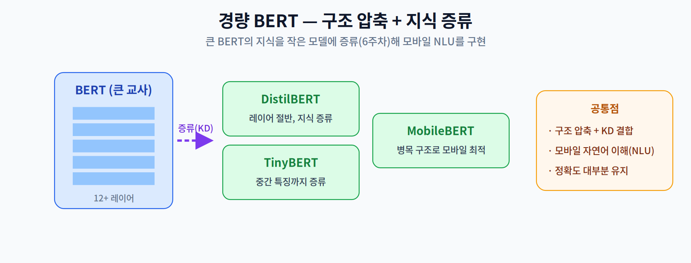

# 11주차 1교시. 트랜스포머 경량화와 음성 인식

**강의 목표** — 어텐션(Attention) 메커니즘의 연산 복잡도를 이해하고, 모바일 환경에 맞게 축소된 경량 언어 모델의 구조를 학습한다.

10주차의 시각 지능에 이어, 11주차는 온디바이스 AI에서 가장 뜨거운 화두인 **자연어 처리(NLP)와 거대 언어 모델(LLM)의 엣지 배포**를 다룬다. 무거운 **트랜스포머(Transformer)** 를 자원이 부족한 기기에서 돌리기 위한 최적화 기술에 집중한다.

---

## 1.1 Transformer의 온디바이스 병목 (15분)

Transformer의 성능은 **어텐션(Attention)** 에서 나오지만, 이것이 곧 온디바이스의 병목이 된다.

- **어텐션의 $O(N^2)$ 복잡도** — 어텐션은 시퀀스의 모든 토큰 쌍 사이의 관계를 계산한다. 그래서 시퀀스 길이 $N$ 이 커지면 어텐션 맵($N \times N$)의 크기가 **제곱으로** 늘어난다. 긴 문맥을 다룰수록 메모리·연산이 폭증해, RAM이 제한된 엣지에서 치명적이다.
- **KV Cache (Key-Value Cache)** — 생성형 모델은 토큰을 하나씩 만든다. 이때 이전 토큰들의 Key·Value를 매번 다시 계산하지 않도록 **저장(cache)해 재사용**한다.

KV Cache는 생성 속도를 높이지만, **문맥이 길어질수록 캐시 메모리가 급증**한다(대략 2 × 레이어 수 × 토큰 수 × 히든 차원 × 바이트). 이것이 온디바이스 LLM의 주요 메모리 병목이다.

> 한 줄 정리: Transformer의 온디바이스 병목은 어텐션의 $O(N^2)$ 복잡도와, 문맥 길이에 비례해 커지는 KV Cache 메모리다.

---

## 1.2 경량 BERT (20분)

생성형 LLM 이전에, **자연어 이해(NLU, Natural Language Understanding)** 를 담당하는 BERT 계열도 모바일용으로 경량화됐다. 핵심 도구는 6주차의 **지식 증류(KD)** 다.

- **DistilBERT** — 레이어 수를 절반으로 줄이고 지식 증류로 성능을 유지한다.
- **TinyBERT** — 최종 출력뿐 아니라 **중간 레이어 특징까지 증류**(6주차 Feature-based)해 더 작게 만든다.
- **MobileBERT** — 병목(bottleneck) 구조를 도입해 모바일에 최적화한다.

이들은 모두 **구조 압축 + 지식 증류**의 결합으로, 큰 모델의 정확도를 대부분 유지하면서 모바일 자연어 이해를 가능케 한다.

> 한 줄 정리: 경량 BERT(DistilBERT·TinyBERT·MobileBERT)는 구조 압축과 지식 증류(6주차)를 결합한 결과다.

---

## 1.3 온디바이스 음성 인식(ASR)과 합성(TTS) (20분)

언어 지능은 텍스트뿐 아니라 **음성**으로도 확장된다.

- **음성 인식(ASR, Automatic Speech Recognition)** — 음성을 텍스트로 바꾼다. **Whisper**의 Tiny/Base 같은 경량 버전을 엣지에 이식해, 서버 없이 실시간 받아쓰기·번역을 구현한다.
- **음성 합성(TTS, Text-to-Speech)** — 텍스트를 음성으로 만든다.

응용은 스마트 홈 가전(Matter/MQTT 연동 음성 명령), 차량용 음성 인터페이스 등이다. 오프라인·저지연·프라이버시(1주차 4대 동인)가 모두 중요한 영역이라 온디바이스가 특히 가치 있다.

> 교수님을 위한 Tip: 1교시 마지막에 "왜 음성 비서는 특히 온디바이스가 매력적인가?"를 물어라. 항상 켜져 듣는(always-on) 특성상 프라이버시와 지연이 결정적임을, 1주차 4대 동인과 9주차 TinyML(always-on)로 연결하면 좋다.

---

### 1교시 복습 질문
1. 어텐션이 $O(N^2)$ 인 이유를 '토큰 쌍' 관점에서 설명하라.
2. KV Cache가 주는 이득과, 그 대가(메모리)는?
3. 경량 BERT 3종이 공통으로 사용하는 압축 기법은 무엇인가?
