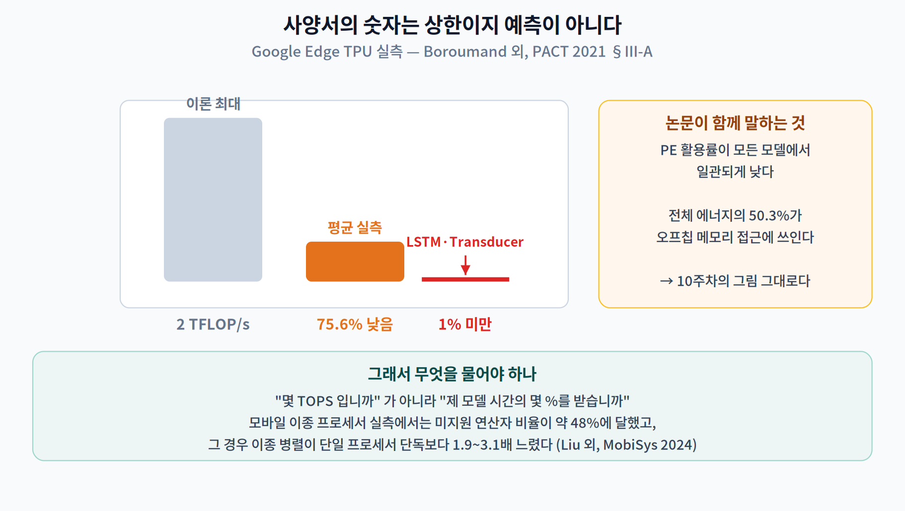
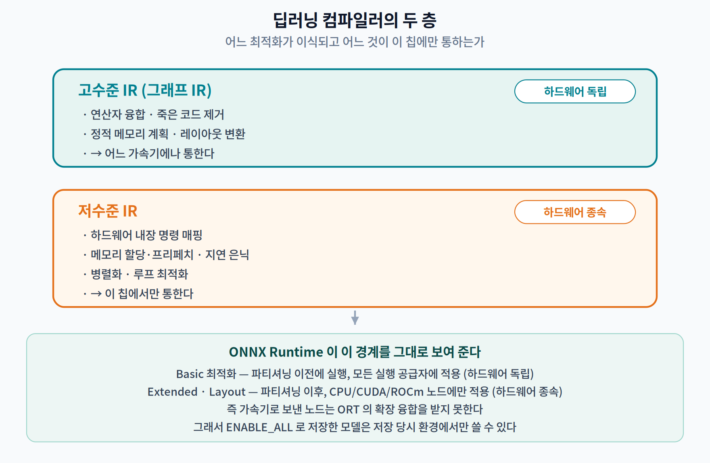
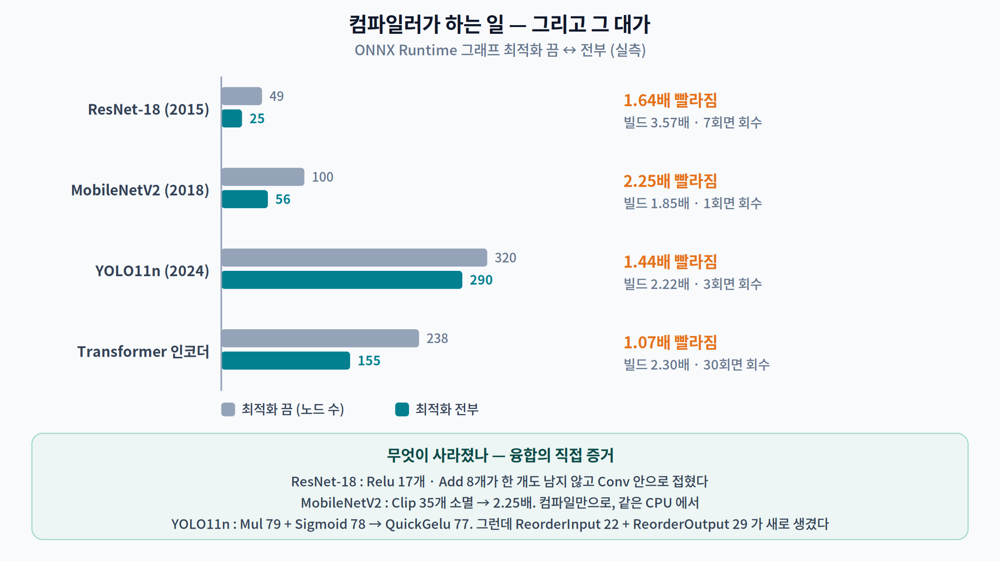
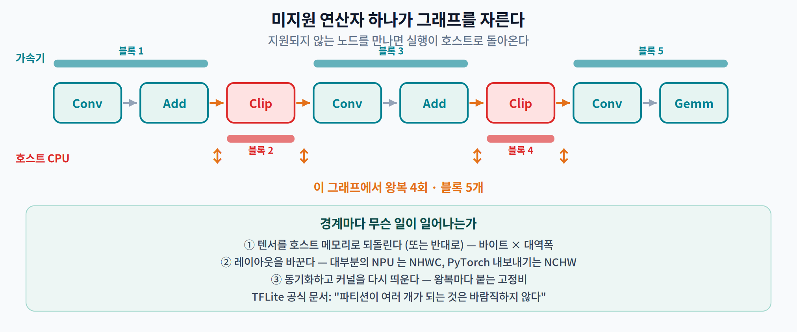
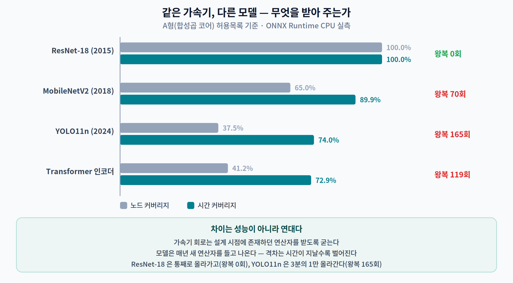
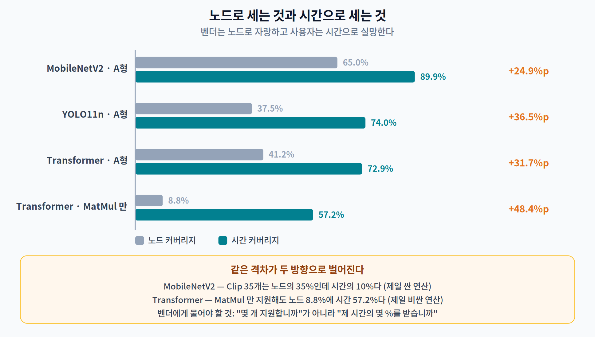
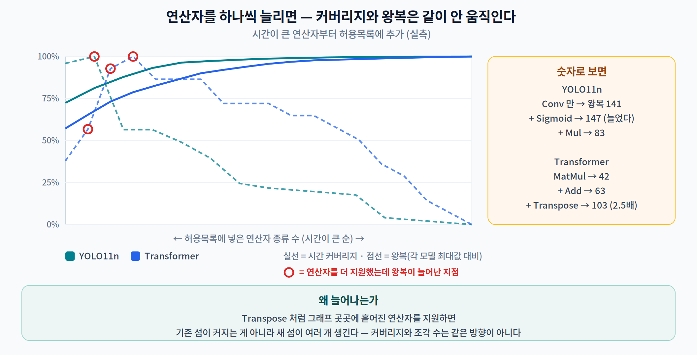

# 11주차 1교시. 가속기를 붙였는데 왜 안 빨라질까?

> **오늘의 질문** — 보드 사양서에 **"NPU 4 TOPS"** 라고 적혀 있다. CPU 로 30 ms 걸리던 모델을 그 NPU 에 올렸더니 **28 ms** 가 나왔다. 고장인가? 아니다. 이것은 이 분야에서 가장 흔한 결과이고, 원인은 거의 항상 **하나**다. 오늘 그 하나를 숫자로 붙잡는다.

---

## 1.1 "NPU 가 10배 빠르다"는 무엇을 말하지 않는가 (14분)

먼저 이 말이 **거짓말이 아니라는 것**부터 인정하자. 4 TOPS 는 실제 숫자다. 문제는 그 숫자가 **어떤 조건의 상한**이라는 데 있다.

가장 좋은 반례는 Google 이 자기 Edge TPU 를 직접 뜯어본 연구다. [1]

> *"Edge TPU 는 이론 최대 처리량 2 TFLOP/s 를 갖는다. 그러나 가속기는 추론 실행 중에 **최대 처리량보다 훨씬 낮게 동작한다(평균 75.6% 낮음)**."*
> *"PE 활용률은 모든 모델에서 일관되게 낮다. Transducer 와 LSTM 모델은 가장 심하게 저활용되어, 둘 다 **최대 처리량의 1% 미만**을 달성한다."*
> — Boroumand 외, PACT 2021, §III-A

**1% 미만.** 2 TFLOP/s 짜리 칩이 20 GFLOP/s 로 도는 것이다. 같은 논문은 전체 에너지의 **50.3%가 오프칩 메모리 접근**에 쓰였다고 보고한다. 10주차에서 본 그림이 그대로 재현된다 — 계산 능력은 남고 데이터를 옮기는 데서 막힌다.



모바일 이종 프로세서를 실측한 연구는 원인을 더 직접적으로 짚는다. [2]

> ResNet-50 을 CPU·GPU 에 나누어 병렬 추론할 때 **미지원 연산자 비율이 약 48%** 에 이르렀고, 그 결과 **이종 병렬이 단일 프로세서 단독 실행보다 1.9~3.1배 느려지는** 사례가 관측되었다.

가속기를 하나 더 쓴 쪽이 **세 배 느리다.** 이것이 오늘의 주제다.

> **한 줄 정리:** 사양서의 TOPS 는 **분자의 상한**이다. 실제 시간을 정하는 것은 분모 — **가속기가 이 그래프의 무엇을, 몇 조각으로 받아 주는가**이다.

---

## 1.2 딥러닝 컴파일러가 실제로 하는 일 (18분)

가속기 툴체인은 모델을 그냥 실행하지 않는다. **미리 컴파일한다.** 그 컴파일러가 무슨 일을 하는지부터 보자.

### 용어부터 바로잡고 간다

학술 문헌의 표준 용어는 "AI 컴파일러"가 아니라 **딥러닝 컴파일러(deep learning compiler, DL compiler)** 다. 대표 서베이 [3] 는 이들이 공통으로 갖는 구조를 이렇게 정리한다.

| 층 | 이름 | 성격 | 하는 일 |
|---|---|---|---|
| 프론트엔드 | **고수준 IR** (그래프 IR) | **하드웨어 독립** | 계산 그래프·제어 흐름 표현, 연산자 융합, 죽은 코드 제거, 정적 메모리 계획, 레이아웃 변환 |
| 백엔드 | **저수준 IR** | **하드웨어 종속** | 하드웨어 내장 명령 매핑, 메모리 할당·프리페치, 지연 은닉, 병렬화, 루프 최적화 |



이 두 층의 경계가 이번 주 내내 중요하다. **고수준 IR 의 최적화는 어느 가속기에나 통하고, 저수준 IR 의 최적화는 그 칩에서만 통한다.**

### 융합을 직접 본다

우리에게는 NPU 가 없다. 그런데 **ONNX Runtime 의 그래프 최적화 단계가 정확히 같은 종류의 일을 한다.** 끄고 켜 가며 재면 컴파일러가 무엇을 하는지 눈으로 보인다.

```python
so = ort.SessionOptions()
so.graph_optimization_level = ort.GraphOptimizationLevel.ORT_DISABLE_ALL   # 끔
# ORT_ENABLE_BASIC / ORT_ENABLE_EXTENDED / ORT_ENABLE_ALL
so.optimized_model_filepath = "opt.onnx"    # ← 최적화된 그래프를 파일로 뽑는다
```

네 모델을 끔 ↔ 전부로 재 봤다.



| 모델 | 노드 (끔→전부) | 정상 추론 | **속도** | 빌드 시간 | **회수 시점** |
|---|---:|---:|---:|---:|---:|
| ResNet-18 | 49 → **25** (1.96배) | 23.19 → 14.16 ms | **1.64배** | 26.1 → 93.4 ms | **7회** |
| MobileNetV2 | 100 → **56** (1.79배) | 11.84 → 5.25 ms | **2.25배** | 11.6 → 21.4 ms | **1회** |
| YOLO11n @320 | 320 → 290 (1.10배) | 18.66 → 12.98 ms | **1.44배** | 15.1 → 33.5 ms | **3회** |
| Transformer 인코더 | 238 → **155** (1.54배) | 7.44 → 6.96 ms | **1.07배** | 10.7 → 24.7 ms | **30회** |

**컴파일만으로 최대 2.25배다.** 가속기를 붙이기 전에, 같은 CPU 에서. 그리고 "회수 시점"은 늘어난 빌드 시간을 몇 번 추론해야 뽑는가다 — MobileNetV2 는 한 번이면 되고, Transformer 는 서른 번 돌려야 본전이다.

무엇이 사라졌는지 그래프를 열어 보면 융합이 그대로 보인다.

| 모델 | 사라진 노드 | 새로 생긴 노드 |
|---|---|---|
| ResNet-18 | `Relu` **17개**, `Add` **8개** | `ReorderOutput` 1 |
| MobileNetV2 | `Clip` **35개**, `Add` 10개 | `ReorderOutput` 1 |
| YOLO11n | `Mul` 79, `Sigmoid` 78 | **`QuickGelu` 77**, `ReorderOutput` **29**, `ReorderInput` **22** |
| Transformer | `Transpose` 32, `MatMul` 21 | `Gemm` 17, `Gelu` 4, `FusedMatMul` 4 |

ResNet-18 의 `Relu` 17개가 **한 개도 남지 않고** 사라졌다. TensorRT 문서가 같은 일을 이렇게 설명한다. [4]

> *"합성곱의 내부 구현은 **두 번째 커널 호출 없이 합성곱 커널에서 직접** 출력에 ReLU 함수를 계산하는 것을 지원한다."*

YOLO11n 의 `Mul` 79 + `Sigmoid` 78 이 `QuickGelu` 77개로 접힌 것도 같은 이야기다 — SiLU 활성화가 두 노드가 아니라 한 노드가 된다.

> **용어 주의.** 컴파일러 문헌의 표준어는 **operator fusion(연산자 융합)** 이다 [3], [5]. NVIDIA 는 같은 개념을 **layer fusion**, XLA 는 **operation fusion** 이라 부른다. 셋은 같은 것이다. 다만 "vertical fusion / horizontal fusion" 은 오래된 NVIDIA 블로그 표현이고 **현행 공식 문서 용어가 아니다.**

### 여기서 이미 이상한 것이 하나 보인다

YOLO11n 에만 `ReorderInput` 22개와 `ReorderOutput` 29개, 도합 **51개의 레이아웃 변환 노드**가 새로 생겼다. 계산을 하나도 안 하는 노드가 51개 들어온 것이다. 이것이 2교시의 주제다.

> **한 줄 정리:** 컴파일러는 **하드웨어 독립 층에서 노드를 접어** 최대 2.25배를 만든다. 그 대가는 빌드 시간이고, 회수 시점은 모델마다 **1회에서 30회까지** 다르다.

---

## 1.3 그런데 컴파일러가 못 하는 일이 있다 — 커버리지 (18분)

융합은 좋았다. 그런데 지금까지의 실험은 전부 **CPU 한 장치**에서 돌았다. 노드를 가속기에 보내는 순간, 완전히 다른 문제가 생긴다.

### 가속기는 모든 연산자를 받지 않는다

이건 결함이 아니라 정의다. 가속기가 빠른 이유는 **적은 종류의 일만 하도록 회로를 짰기 때문**이다. ONNX Runtime 은 이 사실을 API 이름에 그대로 박아 놓았다.

> *"지정된 `<graph>` 에 대한 실행 공급자의 **capability** 를 가져온다. `<*this>` 실행 공급자가 실행할 수 있는 **IndexedSubGraph 뭉치**를 돌려준다."*
> — `execution_provider.h`, `GetCapability` 문서 주석 [6]

그리고 파티셔닝 알고리즘 자체는 이렇게 적혀 있다.

> *"지금은 사용자가 지정한 공급자 선호에 따른 **탐욕적(greedy)** 분할 알고리즘이다. … **CPU 실행 공급자는 어떤 노드든 실행할 수 있다고 기대되며, 실행 공급자 선호에서 마지막이다.**"*
> — `graph_partitioner.cc` [6]

**CPU 폴백은 오류 처리가 아니다. 설계상 마지막 순위의 실행 공급자다.** 이 문장을 정확히 이해하는 것이 이번 주의 절반이다.

### 그래서 우리도 잘라 보자

가속기가 없어도 이 실험은 할 수 있다. **허용 연산자 목록(allowlist)** 을 정하고 그래프를 그 목록으로 자르면, 실제 EP 가 하는 일과 같은 분할이 나온다.

벤더 목록을 그대로 옮기지는 않았다. SDK 판마다 바뀌고 공개 문서와도 어긋나기 때문이다. 대신 **세대별 능력 등급** 세 가지를 정의했다.

| 등급 | 받는 연산자 | 실제 대응 |
|---|---|---|
| **A형** | `Conv` `Relu` `MaxPool` `AveragePool` `GlobalAveragePool` `Add` `Gemm` `MatMul` `Flatten` `Reshape` `BatchNormalization` | 합성곱 코어 · 1세대 NPU/DLA |
| **B형** | A + `Mul` `Sigmoid` `Concat` `Split` `Resize` `Sub` `Div` `Clip` `LeakyRelu` `Pad` `ConvTranspose` | 원소별 연산까지 |
| **C형** | B + `Transpose` `Slice` `Softmax` `Reduce*` `Pow` `Sqrt` `Exp` `Erf` `Where` `Gather` `Cast` 등 | 광범위 |



### 실측 — 네 모델 × 세 등급



| 모델 | 실계산 노드 | A형 노드 | A형 **시간** | A형 **왕복** | C형 노드 | C형 시간 |
|---|---:|---:|---:|---:|---:|---:|
| **ResNet-18** | 49 | **100.0%** | **100.0%** | **0** | 100.0% | 100.0% |
| **MobileNetV2** | 100 | 65.0% | 89.9% | **70** | 100.0% | 100.0% |
| **YOLO11n @320** | 320 | 37.5% | 74.0% | **165** | 100.0% | 100.0% |
| **Transformer 인코더** | 238 | 41.2% | 72.9% | **119** | 95.0% | 95.7% |

**ResNet-18 은 A형에 100% 올라간다. YOLO11n 은 37.5% 다.** 두 모델의 차이는 성능이 아니라 **연대**다. 2015년 모델은 1세대 NPU 가 통째로 받고, 2024년 모델은 3분의 1만 받는다.

> **왜 그런가.** 가속기 회로는 **설계 시점에 존재하던 연산자**를 받도록 굳는다. 모델은 매년 새 연산자를 들고 나온다. 이 격차는 시간이 지날수록 벌어지고, 칩을 다시 만들기 전에는 좁혀지지 않는다.

### 그리고 여기서 오늘의 반전이 나온다

MobileNetV2 를 다시 보자. **노드 커버리지 65.0%, 시간 커버리지 89.9%.** 두 숫자가 25%p 나 다르다.

| | 노드 | 시간 |
|---|---:|---:|
| A형이 받는 것 (`Conv` 52 · `Add` 10 · 기타 3) | 65개 | **9.33 ms** |
| A형이 못 받는 것 (`Clip` 35) | **35개** | **1.04 ms** |

`Clip` 은 노드의 **35%** 인데 시간의 **10%** 다. ReLU6 는 원소마다 자르기 한 번, 세상에서 가장 싼 연산이다.

Transformer 로 가면 방향이 뒤집힌다.

> `MatMul` **하나만** 지원해도 — 노드는 **8.8%** 인데 시간은 **57.2%** 다.



**벤더는 노드로 자랑하고 사용자는 시간으로 실망한다.** "우리 SDK 는 ONNX 연산자 200종을 지원합니다" 는 노드 이야기다. 여러분의 지연시간을 정하는 것은 시간이다.

### 커버리지 곡선 — 마지막 몇 %가 제일 비싸다

시간이 큰 연산자부터 하나씩 허용목록에 넣으면서 재 봤다.



**YOLO11n @320:**

| 추가한 연산자 | 종류 수 | 노드 커버리지 | 시간 커버리지 | **왕복** |
|---|---:|---:|---:|---:|
| `Conv` | 1 | 27.5% | 72.4% | 141 |
| + `Sigmoid` | 2 | 51.9% | 81.2% | **147** ↑ |
| + `Mul` | 3 | 76.6% | 87.9% | 83 |
| + `Softmax` | 4 | 77.2% | **93.2%** | 83 |
| + `Concat` | 5 | 83.8% | 96.4% | 72 |
| … | | | | |
| + `Reshape` | 12 | 98.4% | 99.9% | **6** |
| + `Div` (전부) | 15 | 100.0% | 100.0% | **0** |

두 가지를 보시라.

**첫째, 시간 93.2%를 넘는 데 연산자 4종이면 된다.** 나머지 11종은 시간의 6.8%를 위한 것이다. 그런데 그 11종이 **왕복을 83회에서 0회로** 줄인다. **마지막 몇 %는 속도가 아니라 왕복 때문에 필요하다.**

**둘째 — `Sigmoid` 를 추가했더니 왕복이 141 → 147 로 늘었다.** 커버리지를 올렸는데 조각이 더 나는 것이다. Transformer 에서는 더 극적이다.

| 추가한 연산자 | 노드 커버리지 | **왕복** |
|---|---:|---:|
| `MatMul` | 8.8% | **42** |
| + `Add` | 21.0% | 63 |
| + `Transpose` | 34.5% | **103** |

노드 커버리지가 8.8% → 34.5% 로 **네 배**가 되는 동안 왕복은 42 → 103 으로 **2.5배 늘었다.**

> **왜 그런가.** `Transpose` 는 그래프 곳곳에 흩어져 있다. 흩어진 연산자를 지원하면 **기존 섬이 커지는 게 아니라 새 섬이 여러 개 생긴다.** 커버리지와 조각 수는 같은 방향으로 움직이지 않는다.

이것이 "SDK 를 올렸더니 연산자 지원은 늘었는데 더 느려졌다" 는 현장 보고의 정체다.

> **한 줄 정리:** 가속기 이식의 성패는 **세 숫자**로 정해진다 — 노드 커버리지, **시간** 커버리지, 그리고 **왕복 횟수**. 셋은 함께 움직이지 않는다.

---

### 1교시 정리
- 사양서의 TOPS 는 **상한**이다. Edge TPU 실측은 최대 처리량보다 **평균 75.6% 낮고**, 일부 모델은 **1% 미만**이다 [1].
- 딥러닝 컴파일러는 **하드웨어 독립 고수준 IR** 과 **하드웨어 종속 저수준 IR** 두 층을 갖는다 [3].
- 연산자 융합만으로 실측 **1.07~2.25배**. 대가는 빌드 시간이고 **회수는 1~30회** 추론이다.
- 가속기는 연산자의 **부분집합**만 받는다. CPU 폴백은 오류가 아니라 **마지막 순위의 실행 공급자**다 [6].
- **ResNet-18 100% vs YOLO11n 37.5%** — 차이는 성능이 아니라 **연대**다.
- **노드 커버리지 ≠ 시간 커버리지.** MobileNetV2 는 65% 대 89.9%, Transformer 의 `MatMul` 하나는 **노드 8.8%에 시간 57.2%**.
- **커버리지를 올려도 왕복이 늘 수 있다** — Transformer 는 커버리지 4배에 왕복 2.5배.

### 오늘의 용어
- **실행 공급자 (execution provider, EP)** — ONNX Runtime 에서 특정 하드웨어에 노드를 실행시키는 구성 요소. `GetCapability` 로 자기가 받을 수 있는 서브그래프를 신고한다.
- **허용 연산자 목록 (allowlist)** — 가속기가 받아 주는 연산자 집합. 벤더 문서에 있고 SDK 판마다 바뀐다.
- **노드 커버리지 / 시간 커버리지** — 가속기가 받는 노드의 비율 / 그 노드들이 차지하는 실행 시간의 비율. **후자가 성능을 정한다.**
- **왕복 (host↔device switch)** — 실행이 호스트와 가속기 사이를 오가는 횟수. 파티션 개수에서 온다.
- **연산자 융합 (operator fusion)** — 여러 연산자를 중간 결과를 메모리에 쓰지 않고 한 커널로 합치는 것 [5].
- **고수준 IR / 저수준 IR** — 하드웨어 독립 그래프 표현 / 하드웨어 종속 표현 [3].

### 더 읽어보기
- [1] A. Boroumand *et al.*, "Google neural network models for edge devices: Analyzing and mitigating machine learning inference bottlenecks," in *Proc. 30th Int. Conf. Parallel Architectures and Compilation Techniques (PACT)*, 2021. — **§III-A 의 "평균 75.6% 낮음"을 직접 볼 것.**
- [2] S. Liu *et al.*, "Deep learning inference on heterogeneous mobile processors: Potentials and pitfalls," in *Proc. 22nd ACM Int. Conf. Mobile Systems, Applications, and Services (MobiSys)*, 2024.
- [3] M. Li *et al.*, "The deep learning compiler: A comprehensive survey," *IEEE Trans. Parallel Distrib. Syst.*, vol. 32, no. 3, pp. 708–726, 2021. — **이 분야를 처음 볼 때 가장 먼저 읽을 것.**
- [4] NVIDIA, "TensorRT Layer Fusion Catalog," NVIDIA TensorRT Documentation. (접속: 2026-08-31)
- [5] T. Chen *et al.*, "TVM: An automated end-to-end optimizing compiler for deep learning," in *Proc. 13th USENIX Symp. Operating Systems Design and Implementation (OSDI)*, 2018, pp. 578–594. — **§3 "Operator Fusion".**
- [6] ONNX Runtime, `include/onnxruntime/core/framework/execution_provider.h` 및 `onnxruntime/core/framework/graph_partitioner.cc`, microsoft/onnxruntime. (접속: 2026-08-31) — **문서가 아니라 소스에 적혀 있다.**

### 교수님을 위한 Tip
**1.1 은 학생에게 먼저 답하게 하십시오.** "4 TOPS NPU 에 30 ms 모델을 올리면 몇 ms 가 나올까요?" 대부분 한 자릿수를 답합니다. 그다음 Edge TPU 의 "1% 미만"을 보여 주면 나머지 두 시간의 동기가 한 번에 섭니다.

**1.3 의 커버리지 표는 세로로 읽지 말고 가로로 읽히십시오.** ResNet-18 → MobileNetV2 → YOLO11n 순서로 **연도가 올라간다**는 것을 학생이 스스로 알아채게 하는 것이 목표입니다. 알아채면 "그럼 내년 모델은?" 이라는 질문이 자동으로 나오고, 그것이 이 주차에서 가장 중요한 질문입니다.

**왕복 비단조성(`Sigmoid` 추가 → 141→147)은 반드시 예측시키십시오.** "연산자를 하나 더 지원하게 하면 왕복은 어떻게 될까요?" 전원이 "줄어든다"고 답합니다. 그 오답이 2교시 2.1 의 완벽한 도입입니다.
