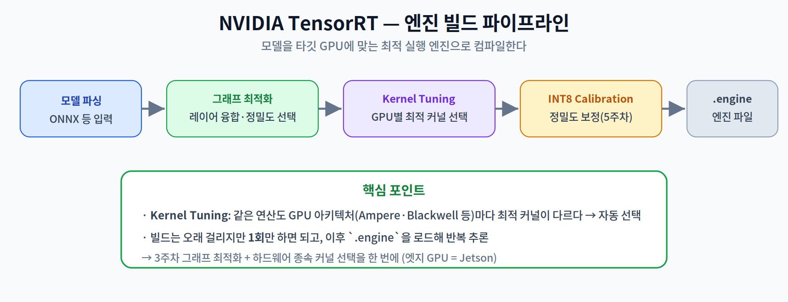
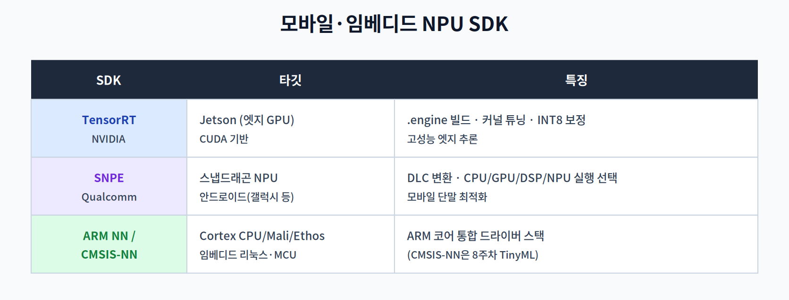

# 11주차 2교시. 산업 표준 하드웨어 가속 SDK 실무

**강의 목표** — 엔비디아 젯슨과 모바일 NPU 환경의 핵심 SDK를 비교 분석하고, 프로파일링으로 병목을 해결하는 능력을 배양한다.

1교시가 "컴파일러가 무엇을 하는가"였다면, 2교시는 "실무에서 어떤 SDK로 그것을 실현하고, 어떻게 병목을 찾는가"이다.

---

## 2.1 NVIDIA TensorRT 심층 (20분)

**TensorRT**는 엔비디아 GPU(엣지에서는 Jetson)에서 모델을 최대 성능으로 실행하는 최적화 엔진이다. 모델을 타깃 GPU에 맞는 **엔진 파일(.engine)** 로 컴파일한다.

- **엔진 빌드 과정** — `모델 파싱 → 그래프 최적화 → 커널 튜닝 → (INT8) 보정 → 엔진 파일` 순으로 진행된다.
- **Kernel Tuning** — 같은 연산이라도 GPU 아키텍처(Ampere, Blackwell 등)마다 최적 CUDA 커널이 다르다. TensorRT는 여러 후보 커널을 실제로 측정해 **타깃 GPU에 가장 빠른 커널을 자동 선택**한다.
- **INT8 Calibration** — 5주차의 양자화 보정을 엔진 빌드 단계에서 수행해, 정확도 손실을 최소화하며 INT8로 가속한다.

핵심은 **빌드는 오래 걸리지만 한 번만** 하면 되고, 이후에는 생성된 `.engine`을 로드해 반복 추론한다는 점이다.

> 한 줄 정리: TensorRT는 그래프 최적화 + GPU별 커널 튜닝 + INT8 보정을 거쳐 타깃 GPU 전용 엔진을 만든다.

---

## 2.2 모바일·임베디드 NPU SDK (20분)

타깃 하드웨어에 따라 사용하는 SDK가 다르다.

- **Qualcomm SNPE** — 스냅드래곤 단말(갤럭시 등)의 NPU를 위한 SDK다. 모델을 **DLC(Deep Learning Container)** 포맷으로 변환하고, CPU/GPU/DSP(Digital Signal Processor)/NPU 중 **어느 유닛에서 실행할지 선택**하며 실행한다.
- **ARM NN / CMSIS-NN** — ARM 기반 임베디드 리눅스·MCU(마이크로컨트롤러) 환경에서 Cortex CPU·Mali GPU·Ethos NPU를 아우르는 **추론 SDK(라이브러리)**다. CMSIS-NN은 8주차 TinyML에서 이미 다뤘다.

즉 "고성능 엣지 GPU = TensorRT, 모바일 NPU = SNPE, ARM 임베디드 = ARM NN/CMSIS-NN"으로 나뉜다. 공통점은 모두 **모델을 타깃 하드웨어 전용 형태로 변환·최적화**한다는 것이다(1교시 컴파일러의 실무 구현).

> 한 줄 정리: 타깃별로 TensorRT(젯슨)·SNPE(스냅드래곤)·ARM NN(ARM 임베디드)을 쓰며, 모두 하드웨어 전용 변환·최적화를 담당한다.

---

## 2.3 하드웨어 프로파일링 (15분)

최적화의 출발점은 **어디가 느린지 아는 것**이다. 프로파일링 도구로 병목을 찾는다.

- **도구** — **NVIDIA Nsight Systems**, **Qualcomm Profiler** 등이 추론 실행 중 어떤 레이어가 병목인지, 메모리 대역폭을 얼마나 쓰는지 시각적으로 보여준다.
- **관점** — "코딩을 완벽히 했는데도" 병목이 남을 수 있다. 특히 1교시의 **Host-to-Device 전송 오버헤드**는 프로파일러로만 드러나는 경우가 많다.

프로파일링은 추측이 아니라 **측정에 근거한 최적화**를 가능케 한다. 이것이 하드웨어 가속을 '모델 실행'이 아니라 '시스템 엔지니어링'으로 접근하게 하는 핵심이다.

> 한 줄 정리: 프로파일링으로 가장 느린 연산·전송을 측정해 찾고, 그곳부터 최적화한다.

---

## 2.4 기말 프로젝트 점검 (5분)

14주차 최종 발표를 앞두고, 9~10주차에 선택한 도메인 모델(비전/언어)이 11주차의 가속 SDK(TensorRT 등)를 거쳐 **실제 타깃 보드에서 기동되는지** 중간 점검한다. 평가지표는 정확도 방어율, 타깃 보드에서의 지연(Latency) 개선율, 프로파일링 결과 제시다.

### 11주차 핵심 키워드
- **AI Compiler** — 모델 그래프를 하드웨어 최적화 기계어로 번역하는 시스템 소프트웨어.
- **Kernel Tuning** — 타깃 하드웨어에 가장 빠른 연산 커널을 선택하는 과정.
- **Host-to-Device Latency** — CPU↔가속기 데이터 복사 지연.
- **Profiling** — 자원 사용량·병목 지점을 추적·분석하는 과정.

> 교수님을 위한 Tip: 프로파일러 스크린샷을 보여주며 "완벽한 코드인데도 H2D 전송 때문에 수십 ms 지연되는" 사례를 짚으면, 학생들이 하드웨어 가속을 시스템 관점으로 보게 된다.

---

### 2교시 복습 질문
1. TensorRT의 Kernel Tuning이 GPU 아키텍처별로 필요한 이유는?
2. SNPE의 DLC 변환과 유닛 선택이 하는 일은?
3. 프로파일링이 "측정에 근거한 최적화"를 가능케 하는 이유는?
