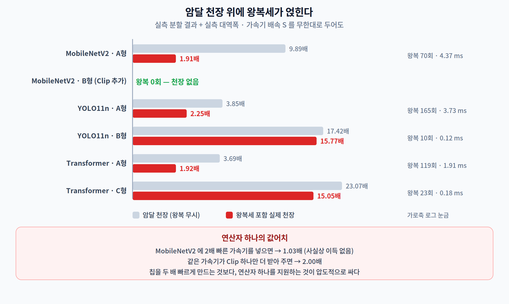
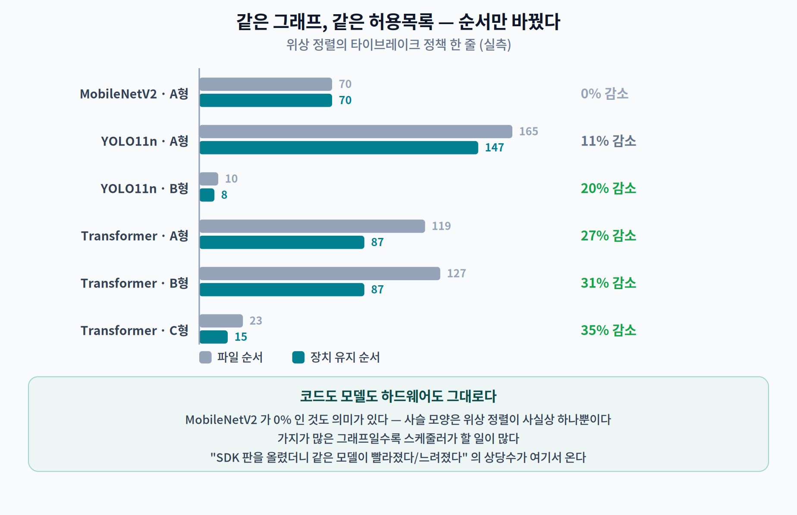
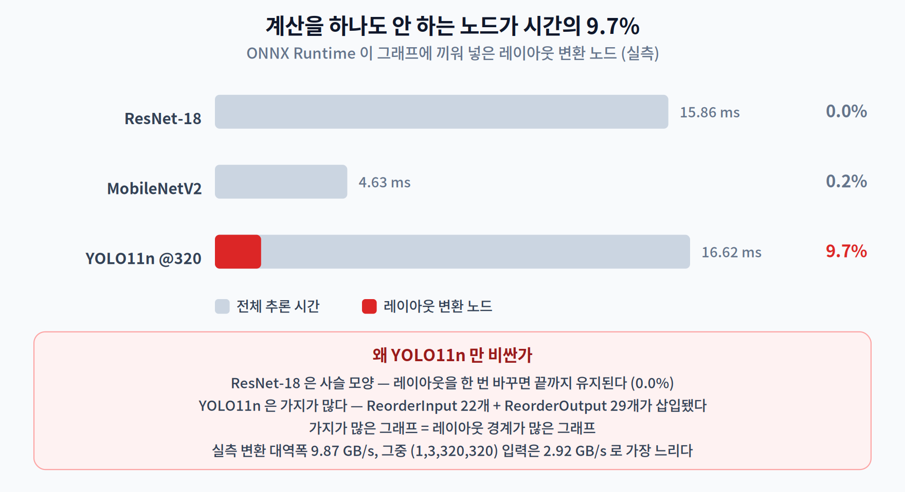
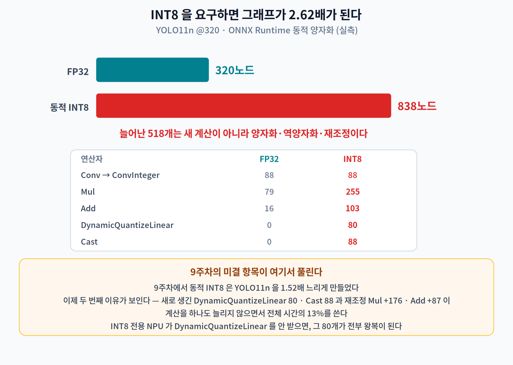

# 11주차 2교시. 무엇이 가속기 이식을 실패시키는가

> **오늘의 질문** — 1교시에서 세 숫자를 얻었다. 노드 커버리지, 시간 커버리지, 왕복 횟수. 앞의 두 개는 익숙한 이야기다 — **암달**이다. 그런데 세 번째는 9주차에도 10주차에도 없던 항이다. 왕복은 값이 얼마나 될까? 그리고 **왕복이 이득을 전부 먹어 버리는 지점**은 어디일까?

---

## 2.1 왕복세 — 이득을 먹는 항 (14분)

9주차에서 우리는 암달의 벽을 만났다. 파이프라인의 일부만 빨라지면 전체 속도에 천장이 생긴다.

$$S_{\text{천장}} = \frac{1}{1-p}$$

11주차의 $p$ 는 **시간 커버리지**다. 그런데 가속기에는 9주차 파이프라인에 없던 항이 하나 더 있다. **경계마다 데이터가 건너간다.**

이건 우리 추측이 아니라 공식 문서가 직접 경고하는 내용이다. [7]

> *"일반적으로 delegate 가 처리하는 파티션이 **여러 개가 되는 것은 바람직하지 않다.** delegate 와 메인 그래프를 오갈 때마다 delegate 서브그래프의 결과를 메인 그래프로 전달하기 위한 **메모리 복사(예: GPU → CPU)** 오버헤드가 발생하기 때문이다. 복사가 많으면 이 오버헤드가 **성능 이득을 상쇄할 수 있다.**"*
> — Google AI Edge, "Implementing a Custom Delegate"

그래서 모형은 이렇게 된다.

$$T_{\text{가속}} = \underbrace{T(1-p)}_{\text{호스트가 하는 일}} + \underbrace{\frac{Tp}{S}}_{\text{가속기가 하는 일}} + \underbrace{k \cdot c}_{\textbf{왕복세}}$$

- $T$ — CPU 전체 시간, $p$ — 시간 커버리지, $S$ — 가속기 배속
- $k$ — 왕복 횟수, $c$ — 왕복 1회 비용

### $c$ 를 실측한다

가속기가 없어도 $c$ 의 실체는 잰다. 경계에서 일어나는 일은 **바이트를 옮기고 레이아웃을 바꾸는 것**이다.

| 측정 | 값 |
|---|---:|
| 단순 복사 대역폭 (1~64 MB) | **10.96 GB/s** |
| NCHW→NHWC 변환 대역폭 (중앙값) | **9.87 GB/s** |
| 변환 중 최악 — `(1, 3, 320, 320)` 입력 텐서 | **2.92 GB/s** (복사 대비 **3.8배 느림**) |

채널이 얕은 텐서의 레이아웃 변환이 제일 비싸다. 그리고 그 텐서가 바로 **맨 처음 경계를 넘는 입력 이미지**다.

### 그래서 몇 배가 나오는가

1교시의 실측 분할 결과에 이 $c$ 를 넣었다.



| 모델 · 등급 | 시간 커버 | 왕복 $k$ | 왕복세 | **암달 천장** | **실제 천장** | 2배 가속기 | 10배 가속기 |
|---|---:|---:|---:|---:|---:|---:|---:|
| MobileNetV2 · **A형** | 89.9% | 70 | 4.37 ms | 9.89배 | **1.91배** | **1.03배** | 1.63배 |
| MobileNetV2 · **B형** | 100% | **0** | 0 ms | ∞ | ∞ | **2.00배** | **10.0배** |
| YOLO11n · A형 | 74.0% | 165 | 3.73 ms | 3.85배 | 2.25배 | 1.23배 | 1.93배 |
| YOLO11n · **B형** | 94.3% | **10** | 0.12 ms | 17.42배 | **15.77배** | 1.87배 | 6.34배 |
| Transformer · A형 | 72.9% | 119 | 1.91 ms | 3.69배 | 1.92배 | 1.13배 | 1.68배 |
| Transformer · **C형** | 95.7% | **23** | 0.18 ms | 23.07배 | **15.05배** | 1.84배 | 6.17배 |

**MobileNetV2 의 두 줄을 나란히 보시라.**

> A형 가속기에 두 배 빠른 코어를 넣으면 **1.03배**가 나온다. 사실상 아무 이득이 없다.
> 같은 가속기가 `Clip` **하나만 더** 받아 주면 **2.00배**가 나온다.

칩을 두 배 빠르게 만드는 것과 연산자 하나를 지원하는 것 중, 후자가 압도적으로 싸다. **이것이 이번 주의 실무적 결론이다.**

### 왕복이 이득을 전부 먹는 지점

$S = \infty$ 에서 speedup 이 1이 되는 $k$ 를 풀면 **최대 유효 왕복 횟수**가 나온다.

$$k_{\max} = \frac{T \cdot p}{c}$$

| 모델 · 등급 | 실제 $k$ | $k_{\max}$ | 소진율 |
|---|---:|---:|---:|
| MobileNetV2 · A형 | 70 | 149 | **47%** |
| YOLO11n · A형 | 165 | 661 | 25% |
| Transformer · A형 | 119 | 346 | 34% |

MobileNetV2 는 이미 **예산의 절반**을 왕복에 쓰고 있다.

> **이 모형의 정직한 한계.** 우리 $c$ 는 **데이터 이동 비용만** 센다. 실제 가속기에는 커널 실행(launch)과 동기화의 **고정 오버헤드**가 왕복마다 붙고, 이것이 보통 수십 µs 로 데이터 이동보다 크다. 즉 **$k_{\max}$ 는 낙관적인 값이고 현실은 이보다 나쁘다.** 이 모형은 "왕복이 문제가 되는가"를 판정하는 데는 충분하고, 배수를 예측하는 데는 못 쓴다.

> **한 줄 정리:** 암달 천장 위에 **왕복세**가 얹힌다. MobileNetV2 는 천장 9.89배가 **실제 1.91배**로 내려앉고, 그 차이를 만든 것은 **연산자 하나**다.

---

## 2.2 같은 그래프, 같은 목록, 순서만 바꿨더니 (10분)

왕복 횟수는 그래프와 허용목록만으로 정해지지 않는다. **어떤 순서로 실행하느냐**로도 정해진다.

위상 정렬은 유일하지 않다. 준비된 노드가 여럿일 때 **어느 것을 먼저 실행할지** 고를 수 있고, 그 선택이 왕복을 바꾼다.

```python
# 정책 1 — 파일에 적힌 순서를 따른다 (내보낸 순서)
# 정책 2 — 준비된 노드 중 '지금 장치와 같은 장치' 것을 먼저 (sticky)
```



| 모델 · 등급 | 파일 순서 | **장치 유지 순서** | 감소 |
|---|---:|---:|---:|
| MobileNetV2 · A형 | 70 | 70 | 0% |
| YOLO11n · A형 | 165 | 147 | 11% |
| YOLO11n · B형 | 10 | **8** | 20% |
| Transformer · A형 | 119 | **87** | **27%** |
| Transformer · B형 | 127 | **87** | **31%** |
| Transformer · C형 | 23 | **15** | **35%** |

**코드도 모델도 하드웨어도 그대로인데 왕복이 35% 줄었다.** 바꾼 것은 스케줄링 정책 한 줄이다.

MobileNetV2 가 0% 인 것도 의미가 있다 — 사슬 모양 그래프는 위상 정렬이 사실상 하나뿐이라 순서를 바꿀 여지가 없다. **가지가 많은 그래프일수록 스케줄러가 할 일이 많다.**

> **현장에서 이 얘기가 왜 중요한가.** "SDK 를 6.2 에서 6.3 으로 올렸더니 같은 모델이 빨라졌다/느려졌다" 는 보고의 상당수가 여기서 온다. 연산자 지원 목록이 그대로여도 **파티셔너와 스케줄러가 바뀌면 왕복이 바뀐다.** 벤치마크를 인용할 때 SDK 판을 함께 적어야 하는 이유다.

> **한 줄 정리:** 왕복 횟수는 그래프의 성질이 아니라 **컴파일러의 선택**이다. 최대 35%가 순서에서 나왔다.

---

## 2.3 보이지 않는 세금 — 레이아웃 (10분)

1교시 끝에 이상한 것을 봤다. YOLO11n 을 최적화했더니 `ReorderInput` 22개와 `ReorderOutput` 29개가 **새로 생겼다.**

이건 우리 실험의 부작용이 아니라 ONNX Runtime 의 정식 동작이다. `NchwcTransformer` 가 합성곱에 유리한 **NCHWc** 레이아웃(채널을 블록으로 쪼갠 배치)으로 그래프를 바꾸면서, 레이아웃이 안 맞는 경계마다 변환 노드를 끼워 넣는다. [8]

**가속기가 아니라 CPU 인데도** 레이아웃 경계가 생기는 것이다. 그러면 그 노드들은 시간을 얼마나 쓸까? 노드별로 재 봤다.



| 모델 | 전체 | 레이아웃 변환 노드 | **비중** |
|---|---:|---:|---:|
| ResNet-18 | 15.86 ms | 0.01 ms | **0.0%** |
| MobileNetV2 | 4.63 ms | 0.01 ms | **0.2%** |
| **YOLO11n @320** | 16.62 ms | **1.61 ms** | **9.7%** |

YOLO11n 은 **계산을 하나도 안 하는 노드에 시간의 9.7%** 를 쓴다 (`ReorderOutput` 0.94 ms + `ReorderInput` 0.64 ms). ResNet-18 은 0.0% 다 — 사슬 모양이라 레이아웃을 한 번 바꾸면 끝까지 유지되기 때문이다.

**가지가 많은 그래프 = 레이아웃 경계가 많은 그래프.** 2.2 의 결론과 같은 원인에서 나온다.

> **실무 함의.** 대부분의 NPU 는 **NHWC** 를 요구하고 PyTorch 내보내기는 **NCHW** 를 만든다. 경계마다 이 변환이 붙는다. 그리고 우리 실측에서 가장 느렸던 텐서가 `(1, 3, 320, 320)` — **입력 이미지**였다(2.92 GB/s). 전처리 단계에서 아예 NHWC 로 만들어 주는 것이 첫 번째로 시도할 최적화다.

> **한 줄 정리:** 레이아웃은 정확도에도 계산량에도 안 나타나지만 **실측 시간의 10%** 를 가져간다. 그리고 그 양은 그래프 모양이 정한다.

---

## 2.4 입장 조건 — 정적 형상과 INT8 (10분)

가속기는 연산자 종류만 따지지 않는다. **형상과 자료형**도 따진다.

### 정적 형상

대부분의 가속기 컴파일러는 **모든 텐서 크기가 컴파일 시점에 정해져 있어야** 한다. 메모리를 정적으로 배치하고(8주차의 오프셋 할당을 떠올리자) 타일 크기를 고정해야 하기 때문이다.

동적 축이 하나라도 남아 있으면 그 노드 이후가 통째로 CPU 로 떨어지는 일이 흔하다. **`Shape` → `Gather` → `Reshape` 사슬** 이 대표적인 범인이다 — 1교시 Transformer 의 커버리지 곡선에서 `Shape` 와 `Gather` 가 뒤늦게 등장한 이유가 이것이다.

### INT8 요구 — 그리고 그 대가

많은 NPU 는 **INT8 만** 받는다. 9주차에서 만든 INT8 YOLO11n 을 열어 봤다.



| | FP32 | **동적 INT8** |
|---|---:|---:|
| 노드 수 | 320 | **838 (2.62배)** |
| `Conv` | 88 | `ConvInteger` 88 |
| `Mul` | 79 | **255** |
| `Add` | 16 | **103** |
| `DynamicQuantizeLinear` | 0 | **80** |
| `Cast` | 0 | **88** |

**양자화가 노드를 518개 늘렸다.** 늘어난 것은 계산이 아니라 **양자화·역양자화·재조정** 노드다. 시간으로 재면 이 노드들이 **전체의 13.4%** 를 쓴다.

> **9주차의 미결 항목이 여기서 풀린다.** 9주차 2.2 에서 우리는 동적 INT8 이 YOLO11n 을 **1.52배 느리게** 만드는 것을 봤고, 그때는 "연산 강도가 낮지 않아서"로 설명했다(10주차에서 정식화했다). 이제 두 번째 이유가 보인다 — **그래프 자체가 2.62배로 불어났다.** 노드 838개 중 256개가 계산이 아니라 자료형 변환이다.

그리고 가속기 관점에서 더 나쁜 소식이 있다. **INT8 전용 NPU 가 `DynamicQuantizeLinear` 를 안 받으면**, 그 80개 노드가 전부 CPU 로 떨어지면서 왕복이 폭발한다. 양자화를 하러 갔다가 왕복을 얻는 것이다.

> **그래서 실무는 QDQ 를 미리 접는다.** 정적 양자화(캘리브레이션으로 스케일을 미리 정하는 방식)를 쓰면 `DynamicQuantizeLinear` 가 사라지고, 벤더 컴파일러가 Q/DQ 를 합성곱에 융합해 흡수한다. TensorRT 는 이를 **"Q/DQ Fusion"** 이라는 별도 범주로 문서화하고 있다. [4]

> **한 줄 정리:** 가속기의 입장 조건은 연산자 목록만이 아니다. **정적 형상**과 **자료형**이 안 맞으면 커버리지가 아니라 **그래프 자체**가 달라진다.

---

## 2.5 [논문 읽기] 이 분야는 수치가 특히 잘 둔갑한다 (6분)

가속기 분야는 벤더 자료와 논문이 섞여 돌아다니고, **조건이 떨어져 나간 채로** 인용되는 일이 유난히 잦다. 이번 교재를 만들며 1차 출처로 확인한 것들이다.

| 자주 도는 말 | 실제 |
|---|---|
| "TVM 은 1.2~3.8배 빠르다" | **그런 범위는 논문에 없다.** 서버 GPU(Titan X) 대 프레임워크가 **1.6~3.8배**(§6.1), 모바일 GPU(Mali) 대 ARM Compute Library 가 **1.2~1.6배**(§6.3). 서로 다른 하드웨어·다른 베이스라인의 끝값을 이어붙인 유령 수치다 [5] |
| "Ansor 는 AutoTVM 보다 3.8배" | AutoTVM 대비는 **1.02~1.8배**. 초록의 "최대 3.8배"는 PyTorch·TensorFlow·TensorRT 등 **여러 베이스라인 전체**에 대한 최대값이다 [9] |
| "Triton 이 cuBLAS 보다 빠르다" | 논문 주장은 **"on par"(동등)** 이고 GTX 1070 기준이다. 게다가 2019년 논문의 Triton 은 C 기반 언어이지 지금의 **Python DSL 이 아니다** [10] |
| "Amdahl 이 1967년에 그 공식을 냈다" | 원논문에는 **수식이 하나도 없고 그림 한 장뿐**이다 [11] |
| "ORT 는 최적화를 파티셔닝 전에 한다" | **Basic 만** 전에 돈다. **Extended 와 Layout 은 파티셔닝 후에**, 그것도 **CPU/CUDA/ROCm 에 할당된 노드에만** 적용된다 [12] |
| "NNAPI 는 미지원 연산자를 CPU 로 폴백한다" | 문서 표현은 "**might** fall back" 이고, CPU 에 구현이 없으면 폴백 대신 **실패**한다. 그리고 NNAPI 는 **Android 15 에서 deprecated** 되었다 [13] |
| Glow 를 "논문" 으로 인용 | **arXiv 프리프린트**(1805.00907)이고 동료심사 게재 이력이 없다 |
| XLA 를 "(저자, 연도)" 로 인용 | **정경 논문이 없다.** 문서 URL + 접속일자로 인용해야 정확하다 |

가운데 다섯 번째 줄은 **우리 실험에도 직접 영향을 준다.** Extended 와 Layout 최적화가 파티셔닝 **후에** CPU 노드에만 적용된다는 것은, 곧 **가속기로 보낸 노드는 ORT 의 확장 융합을 못 받는다**는 뜻이다. 1교시에서 본 1.07~2.25배는 CPU 에 남은 부분에만 붙는다.

### 그리고 엔진의 이식성

TensorRT 공식 문서는 이렇게 못박는다. [14]

> *"기본적으로 TensorRT 엔진은 **빌드에 사용한 TensorRT 버전과만** 호환된다."*
> *"기본적으로 TensorRT 엔진은 **빌드한 장치 유형에서만** 호환된다."*
> *"TensorRT 는 엔진 빌드 단계에서 **가능한 모든 tactic 을 실제로 돌려보고** 가장 빠른 것을 고른다. 선택이 지연시간 측정에 기반하므로, **실행할 때마다 다른 tactic 이 선택될 수 있다.**"*

빌드 시간은 "작은 네트워크의 수 초에서 복잡한 대형 모델의 **수십 분 이상**"이다. ONNX Runtime 도 같은 성격의 경고를 한다 — `ORT_ENABLE_ALL` 로 최적화해 저장한 모델은 **저장 당시 환경과 호환되는 하드웨어에서만** 쓸 수 있다(예: AVX2 용으로 최적화됐으면 AVX2 CPU 가 필요하다). [12]

**즉 가속기 이식의 산출물은 "모델"이 아니라 "이 칩·이 SDK 판 전용 바이너리"다.** 배포·CI·기기 다양성 전략이 여기서 갈린다.

> **한 줄 정리:** 이 분야의 수치는 **하드웨어·베이스라인·SDK 판**을 함께 적지 않으면 의미가 없다. 그리고 컴파일 산출물은 이식되지 않는다.

---

## 2.6 [더 깊이 · 선택] 그래서 커널을 직접 쓰는가 (8분)

여기까지 오면 자연스러운 질문이 나온다. **가속기가 안 받아 주면, 내가 그 연산자 커널을 짜 넣으면 되지 않나?**

TVM 논문이 이 질문에 정면으로 답한다. [5]

> *"프로그램이 요구하는 다양한 연산과 **각 백엔드마다** 연산자 커널을 손으로 짜는 것은 **실행 가능하지 않다**."*
> *"필요한 융합 패턴 구현의 수는 지원해야 하는 **자료 레이아웃·자료형·가속기 내장 명령의 수에 조합적으로(combinatorially) 증가**한다."*

**조합적으로.** 레이아웃 3종 × 자료형 3종 × 내장 명령 5종이면 이미 45가지다. 그래서 이 분야는 커널을 손으로 짜는 대신 **탐색**으로 간다.

| 접근 | 핵심 아이디어 | 실제 수치 |
|---|---|---|
| **Halide** (PLDI 2013) | *"알고리즘 정의를 실행 전략에서 **분리(decoupling)**"* — 무엇을 계산할지와 어떻게 계산할지를 따로 쓴다 | — |
| **AutoTVM → Ansor** (OSDI 2020) | 스케줄 공간을 자동 탐색 | Ansor 가 AutoTVM 대비 **1.02~1.8배** [9] |
| **Triton** (MAPL 2019) | 타일(tile)을 일급 개념으로 | GTX 1070 에서 cuBLAS/cuDNN 과 **동등(on par)** [10] |

> **인용 주의.** "separating algorithm from schedule" 은 널리 쓰이는 **의역**이지 어느 논문의 축자 인용도 아니다. 원문은 *"decoupling the algorithm definition from its execution strategy"* (PLDI 2013 §1)다. 따옴표를 붙여 인용하지 말자.

**그런데 이 모든 것이 여러분의 NPU 에 적용되는가?** 대개는 아니다. Halide·TVM·Triton 은 CPU/GPU 백엔드가 성숙해 있고, 폐쇄형 NPU 는 벤더 컴파일러 말고 다른 경로가 없는 경우가 많다. **그래서 실무의 답은 대부분 "커널을 짜는 것"이 아니라 "모델을 바꾸는 것"이다** — 4·5·6주차에서 배운 그대로.

> **한 줄 정리:** 커널을 손으로 짜는 길은 **조합 폭발**로 막혀 있다. 자동 탐색이 그 답이지만, 폐쇄형 NPU 에서는 대개 **모델 쪽을 고치는 것**이 유일한 지렛대다.

---

### 2교시 정리
- 암달 천장 위에 **왕복세** $k \cdot c$ 가 얹힌다. MobileNetV2 A형은 천장 9.89배가 **실제 1.91배**로 내려앉는다.
- **연산자 하나(`Clip`)의 값**: 2배 가속기가 **1.03배 → 2.00배**. 칩을 두 배 빠르게 하는 것보다 싸다.
- 왕복 횟수는 **실행 순서**로도 정해진다 — 정책 한 줄로 최대 **35% 감소**(Transformer C형 23→15).
- 레이아웃 변환은 계산을 안 하면서 **YOLO11n 시간의 9.7%** 를 쓴다. 가지가 많을수록 비싸다.
- INT8 요구는 그래프를 **320 → 838 노드(2.62배)** 로 만든다. 그중 **256개가 자료형 변환**이고 시간의 13.4%다 — **9주차 1.52배 손해의 두 번째 이유**.
- ORT 의 **Extended·Layout 최적화는 파티셔닝 후 CPU/CUDA/ROCm 노드에만** 적용된다. 가속기로 보낸 노드는 그 융합을 못 받는다.
- 컴파일 산출물은 **이식되지 않는다** — TensorRT 엔진은 버전·장치 유형에 묶이고, ORT 의 `ENABLE_ALL` 모델은 명령어 집합에 묶인다.

### 오늘의 용어
- **왕복세 (boundary tax)** — 파티션 경계마다 드는 데이터 이동·레이아웃 변환·동기화 비용. $k \cdot c$.
- **최대 유효 왕복 횟수 $k_{\max}$** — 왕복세가 가속 이득 전부와 같아지는 왕복 수. $T p / c$.
- **NCHWc** — ONNX Runtime 이 CPU 합성곱에 쓰는 블록 채널 레이아웃. 경계에 `ReorderInput`/`ReorderOutput` 이 삽입된다 [8].
- **정적 형상 (static shape)** — 모든 텐서 크기가 컴파일 시점에 정해진 상태. 대부분의 가속기 컴파일러의 전제.
- **QDQ** — `QuantizeLinear`/`DequantizeLinear` 쌍. 양자화 경계를 그래프에 명시하는 표현이며, 컴파일러가 합성곱에 융합해 흡수하는 것이 목표다.
- **tactic** — TensorRT 가 한 레이어를 구현하는 후보 커널. 빌더가 실제로 돌려보고 고른다 [14].

### 함께 생각해 볼 문제
1. **8주차와 잇기** — 8주차에서 우리는 텐서 수명을 계산해 SRAM 을 8.74배 줄였다. 그 계획은 **한 장치**를 가정했다. 그래프가 두 장치로 쪼개지면 텐서 수명 계산은 어떻게 달라지는가? 경계를 넘는 텐서는 **양쪽 메모리에 동시에** 살아 있어야 하는가?
2. **2.2 의 sticky 정책은 왕복을 줄이지만 다른 것을 희생한다.** 무엇을 희생하는가? (힌트: 8주차의 최대 활성 메모리)
3. MobileNetV2 A형의 $k_{\max}$ 가 149 인데 실제 $k$ 가 70 이다. 커널 실행 고정 오버헤드를 **왕복당 30 µs** 로 잡으면 $k_{\max}$ 는 얼마가 되는가? 판정이 뒤집히는가?
4. 여러분의 응용에서 **커버리지 90% · 왕복 100회** 인 가속기와 **커버리지 70% · 왕복 2회** 인 가속기 중 어느 쪽을 고르겠는가? 답이 무엇에 달려 있는가?

### 더 읽어보기
- [4] NVIDIA, "TensorRT Layer Fusion Catalog," NVIDIA TensorRT Documentation. (접속: 2026-08-31) — **Q/DQ Fusion 범주를 볼 것.**
- [5] T. Chen *et al.*, "TVM: An automated end-to-end optimizing compiler for deep learning," in *Proc. 13th USENIX Symp. OSDI*, 2018, pp. 578–594. — **§3 의 "combinatorially" 문장이 이 분야의 출발점이다.**
- [7] Google AI Edge, "Implementing a Custom Delegate," LiteRT Documentation. (접속: 2026-08-31) — **파티션 개수 경고의 1차 출처.** 실제 파티션 수는 런타임 로그 `yielding N partitions for the whole graph` 로 확인할 수 있다.
- [8] ONNX Runtime, `onnxruntime/core/optimizer/nchwc_transformer.cc`, microsoft/onnxruntime. (접속: 2026-08-31)
- [9] L. Zheng *et al.*, "Ansor: Generating high-performance tensor programs for deep learning," in *Proc. 14th USENIX Symp. OSDI*, 2020, pp. 863–879.
- [10] P. Tillet, H. T. Kung, and D. Cox, "Triton: An intermediate language and compiler for tiled neural network computations," in *Proc. 3rd ACM SIGPLAN Int. Workshop Machine Learning and Programming Languages (MAPL)*, 2019, pp. 10–19. — **워크숍 논문이다.**
- [11] G. M. Amdahl, "Validity of the single processor approach to achieving large scale computing capabilities," in *AFIPS Conf. Proc.*, vol. 30, 1967, pp. 483–485. — **수식이 하나도 없다.**
- [12] ONNX Runtime, "Graph Optimizations," onnxruntime.ai. (접속: 2026-08-31) — **Basic 은 파티셔닝 전, Extended·Layout 은 후.**
- [13] Android, "Neural Networks API Migration Guide," developer.android.com. (접속: 2026-08-31) — **Android 15 에서 deprecated.**
- [14] NVIDIA, "TensorRT Engine Compatibility" 및 "Optimizing TensorRT Performance," NVIDIA TensorRT Documentation. (접속: 2026-08-31)
- J. Ragan-Kelley *et al.*, "Halide: A language and compiler for optimizing parallelism, locality, and recomputation in image processing pipelines," in *Proc. ACM SIGPLAN Conf. PLDI*, 2013, pp. 519–530.

### 교수님을 위한 Tip
**2.1 의 MobileNetV2 두 줄이 이번 주의 정점입니다.** 표 전체를 한꺼번에 열지 마시고 **A형 줄만 먼저** 보여 주십시오. "2배 가속기를 넣었는데 1.03배" 를 충분히 당황하게 둔 다음 B형 줄을 여시면, "`Clip` 하나" 라는 답이 훨씬 강하게 박힙니다.

**2.5 는 짧게, 그러나 반드시 하십시오.** 대학원생이 이 분야 논문을 읽기 시작하면 가장 먼저 다치는 지점입니다. 특히 "TVM 1.2~3.8배" 가 **존재하지 않는 범위** 라는 것은 학생이 직접 §6.1 과 §6.3 을 열어 보게 하면 평생 기억합니다.

**2.6 은 시간이 모자라면 통째로 넘기십시오.** 여기서 중요한 것은 Halide/TVM/Triton 의 세부가 아니라 마지막 문장 — **"폐쇄형 NPU 에서는 모델 쪽을 고치는 것이 유일한 지렛대"** 이고, 그것이 4·5·6주차를 이번 주와 잇는 다리입니다.
