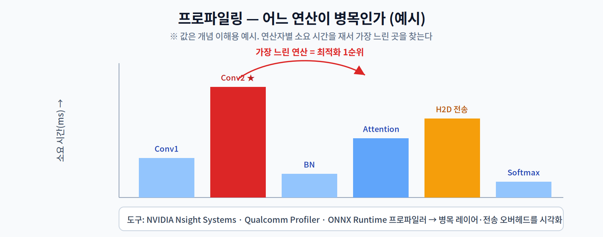

# 11주차 3교시. 연산자별 프로파일링

**실습 목표** — ONNX Runtime의 **내장 프로파일러**로 추론을 측정해, 어떤 연산자가 시간을 가장 많이 쓰는지(병목)를 데이터로 찾는다. 값비싼 상용 도구 없이도 "측정에 근거한 최적화"를 체험한다.

> 준비물: 1주차 환경(`odai`) + `onnxruntime`, `numpy` + `mobilenetv2.onnx`(1주차 3.1 산출물).

---

## 3.1 그래프 최적화·공급자 재확인 (15분)

먼저 3주차의 그래프 최적화를 켜고, 실행 공급자(하드웨어)를 확인한다. 최적화 수준·공급자에 따라 병목이 달라진다.

```python
import onnxruntime as ort
print("공급자:", ort.get_available_providers())

so = ort.SessionOptions()
so.graph_optimization_level = ort.GraphOptimizationLevel.ORT_ENABLE_ALL  # 3주차
```

> 관찰 포인트: CPU 빌드면 `CPUExecutionProvider`만 보인다. 같은 모델도 공급자(CPU/GPU/NPU)와 최적화 수준에 따라 병목 연산이 바뀐다 — 그래서 **프로파일링은 항상 실제 타깃 환경에서** 해야 한다.

---

## 3.2 연산자별 프로파일링 (25분)

`enable_profiling`을 켜면 ORT가 실행 내역을 **JSON 추적 파일**로 남긴다. 이를 파싱해 연산자별 누적 시간을 집계한다.

```python
import numpy as np, onnxruntime as ort, json
from collections import defaultdict

so = ort.SessionOptions()
so.graph_optimization_level = ort.GraphOptimizationLevel.ORT_ENABLE_ALL
so.enable_profiling = True                       # ★ 프로파일링 켜기

sess = ort.InferenceSession("mobilenetv2.onnx", sess_options=so,
                            providers=["CPUExecutionProvider"])
name = sess.get_inputs()[0].name
x = np.random.rand(1, 3, 224, 224).astype(np.float32)

for _ in range(20):                              # 여러 번 실행해 통계 확보
    sess.run(None, {name: x})

prof_file = sess.end_profiling()                 # JSON 경로 반환
print("프로파일 파일:", prof_file)

# JSON 파싱: 연산자(op) 종류별 소요 시간 합산 (단위: 마이크로초)
events = json.load(open(prof_file))
by_op = defaultdict(float)
for e in events:
    if e.get("cat") == "Node" and e.get("name", "").endswith("_kernel_time"):
        op = e.get("args", {}).get("op_name", "unknown")
        by_op[op] += e.get("dur", 0)

print("\n[연산자별 누적 시간 상위 5]")
for op, us in sorted(by_op.items(), key=lambda kv: -kv[1])[:5]:
    print(f"  {op:<16} {us/1000:8.2f} ms")
```



관찰의 핵심:

1. 대개 **Conv(합성곱)** 계열이 시간의 대부분을 차지한다(MobileNet은 Conv가 지배적).
2. 상위 몇 개 연산이 전체 시간의 큰 비중을 차지한다 — **거기를 먼저 최적화**해야 효과가 크다.
3. 실제 GPU/NPU 환경이라면 여기에 **Host-to-Device 전송**이 병목으로 잡히기도 한다(1교시).

> 관찰 포인트: 프로파일러가 알려주는 것은 "느낌"이 아니라 "숫자"다. 추측으로 엉뚱한 곳을 최적화하지 않도록, 항상 측정 후에 손대는 습관을 들인다.

---

## 3.3 과제 (10분 안내)

1. **병목 리포트** — 위 프로파일로 연산자별 누적 시간 상위 5개를 표로 제출하고, 전체 대비 비중(%)을 계산한다. 어느 연산이 최적화 1순위인지 밝힌다.
2. **최적화 전후 비교** — `ORT_DISABLE_ALL`과 `ORT_ENABLE_ALL`로 각각 프로파일해, 그래프 최적화가 어떤 연산을 줄였는지(또는 융합했는지) 비교한다.
3. **개념 연결** — 프로파일 결과를 1교시의 컴파일러(그래프 최적화)·Host-to-Device 개념과 연결해 3~4문장으로 해석한다.
4. **기말 프로젝트** — 본인 도메인 모델을 프로파일해 병목을 찾고, 어떤 SDK/기법으로 개선할지 한 페이지로 계획한다.
5. **타깃 기기에서 한 번 더 (권장)** — 같은 모델을 **안드로이드 폰**에 올려 같은 프로파일링을 해 본다. 절차는 [부록 A](appendix-a-phone-profiling.md)에 있다. 노트북과 병목 순위가 달라지는지 확인하면, 14주차 캡스톤의 "타깃 기기 실측"이 그대로 준비된다.

> 교수님을 위한 Tip: 생성된 JSON을 브라우저 `chrome://tracing`(또는 최신 브라우저는 `ui.perfetto.dev`)에 넣으면 타임라인으로 시각화됩니다. 상용 프로파일러(Nsight 등)가 없어도 병목을 눈으로 보여줄 수 있어 실습 효과가 큽니다.
>
> **캡스톤 대비의 분기점이 이 주차입니다.** 과제 5번(폰 프로파일링, 부록 A)을 여기서 한 번 돌려 둔 팀은 14주차에 타깃 기기 실측으로 헤매지 않습니다. 실습 말미 5분을 내어 부록 A를 소개하고, `adb devices`가 뜨는지만 확인시켜 주세요.

---

### 3교시 정리
- ONNX Runtime 내장 프로파일러로 연산자별 소요 시간을 측정했다.
- 상위 병목 연산을 데이터로 식별하고, 최적화 우선순위를 정하는 법을 익혔다.
- 같은 측정을 실제 타깃 기기에서 반복하는 방법을 [부록 A](appendix-a-phone-profiling.md)로 확보했다.
- 다음은 12주차 연합 학습·프라이버시로, 추론을 넘어 '기기에서의 학습·보안'으로 확장한다.
