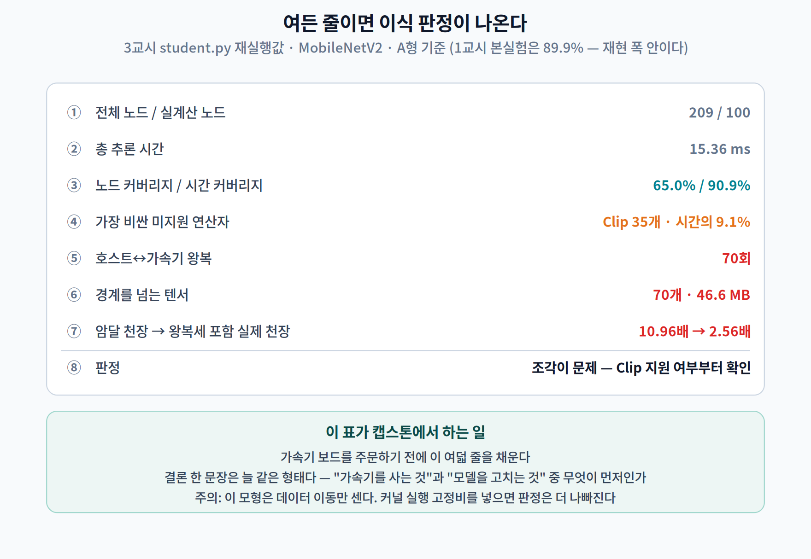

# 11주차 3교시. 내 모델이 NPU 에 몇 % 올라가는지 재 보기

> **오늘의 질문** — 앞의 두 시간에서 나온 숫자는 전부 **가속기 없이** 잰 것이다. 그게 이번 실습의 전부다. 여러분에게 NPU 가 있든 없든, **이식을 시작하기 전에** 커버리지·왕복·손익분기를 알 수 있다. 오늘 짜는 것은 여든 줄짜리 판정기다.

---

## 실험 설계

| | 내용 |
|---|---|
| **가설** | ① 노드 커버리지와 시간 커버리지는 **다르다** ② 미지원 연산자는 그래프를 **여러 조각**으로 자른다 ③ 조각 수가 충분히 크면 **가속기를 빠르게 해도 이득이 없다** |
| **측정 대상** | 실계산 노드 수 · op 별 실행 시간 · 노드/시간 커버리지 · 왕복 횟수 · 경계 바이트 · 손익분기 |
| **필요한 것** | `onnx`, `onnxruntime`, `numpy`. **가속기 불필요.** 모델은 `.onnx` 파일 아무거나 |
| **타당성 위협** | ① 우리 분할은 **위상 순서 한 개**를 기준으로 세므로 실제 파티셔너보다 보수적이다 ② 경계 비용에 **커널 실행 고정비가 빠져 있다** — 실제는 더 나쁘다 ③ CPU 의 op 별 시간이 가속기에서의 상대 비중과 같다는 보장은 없다 |

> **절대값이 아니라 구조를 보라.** 이 문서를 만들며 여러 번 돌린 값이 MobileNetV2 시간 커버리지 **89.9~90.9%**, YOLO11n **70.3~74.0%** 사이에서 흔들렸다. 재현해야 하는 것은 **"노드와 시간이 다르다 · 조각이 수십 개 난다 · 연산자 하나가 판정을 뒤집는다"** 라는 구조다.

---

## 3.1 그래프를 열어 본다 (12분)

### 준비

```bash
pip install onnx onnxruntime numpy
```

모델은 아무 `.onnx` 나 좋다. 없으면 한 줄로 만든다.

```python
import torch, torchvision
m = torchvision.models.mobilenet_v2(weights=None).eval()
torch.onnx.export(m, torch.randn(1, 3, 224, 224), "mbv2.onnx", opset_version=17)
```

### 첫 함정 — 노드를 그냥 세면 안 된다

```python
import onnx, collections
m = onnx.load("mbv2.onnx")
print("전체 노드", len(m.graph.node))          # 209
```

209개? MobileNetV2 는 그렇게 크지 않다. 열어 보면 **`Constant` 70개와 `Identity` 39개**가 들어 있다. 런타임에 사라지는 장부(bookkeeping) 노드다. 8주차에서 상수 전파를 안 하면 SRAM 이 부풀려졌던 것과 **정확히 같은 함정**이다.

```python
const  = {i.name for i in m.graph.initializer}
const |= {n.output[0] for n in m.graph.node if n.op_type == "Constant"}
nodes = [n for n in m.graph.node
         if n.op_type != "Constant"
         and not (n.op_type == "Identity" and n.input and all(i in const for i in n.input))]
print("실제 계산하는 노드", len(nodes))          # 100
```

**209 → 100.** 이 한 줄을 빼먹으면 이후 모든 커버리지가 절반으로 희석된다.

```
① 전체 노드 209개 · 실제 계산하는 노드 100개
   상위 연산자: [('Conv', 52), ('Clip', 35), ('Add', 10),
                ('GlobalAveragePool', 1), ('Flatten', 1), ('Gemm', 1)]
```

> **여기서 멈추고 예측하십시오.** A형 가속기(`Conv` `Add` `Gemm` … 받고 `Clip` 은 못 받음)에 이 모델을 올리면 **시간의 몇 %가 가속기로 갈까요?** 노드로는 65%입니다.

---

## 3.2 시간으로 세면 답이 달라진다 (14분)

ONNX Runtime 은 **노드별 실행 시간**을 그냥 준다.

```python
so = ort.SessionOptions()
so.enable_profiling = True
so.graph_optimization_level = ort.GraphOptimizationLevel.ORT_DISABLE_ALL  # ← 중요
```

`ORT_DISABLE_ALL` 이 왜 중요한가. 최적화를 켜면 `Clip` 35개가 `Conv` 로 융합돼 **사라진다.** 그러면 원본 그래프의 노드에 시간을 매길 수 없다. 우리가 분할하려는 것은 **원본 그래프**이므로 최적화를 꺼야 앞뒤가 맞는다.

> **9주차와 같은 요령이다.** 그때는 NMS 비용을 재려고 `nms=False` 로 내보냈다. 재려는 것을 감추는 기능은 끄고 잰다.

```python
for _ in range(2): s.run(None, feed)        # 워밍업 (1주차)
for _ in range(6): s.run(None, feed)
ev = json.load(open(s.end_profiling()))
t = collections.Counter()
for e in ev:
    if e.get("cat") == "Node" and e["name"].endswith("_kernel_time"):
        t[e["args"]["op_name"]] += e["dur"] / 1000.0 / 8    # 워밍업 2 + 본 6
```

그리고 두 커버리지를 나란히 낸다.

```python
node_cov = sum(1 for n in nodes if n.op_type in ALLOW) / len(nodes)
time_cov = sum(v for k, v in t.items() if k in ALLOW) / sum(t.values())
```

**결과:**

```
② 총 15.36 ms · 상위: [('Conv', 13.61), ('Clip', 1.40), ('Add', 0.18), ('Gemm', 0.15)]

③ 노드 커버리지 65.0%  ·  시간 커버리지 90.9%
④ 미지원 연산자 (시간이 큰 순):
     Clip                     35개 ·  1.402 ms · 전체의  9.1%
```

**노드로는 35%를 못 받는데, 시간으로는 9.1%다.** 예측과 맞았는가?

> **이 두 줄이 이번 주 실습의 핵심 산출물이다.** 벤더에게 물어야 할 질문이 "몇 개 지원합니까"가 아니라 **"제 모델 시간의 몇 %를 받습니까"** 로 바뀐다.

---

## 3.3 조각을 센다 (14분)

이제 그래프를 위상 정렬하고, 장치가 바뀌는 횟수를 센다. 이게 왕복이다.

```python
# 위상 정렬 (Kahn) — 준비된 노드 중 파일 순서가 앞선 것부터
...
sw, cur = 0, None
for n in order:
    d = n.op_type in ALLOW          # True=가속기, False=호스트
    if cur is not None and d != cur:
        sw += 1                     # ← 장치가 바뀐 순간이 왕복이다
    cur = d
```

그리고 경계를 넘는 텐서의 바이트를 센다.

```python
cross = {i for n in nodes for i in n.input
         if i in prod and (prod[i].op_type in ALLOW) != (n.op_type in ALLOW)}
```

**결과:**

```
⑤ 호스트↔가속기 왕복 70회 (블록 71개)
⑥ 경계를 넘는 텐서 70개 · 46.6 MB
```

**모델 파일이 13.9 MB 인데 경계를 넘는 데이터가 46.6 MB 다.** 모델을 세 번 넘게 실어 나르는 셈이다. 원인은 `Clip` 35개가 그래프 전체에 고르게 흩어져 있다는 것 하나다.

이 값은 TFLite 로 실제 delegate 를 붙였을 때 로그에 찍히는 것과 같은 종류의 수치다. [7]

```
Replacing N out of M node(s) with delegate (...) node,
yielding K partitions for the whole graph.
```

**`yielding K partitions` 를 못 보고 이식을 시작하면 안 된다.**

---

## 3.4 판정한다 (10분)

2교시의 모형에 실측값을 넣는다.

$$T_{\text{가속}} = T(1-p) + \frac{Tp}{S} + k \cdot c$$

```python
LGBPS = 9.87                                   # 레이아웃 변환 대역폭 (2교시 실측)
c_ms  = (xmb / sw) / 1024 / LGBPS * 1000       # 왕복 1회 비용
speedup = lambda S: T / (T*(1-time_cov) + (T*time_cov/S if S else 0) + sw*c_ms)
```

**결과:**

```
⑦ 왕복 1회 65.8 µs · 왕복세 합계 4.61 ms
   암달 천장    10.96배   ← 왕복을 무시하면
   실제 천장     2.56배   ← 왕복세를 넣으면
   가속기  2배 →  1.18배
   가속기  5배 →  1.74배
   가속기 10배 →  2.07배

⑧ 판정
   조각이 문제입니다(70회). 먼저 'Clip' 지원 여부를 벤더에 확인하십시오.
```

**10배 빠른 가속기를 넣어도 2.07배다.** 그리고 이 값조차 낙관적이다 — 우리 $c$ 에는 커널 실행·동기화 고정비가 빠져 있다.



### YOLO11n 으로 한 번 더

```bash
python3 student.py yolo11n_320.onnx
```

```
③ 노드 커버리지 37.5%  ·  시간 커버리지 70.3%
④ 미지원: Sigmoid 78개 9.7% · Mul 79개 7.6% · Softmax 2개 6.1% · Concat 21개 4.0%
⑤ 왕복 165회      ⑥ 193개 · 39.7 MB
⑦ 암달 3.37배 → 실제 2.14배 · 가속기 10배 → 1.86배
⑧ 커버리지가 부족합니다(70%). 가속기보다 모델을 먼저 고치십시오.
```

같은 코드, 같은 기계, 전혀 다른 판정이다. **`Softmax` 2개가 시간의 6.1%** 라는 줄에 주목하자 — 노드 두 개짜리 문제가 커버리지 천장을 3.37배로 눌러 놓았다.

---

## 3.5 과제

### 필수 — 이식 판정서 한 장 (A4 1쪽)

자기 응용 모델 하나를 골라 `student.py` 를 돌리고, **아래 여덟 줄을 채운 표**와 **결론 한 문단**을 제출하십시오.

| 항목 | 값 |
|---|---|
| 모델 · 입력 해상도 | |
| 전체 노드 / 실계산 노드 | |
| **노드 커버리지 / 시간 커버리지** | |
| 시간이 큰 미지원 연산자 상위 3개 | |
| 왕복 횟수 / 경계 바이트 | |
| 암달 천장 / 왕복세 포함 실제 천장 | |
| 가속기 2배·10배일 때 예상 배수 | |
| **판정과 그 근거 한 문장** | |

결론 문단에는 반드시 다음이 들어가야 합니다 — **"가속기를 사는 것"과 "모델을 고치는 것" 중 무엇이 먼저인가, 그리고 그 판단의 근거가 된 숫자.**

### 선택 A — 연산자 하나의 값어치

허용목록에 연산자를 **하나씩** 추가하며 (시간 커버리지, 왕복) 곡선을 그리십시오. 그리고 다음 두 질문에 답하십시오.

1. **가장 값어치 있는 연산자 하나**는 무엇인가? (시간 커버리지 기준과 왕복 기준의 답이 다른가?)
2. 추가했더니 **왕복이 늘어나는** 연산자가 있는가? 왜 그런가?

### 선택 B — 순서를 바꿔 본다

위상 정렬의 타이브레이크를 "파일 순서" 대신 **"지금 장치와 같은 장치를 먼저"** 로 바꾸고 왕복을 다시 세십시오. 얼마나 줄었습니까? **줄지 않은 모델이 있다면 그 그래프의 어떤 성질 때문입니까?**

### 선택 C — 고정비를 넣는다

왕복 1회 비용 $c$ 에 커널 실행 고정비 $c_0$ 를 더하십시오.

$$c' = c_0 + \frac{\text{경계 바이트}/k}{\text{대역폭}}$$

$c_0$ 를 10 · 30 · 100 µs 로 바꿔 가며 **판정이 뒤집히는 지점**을 찾으십시오. 여러분의 모델은 어느 구간에서 "이식할 만함"에서 "이식하면 손해"로 넘어갑니까?

### 선택 D — 벤더 목록으로 바꿔 보기

`ALLOW` 를 **여러분이 실제로 쓸 가속기의 공개 문서**에 나온 목록으로 바꾸고 다시 돌리십시오. 그리고 그 문서에서 **SDK 판 번호와 문서 날짜**를 함께 적어 오십시오 — 2교시에서 본 대로, 이 목록은 판마다 바뀝니다.

---

### 3교시 정리
- **노드를 그냥 세면 안 된다.** MobileNetV2 는 209개 중 100개만 계산한다.
- **시간 프로파일은 그냥 준다** — `enable_profiling=True`. 단, 원본 그래프를 분할하려면 최적화를 **꺼야** 한다.
- 실측 — MobileNetV2 노드 **65.0%** 대 시간 **90.9%**, YOLO11n 노드 **37.5%** 대 시간 **70.3%**.
- 왕복 70회 · 경계 46.6 MB — **모델 파일(13.9 MB)의 세 배**가 경계를 넘는다.
- 암달 천장 10.96배가 왕복세를 넣으면 **2.56배**, 10배 가속기로도 **2.07배**.
- 여든 줄이면 **가속기를 사기 전에** 판정이 나온다.

### 교수님을 위한 Tip
**3.1 의 209 → 100 은 반드시 학생이 직접 놀라게 하십시오.** `len(m.graph.node)` 를 먼저 찍게 하고 "이게 MobileNetV2 크기가 맞습니까?" 라고 물으시면 됩니다. 8주차 상수 전파를 기억하는 학생이 먼저 답하면 가장 좋습니다.

**3.2 의 예측(노드 65% → 시간 몇 %?)은 반드시 손을 들게 하십시오.** 대부분 65%보다 **낮게** 답합니다("35개나 못 받으니까"). 실제는 90.9%입니다. 이 오답이 "노드로 세지 말라"를 가장 강하게 각인시킵니다.

**과제는 필수 하나만으로 충분합니다.** 선택 A~D 는 캡스톤에서 가속기를 쓰려는 팀에게만 권하십시오. 특히 **선택 C 는 실제 보드를 가진 팀에게** 주시면 좋습니다 — 자기 기기에서 $c_0$ 를 재 오면 그 자체가 훌륭한 캡스톤 중간 산출물이 됩니다.

**14주차 캡스톤 연결** — 가속기 보드를 쓰기로 한 팀은 **부품을 주문하기 전에** 이 판정서를 제출하게 하십시오. 여든 줄이면 됩니다.
