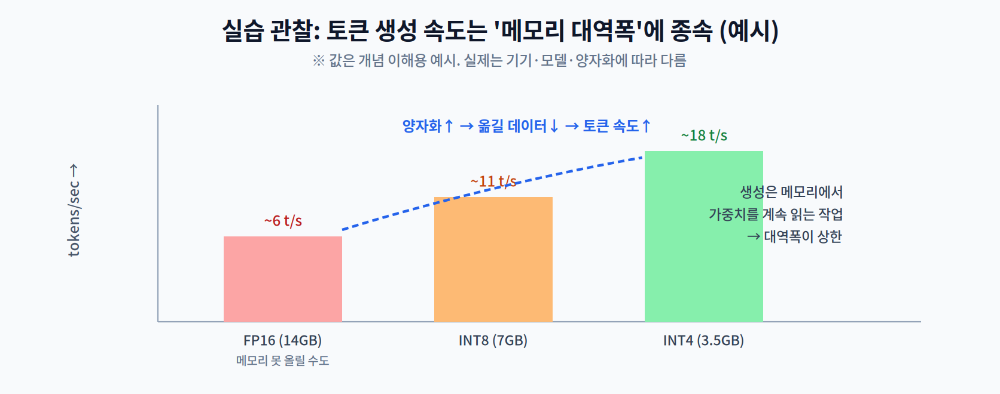

# 11주차 3교시. LLM 메모리·속도 추정

**실습 목표** — On-Device LLM의 두 병목인 **모델 메모리**와 **KV Cache 메모리**를 직접 계산하고, 토큰 생성 속도가 왜 **메모리 대역폭**에 종속되는지 수치로 확인한다. 무거운 LLM 없이 순수 파이썬으로 원리를 체감한다.

> 준비물: 파이썬만 있으면 된다(라이브러리 불필요). 실제 sLLM을 돌려보고 싶으면 `llama.cpp`로 4비트 모델을 별도 구동(선택).

---

## 3.1 모델·KV Cache 메모리 추정 (20분)

먼저 정밀도(비트)에 따른 **모델 가중치 메모리**와, 문맥 길이에 따른 **KV Cache 메모리**를 계산한다.

```python
def model_mem_gb(params_billion, bits):
    # 파라미터 수 × (비트/8) 바이트
    return params_billion * 1e9 * (bits / 8) / 1e9

def kv_cache_gb(layers, hidden, seq_len, bytes_per=2, batch=1):
    # 2 = Key와 Value 두 벌, 저장은 보통 FP16(2바이트)
    return 2 * layers * hidden * seq_len * bytes_per * batch / 1e9

print("[모델 가중치 메모리 — 7B 기준]")
for bits in [32, 16, 8, 4]:
    print(f"  {bits:>2}-bit : {model_mem_gb(7, bits):5.1f} GB")

print("\n[KV Cache — 32층, hidden=4096, FP16]")
for seq in [512, 2048, 8192]:
    print(f"  seq={seq:>4} : {kv_cache_gb(32, 4096, seq):.2f} GB")
```

예상 출력(개략): 7B는 FP16 14GB → INT4 **3.5GB**(1/4~1/8), KV Cache는 문맥이 길수록 선형 증가.

> 관찰 포인트: "모델 메모리"와 "KV Cache 메모리"는 **다른 예산**이다. 모델을 4비트로 줄여 올렸어도, 문맥이 아주 길면 KV Cache가 RAM을 잠식한다.

---

## 3.2 토큰 생성 속도 관찰 (20분)

생성은 **토큰 하나를 만들 때마다 모델의 모든 가중치를 메모리에서 한 번 읽는** 작업에 가깝다(메모리-바운드). 그래서 속도는 대략 **메모리 대역폭 ÷ 모델 크기**로 근사된다.

```python
def tokens_per_sec(model_gb, bandwidth_gbps):
    # 메모리-바운드 근사: 초당 대역폭으로 모델을 몇 번 읽을 수 있나
    return bandwidth_gbps / model_gb

BW = 50   # 예: 노트북 메모리 대역폭 ~50 GB/s (기기마다 다름)
print(f"[토큰 생성 속도 근사 @ {BW} GB/s]")
for bits, gb in [(16, 14.0), (8, 7.0), (4, 3.5)]:
    print(f"  {bits:>2}-bit ({gb:>4} GB): ~{tokens_per_sec(gb, BW):4.1f} tokens/sec")
```



관찰의 핵심:

1. 양자화로 모델이 작아지면 **읽을 데이터가 줄어** 토큰 속도가 오른다(그래서 4비트가 빠르다).
2. 속도의 상한은 **연산 능력이 아니라 메모리 대역폭**이다 — 2주차 Memory Wall이 LLM 생성에서 극명하게 나타난다.
3. 그래서 같은 모델도 대역폭이 높은 기기(예: 통합 메모리 노트북)에서 더 빠르다.

> 관찰 포인트: `BW`(대역폭)와 `gb`(모델 크기)를 본인 기기 값으로 바꿔 보라. tokens/sec가 두 값의 비율로 근사됨을 확인하면, "왜 4비트가 빠른가"를 시스템 관점에서 이해하게 된다. (주의: 이 값은 **이론적 상한**이다. 실제로는 KV Cache 읽기 트래픽·오버헤드로 대략 50~80% 수준에 그친다. KV 공식도 표준 멀티헤드 기준이며, GQA 같은 기법은 캐시를 더 줄인다.)

---

## 3.3 과제 (10분 안내)

1. **메모리 예산표** — 3B·7B·13B 모델에 대해 FP16/INT8/INT4 메모리를 계산하고, 본인 기기 RAM(예: 16GB)에 올릴 수 있는 조합을 표시한다.
2. **KV Cache 실험** — 문맥 길이를 512→8192로 늘리며 KV Cache를 계산하고, 언제 KV Cache가 모델 메모리에 필적하게 되는지 논한다.
3. **속도 해석** — 같은 4비트 모델이 대역폭 25GB/s와 100GB/s 기기에서 각각 몇 tokens/sec인지 계산하고, 그 차이를 Memory Wall로 설명한다.
4. **다음 주 예습** — 12주차(하드웨어 가속기 프로그래밍)에서는 이 모델들을 실제 하드웨어에서 최대 성능으로 돌리는 컴파일러·SDK를 다룬다. TensorRT가 무엇을 하는지 미리 찾아온다.

> 교수님을 위한 Tip: `llama.cpp`로 4비트 sLLM을 실제 구동해 tokens/sec를 보여주면 최고의 데모다. 여의치 않으면 위 근사 계산만으로도 "메모리 대역폭이 토큰 속도를 좌우한다"는 핵심을 충분히 전달할 수 있다.

---

### 3교시 정리
- 모델 메모리와 KV Cache 메모리를 계산해 On-Device LLM의 두 예산을 구분했다.
- 토큰 생성 속도가 메모리 대역폭에 종속됨을 수치로 확인했다(양자화가 빠른 이유).
- 다음 주부터는 이 모델들을 실제 하드웨어에서 최적 실행하는 가속기 프로그래밍으로 넘어간다.
