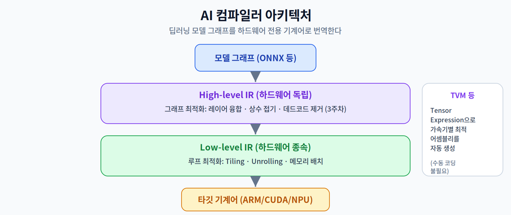
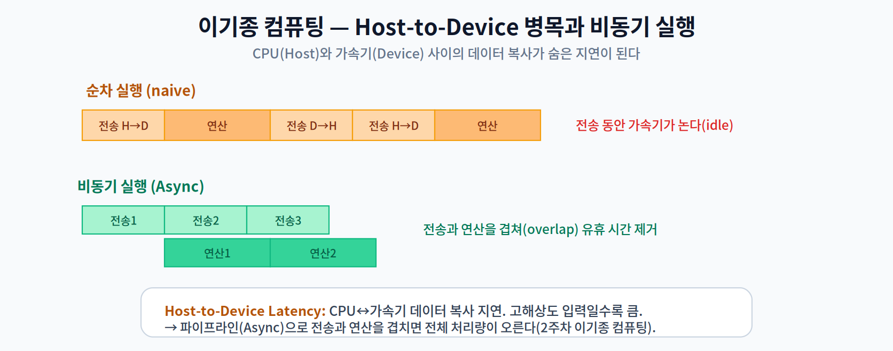
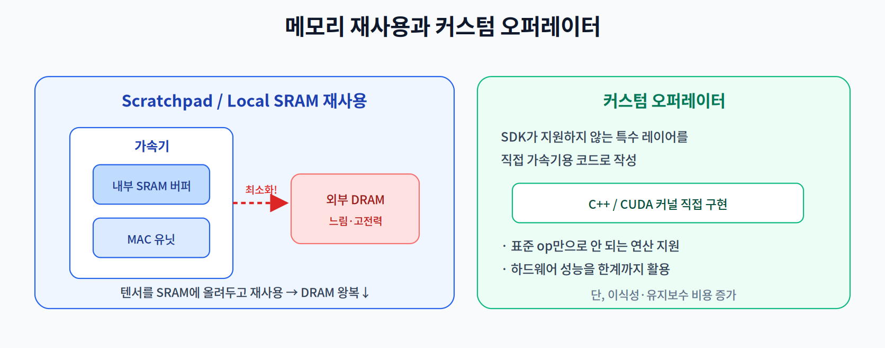

# 12주차 1교시. 컴파일러 툴체인과 하드웨어 매핑

**강의 목표** — 고수준 딥러닝 모델이 하드웨어 전용 기계어로 번역되는 컴파일러 아키텍처를 이해하고, 가속기 백엔드의 구조를 파악한다.

지금까지 배운 최적화 모델(경량화·양자화)을 **실제 하드웨어에서 최대 성능으로 돌리는 것**이 12주차의 주제다. 3주차에서 본 그래프 최적화가 여기서 본격적인 **AI 컴파일러**로 심화되고, 2주차의 이기종 컴퓨팅이 실무 프로그래밍으로 종합된다.

---

## 1.1 AI 컴파일러 아키텍처 (20분)

**AI 컴파일러**는 딥러닝 모델 그래프를 특정 하드웨어의 기계어로 번역하는 시스템 소프트웨어다. 일반 컴파일러처럼 여러 단계의 **중간 표현(IR, Intermediate Representation)** 을 거친다.

- **High-level IR (하드웨어 독립)** — 어떤 하드웨어에서도 유효한 **그래프 수준 최적화**를 수행한다. 3주차에서 배운 레이어 융합(Operator Fusion), 상수 접기(Constant Folding), 데드코드 제거가 여기에 속한다.
- **Low-level IR (하드웨어 종속)** — 특정 하드웨어에 맞춘 **루프 수준 최적화**를 한다. 루프 타일링(Loop Tiling), 언롤링(Unrolling), 메모리 배치 등 타깃 아키텍처의 특성을 반영한다.
- **TVM과 Tensor Expression** — TVM은 수동 코딩 없이 **가속기별 최적 어셈블리를 자동 생성**한다. 연산을 수학적 표현(Tensor Expression)으로 기술하면, 컴파일러가 타깃에 맞는 구현을 탐색·생성한다.

즉 컴파일러는 "하드웨어 독립 최적화 → 하드웨어 종속 최적화 → 기계어 생성"의 계단을 내려가며 모델을 특정 칩에 맞춰간다.

> 한 줄 정리: AI 컴파일러는 High-level IR(그래프 최적화)에서 Low-level IR(루프·메모리 최적화)로 낮추며 모델을 타깃 하드웨어 기계어로 번역한다.

---

## 1.2 이기종 컴퓨팅과 런타임 제어 (20분)

2주차에서 CPU·GPU·NPU가 협력하는 이기종 컴퓨팅을 배웠다. 실무에서는 이들 사이의 **데이터 이동**이 숨은 병목이 된다.

- **Host-to-Device 병목** — CPU(Host)와 가속기(Device)는 메모리가 분리된 경우가 많아, 입력을 가속기 메모리로 복사(H→D)하고 결과를 되가져오는(D→H) 비용이 든다. 고해상도 이미지처럼 데이터가 크면 이 **복사 지연이 전체 성능을 좌우**한다(2주차 Memory Wall의 실무판).
- **비동기 실행(Async Execution)** — 전송과 연산을 순차로 하면 전송 동안 가속기가 논다. 이를 **파이프라인으로 겹쳐(overlap)**, 다음 데이터를 전송하는 동안 현재 데이터를 연산하면 유휴 시간이 사라진다.

> 한 줄 정리: 이기종 컴퓨팅의 실무 핵심은 Host-to-Device 복사 비용을 줄이고, 비동기 실행으로 전송과 연산을 겹치는 것이다.

---

## 1.3 메모리 재사용과 커스텀 오퍼레이터 (15분)

- **Scratchpad / Local SRAM 재사용** — 가속기 내부의 빠른 SRAM 버퍼에 텐서를 올려두고 최대한 재사용해, 느리고 전력이 큰 외부 DRAM 왕복을 줄인다(2주차 Tiling·메모리 계층의 실무판).
- **커스텀 오퍼레이터(Custom Operator)** — 제조사 SDK가 지원하지 않는 특수 레이어를, 가속기용 C++/CUDA 코드로 **직접 작성**한다. 하드웨어 성능을 한계까지 끌어낼 수 있지만, 이식성과 유지보수 비용이 늘어난다.

> 교수님을 위한 Tip: "왜 같은 연산을 굳이 직접 커널로 짜야 할 때가 있을까?"를 물어라. 표준 op 조합으로는 표현 못 하거나, 조합이 비효율적이어서 융합된 전용 커널이 훨씬 빠른 경우가 있음을 짚으면 커스텀 오퍼레이터의 존재 이유가 명확해진다.

---

### 1교시 복습 질문
1. High-level IR과 Low-level IR이 각각 담당하는 최적화의 차이는?
2. Host-to-Device 병목이 발생하는 이유와, 비동기 실행이 이를 완화하는 원리는?
3. Scratchpad/SRAM 재사용이 성능·전력에 유리한 이유를 2주차 개념으로 설명하라.
