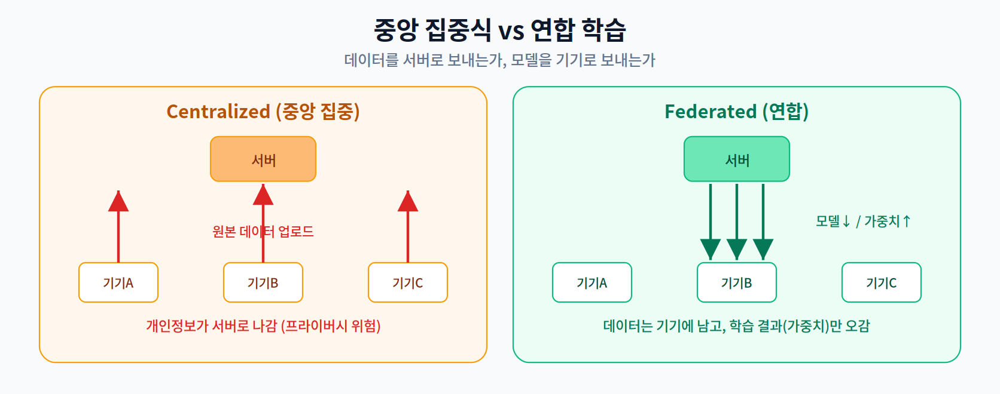
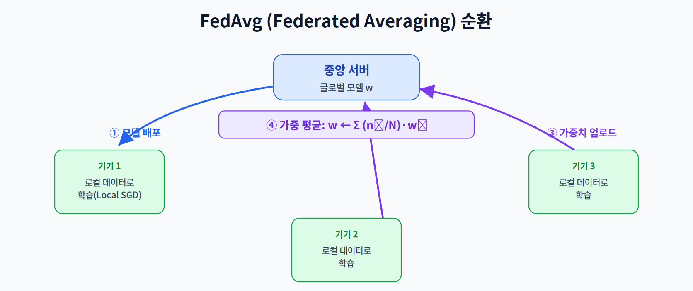
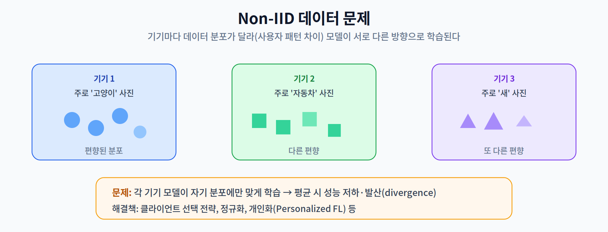

# 12주차 1교시. 연합 학습의 메커니즘과 통신 최적화

**강의 목표** — 중앙 집중식 학습의 프라이버시 한계를 극복하는 연합 학습의 분산 알고리즘을 이해한다.

지금까지의 온디바이스 AI는 대부분 **추론(Inference)** 에 집중했다. 12주차는 한 걸음 더 나아가, **기기 위에서 학습(Training)** 하되 프라이버시를 지키는 **연합 학습(Federated Learning, FL)** 을 다룬다. 온디바이스 AI의 종착지에 해당하는 주제다.

---

## 1.1 왜 연합 학습인가 (15분)

기존의 AI 학습은 데이터를 한곳(서버)에 모아서 했다. 그러나 이 방식은 근본적 한계가 있다.

- **규제와 데이터 주권** — GDPR, 마이데이터 등 개인정보 보호 규제가 강해지면서, 민감한 데이터(사진·음성·건강)를 서버로 보내는 것 자체가 위험하고 때로 불법이다.
- **연합 학습의 아이디어** — 데이터를 서버로 보내는 대신, **모델을 기기로 보낸다**. 각 기기가 자기 데이터로 학습하고, **학습 결과(가중치)만** 서버로 보낸다. 원본 데이터는 절대 기기를 떠나지 않는다.

이로써 1주차의 4대 동인 중 **Privacy**가 추론을 넘어 **학습 단계까지** 확장된다.

> 한 줄 정리: 연합 학습은 "데이터를 모으는" 대신 "모델을 보내고 결과만 취합"해, 데이터를 기기에 둔 채 학습한다.

---

## 1.2 핵심 알고리즘: FedAvg (25분)

연합 학습의 표준 알고리즘이 **FedAvg (Federated Averaging)** 다.

한 라운드는 네 단계로 돈다.

1. **배포** — 서버가 현재 글로벌 모델 $w$ 를 참여 기기들에 보낸다.
2. **로컬 학습** — 각 기기(Client) $k$ 가 자기 데이터로 몇 스텝 학습한다(Local SGD) → $w_k$.
3. **업로드** — 각 기기가 갱신된 $w_k$ 를 서버로 보낸다(원본 데이터는 안 보냄).
4. **가중 평균** — 서버가 데이터 양에 비례해 평균한다:

$$w \leftarrow \sum_{k} \frac{n_k}{N}\, w_k$$

여기서 $n_k$ 는 기기 $k$ 의 데이터 수, $N$ 은 전체 데이터 수다. 데이터가 많은 기기의 가중치를 더 반영한다.

**Non-IID 문제** — 현실에서 기기마다 데이터 분포가 **다르다**(Non-IID; IID(독립 동일 분포)가 아님). 어떤 폰엔 고양이 사진만, 어떤 폰엔 자동차 사진만 있는 식이다.

각 기기가 자기 분포에만 맞게 학습하면, 이를 평균할 때 모델이 엉뚱한 방향으로 가거나 **발산(divergence)** 할 수 있다. 이것이 FL의 대표적 난제이며, 클라이언트 선택·정규화·개인화(Personalized FL) 등으로 완화한다.

> 한 줄 정리: FedAvg는 로컬 학습 결과를 데이터 크기로 가중 평균하며, Non-IID 분포가 핵심 난제다.

---

## 1.3 통신 오버헤드와 효율화 (15분)

수백~수만 대의 기기가 모델 파라미터를 서버와 주고받으면, **통신 자체가 병목**이 된다. 특히 업링크(기기→서버) 대역폭이 제한적이다.

- **Gradient 압축·희소화(Sparsification)** — 가중치/그래디언트를 양자화하거나(5주차), 큰 값만 골라 보내 통신량을 줄인다.
- **클라이언트 선택(Client Selection)** — 매 라운드 모든 기기가 아니라, 일부만 선택해 참여시켜 통신·연산 부담을 조절한다.

> 교수님을 위한 Tip: "스마트폰 자동완성 키보드(구글 Gboard 등)가 어떻게 내 문장을 서버로 안 보내면서도 전 세계 사용자로부터 똑똑해지는가?"를 예로 들면, 연합 학습의 실용적 가치를 학생들이 즉시 이해한다.

---

### 1교시 복습 질문
1. 연합 학습이 중앙 집중식과 다른 결정적 지점(무엇이 오가는가)은?
2. FedAvg의 가중 평균에서 $n_k/N$ 가중치를 쓰는 이유는?
3. Non-IID가 왜 문제이며, 어떻게 완화하는가?
