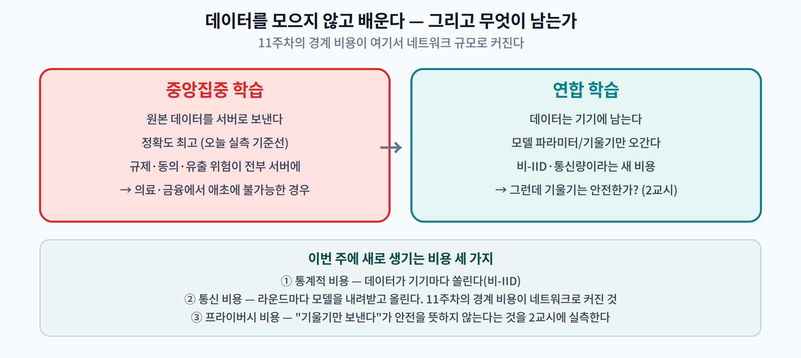
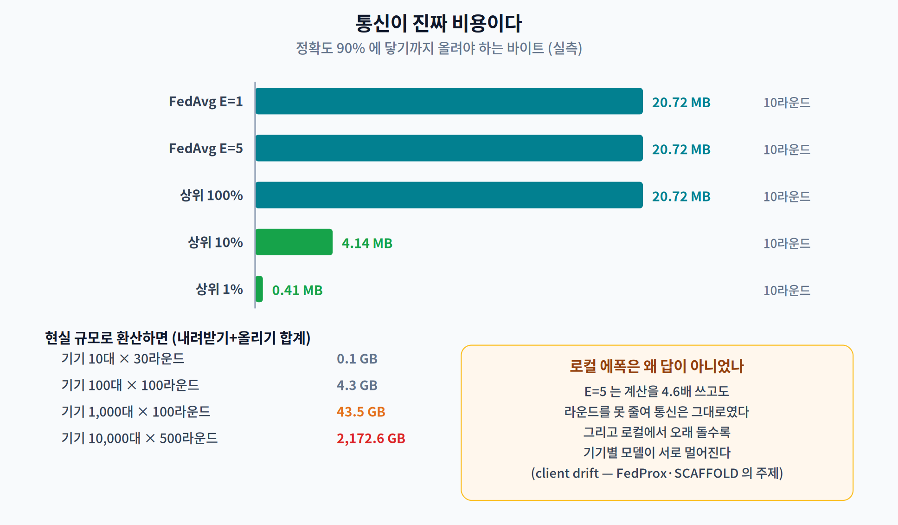

# 12주차 1교시. 왜 데이터를 모으지 않는가

> **오늘의 질문** — 11주차까지 우리는 모델을 기기 **안에서** 어떻게 돌릴지 물었다. 그런데 그 모델은 애초에 어떻게 학습됐나? 데이터를 서버로 모아서다. **병원 100곳의 환자 영상을 한 서버에 모을 수 있는가?** 모을 수 없다면, 모으지 않고 배우는 방법이 필요하다. 그 방법이 무엇을 해결하고 **무엇을 새로 만드는지**가 오늘의 주제다.

---

## 1.1 데이터를 모으지 않고 배운다 (12분)

### 문제는 성능이 아니라 애초에 불가능하다는 것

지금까지 우리가 다룬 제약은 전부 **기술적**이었다 — 메모리가 모자란다, 시간이 모자란다, 대역폭이 모자란다. 이번 주의 제약은 성격이 다르다.

- 병원 100곳의 환자 영상을 한 서버에 모으는 것은 **기술 문제가 아니라 법 문제**다.
- 스마트폰 10억 대의 키보드 입력을 수집하는 것은 **비용 문제가 아니라 동의 문제**다.
- 공장 여러 곳의 설비 로그를 합치는 것은 **네트워크 문제가 아니라 영업비밀 문제**다.

**연합 학습(federated learning)** 은 이 상황의 답으로 제안됐다. 데이터는 기기에 두고, **모델만 오간다.**

이 용어가 처음 등장한 논문은 McMahan 외의 2017년 AISTATS 논문이다. [1]

> *"우리는 이 접근을 **연합 학습(Federated Learning)** 이라 부른다. 학습 과제가 중앙 서버에 의해 조율되는, 참여 기기들(우리는 이들을 클라이언트라 부른다)의 느슨한 연합(federation)에 의해 풀리기 때문이다."*

### 11주차에서 무엇이 이어지는가

11주차에서 우리는 그래프가 두 장치로 쪼개질 때 **경계마다 비용이 든다**는 것을 $k \cdot c$ 로 셌다. 그 경계는 칩 안에 있었고, $c$ 는 마이크로초 단위였다.

**연합 학습은 같은 구조를 네트워크 규모로 확대한 것이다.** 경계는 이제 인터넷이고, $c$ 는 메가바이트 단위다. 그리고 여기에 앞선 어느 주차에도 없던 항이 하나 더 붙는다 — 그 경계를 넘는 것이 **텐서가 아니라 개인정보**라는 것.

> **한 줄 정리:** 연합 학습은 **모을 수 없는 데이터**를 위한 방법이다. 그 대가로 세 가지 새 비용이 생긴다 — 통계적 비용(비-IID), 통신 비용, 그리고 **프라이버시 비용**.

---

## 1.2 FedAvg 는 무엇을 얻고 무엇을 잃는가 (20분)

### 한 라운드에 무슨 일이 일어나는가

| 단계 | 하는 일 |
|---|---|
| ① | 서버가 현재 모델을 참여 기기에 **내려보낸다** |
| ② | 각 기기가 **자기 데이터로** 로컬 학습한다 ($E$ 에폭) |
| ③ | 모델 변화량 $\Delta$ 만 **올려 보낸다** |
| ④ | 서버가 **표본 수로 가중 평균**한다 |

$$w^{t+1} \leftarrow w^{t} + \sum_{k} \frac{n_k}{n} \Delta_k$$

코드로는 서른 줄이 안 된다. 3교시에서 직접 짠다.

**원본 데이터는 한 번도 기기를 떠나지 않는다.** 이 문장이 연합 학습의 전부이고, 2교시에서 우리가 겨냥할 표적이다.

### 얼마나 손해인가 — 실측

MNIST 8,000장, SmallCNN(54,314 파라미터), 클라이언트 10대, 30라운드.

먼저 **데이터를 다 모았을 때**를 기준선으로 잡는다.

| | 최종 정확도 |
|---|---:|
| **중앙집중** (데이터를 한곳에 모음) | **98.65%** |
| FedAvg · 거의 IID (디리클레 $\alpha$=100) | 97.95% |

**0.70%p.** 데이터를 한 번도 모으지 않고 이만큼 왔다. 연합 학습이 왜 실용적인 방법인지가 이 한 줄에 있다.

### 그런데 데이터가 쏠리면

현실의 기기는 IID 가 아니다. 어떤 사람은 고양이 사진만 찍고, 어떤 병원은 특정 질환만 본다. 이것을 **비-IID(non-IID)** 라 하고, 시뮬레이션에는 **디리클레 분할**을 쓴다 — $\alpha$ 가 작을수록 한 기기가 몇 개 클래스만 갖는다.

> **인용 주의.** 이 방식의 최초 출처는 **Yurochkin 외, ICML 2019**($\alpha$=0.5 고정)다. 흔히 인용되는 Hsu 외의 논문은 $\alpha$ 를 연속 범위로 확장한 것이고, **학회 게재 이력이 없는 프리프린트**다.

| 분할 | 기기당 보유 클래스 | 최종 정확도 | 중앙집중 대비 |
|---|:---:|---:|---:|
| 중앙집중 | 10 | **98.65%** | — |
| $\alpha$ = 100 | 10 | 97.95% | −0.70%p |
| $\alpha$ = 1.0 | 10 | 97.95% | −0.70%p |
| $\alpha$ = 0.5 | 9~10 | 97.40% | −1.25%p |
| $\alpha$ = 0.1 | **2~10** | 96.50% | −2.15%p |

**그런데 생각보다 안 무너진다.** $\alpha$=0.1 이면 어떤 기기는 숫자 두 개만 갖는데도 하락이 2.15%p 다.

> **여기서 멈추고 물으십시오.** "비-IID 면 정확도가 55% 떨어진다"는 말을 들어 보셨을 겁니다. 우리 실측은 2.15%p 입니다. **누가 틀렸습니까?**

둘 다 맞다. 그 "55%"는 **KWS(음성 키워드) 데이터셋에서 기기마다 클래스를 하나만 준 극단적 분할, 작은 배치** 조건의 값이다. 같은 논문의 **MNIST 는 6.5~11.3%** 다. 그리고 그 논문은 **프리프린트**다.

**비-IID 의 피해는 과제 난이도와 분할 방식에 달려 있다.** MNIST 는 너무 쉬워서 잘 안 무너진다. 이것은 우리 실험의 실패가 아니라 **정보**다 — 여러분의 응용에서 비-IID 가 얼마나 아플지는 여러분 데이터로 재 봐야 안다.

### 더 세게 밀어 보면

FedAvg 논문 자신이 쓴 분할을 재현해 보자. 라벨로 정렬해 조각으로 자르고, 기기마다 몇 조각씩만 준다. 논문은 이것을 "**병리적(pathological) 비-IID 분할**"이라 부른다.

> *"비-IID — 먼저 데이터를 숫자 라벨로 정렬하고, 크기 300짜리 조각 200개로 나눈 뒤, 100개 클라이언트 각각에 2조각씩 할당한다. 이것은 **병리적인 비-IID 분할**이다. 대부분의 클라이언트가 숫자 두 개의 예시만 갖게 되기 때문이다."* — McMahan 외, AISTATS 2017, §3

| 분할 | 기기당 보유 클래스 | 최종 정확도 | 중앙집중 대비 |
|---|:---:|---:|---:|
| 디리클레 $\alpha$ = 0.1 | 2~10 | 96.50% | −2.15%p |
| 조각 2개 | **1~4** | 95.60% | **−3.05%p** |
| **조각 1개** | **1~3** | **91.60%** | **−7.05%p** |

**여기서야 무너진다.** 기기 하나가 사실상 숫자 한두 개만 보는 상태가 되자 하락이 **7.05%p** 로 커졌다. 디리클레 $\alpha$=0.1(−2.15%p)의 세 배가 넘는다.

**같은 "비-IID" 라는 말이 −2.15%p 도 되고 −7.05%p 도 된다.** 그래서 논문을 읽을 때 반드시 확인해야 하는 것이 **분할 방식**이다. 우리 실측(−7.05%p)은 문헌이 MNIST 에 대해 보고하는 6.5~11.3% 범위 안에 정확히 들어온다.

> **한 줄 정리:** 연합 학습의 통계적 대가는 **과제에 따라 다르다.** MNIST 는 2%p, 극단적 분할은 그보다 크고, 문헌의 "55%"는 특정 데이터셋·특정 분할의 값이다. **조건 없이 인용하면 안 된다.**

---

## 1.3 통신이 진짜 비용이다 (18분)

### 라운드마다 얼마가 오가나

모델이 54,314 파라미터 × 4바이트 = **212.2 KB** 다. 라운드마다 각 기기가 내려받고 올리므로

$$\text{라운드당 통신} = 2 \times 212.2\,\text{KB} \times (\text{참여 기기 수})$$

10대 × 30라운드면 업로드만 **62.16 MB** 다. 작아 보인다. 그런데 현실 규모로 가면

| 규모 | 총 통신량 (내려받기+올리기) |
|---|---:|
| 기기 10대 × 30라운드 | 0.13 GB |
| 기기 100대 × 100라운드 | 4.34 GB |
| 기기 1,000대 × 100라운드 | **43.45 GB** |
| 기기 10,000대 × 500라운드 | **2,172.56 GB** |

**2.1 테라바이트.** 그리고 이건 212 KB 짜리 장난감 모델이다. 실제 온디바이스 모델이 10 MB 면 여기에 50배를 곱해야 한다.

> **10주차와 잇기** — 10주차에서 우리는 SmolLM2 가 538 MB 라는 것을 봤다. 그 모델을 연합 학습으로 미세조정한다면 라운드당 기기 하나가 **1 GB** 를 주고받는다. 이것이 온디바이스 LLM 의 연합 학습이 아직 어려운 이유다.

### 그래서 무엇을 줄이나

두 가지 손잡이가 있다. **라운드 수를 줄이거나, 라운드당 바이트를 줄이거나.**

**손잡이 1 — 로컬 에폭을 늘린다.** 기기가 로컬에서 더 오래 학습하면 라운드가 덜 필요할 것이다.

| | 최종 정확도 | 업로드 | 로컬 계산 |
|---|---:|---:|---:|
| $E$ = 1 | 97.40% | 62.16 MB | 453초 |
| $E$ = 5 | 97.80% | 62.16 MB | **2,076초** |

**계산이 4.6배 들었는데 정확도는 0.4%p 올랐고 통신은 그대로다.** 라운드 수를 고정한 채 $E$ 만 늘리면 계산만 늘어난다. $E$ 를 늘리는 것이 이득이려면 **라운드를 실제로 줄여야** 한다.

그리고 $E$ 를 무작정 늘릴 수도 없다. 기기별 모델이 서로 멀어지는 **client drift** 가 생기기 때문이다. FedProx 와 SCAFFOLD 가 푸는 문제가 정확히 이것이다. [2], [3]

> **인용 주의.** "FedProx 가 FedAvg 를 22% 앞선다"는 **탈락률 90%** 설정에서의 평균값이다. 조건 없이 쓰면 안 된다.

**손잡이 2 — 업데이트를 희소화한다.** 변화량이 큰 상위 $k$% 만 보낸다.

| | 최종 정확도 | 업로드 | 90% 도달 시 |
|---|---:|---:|---:|
| 전부 (100%) | 97.40% | 62.16 MB | 20.72 MB |
| 상위 10% | 97.05% | 12.43 MB | 4.14 MB |
| **상위 1%** | **95.95%** | **1.24 MB** | **0.41 MB** |

**50배 적은 바이트로 같은 라운드에 90% 에 닿았다.** 최종 정확도는 1.45%p 손해다.

> 이것이 이번 주의 통신 이야기다. 그리고 **11주차의 구조와 정확히 같다** — 그때는 왕복 횟수 $k$ 를 줄였고, 지금은 라운드당 바이트를 줄인다. 둘 다 "경계를 넘는 양"의 문제다.

### FedAvg 논문의 "10~100배"는 무슨 뜻인가

FedAvg 논문 초록은 "동기식 SGD 대비 통신 라운드 **10~100배** 감소"를 말한다. 이 숫자가 그대로 인용되는 일이 많은데, 논문 Table 2·3 을 열어 보면 **조건에 따라 극단적으로 갈린다.**

| 조건 | 실제 값 |
|---|---:|
| MNIST CNN · **IID** · 99% 목표 | 34.8배 |
| MNIST CNN · **병리적 비-IID** · 99% 목표 | **최고 2.8배** (일부 설정은 **0.5배 — 오히려 느림**) |
| Shakespeare LSTM · 비-IID | 95.3배 |
| CIFAR-10 · 64.3배 | **FedSGD 가 아니라 중앙집중 SGD 대비**. FedSGD 대비는 **4.8배**. 그리고 이 실험은 **IID 전용** |

> **주장하지 말 것:** "FedAvg 는 비-IID 환경에서 통신을 10~100배 줄인다." 논문이 뒷받침하지 않는다.

> **한 줄 정리:** 통신은 라운드 수 × 라운드당 바이트다. **희소화가 50배를 줬고**, 로컬 에폭 늘리기는 라운드를 실제로 줄일 때만 이득이다. 그리고 문헌의 "10~100배"는 **IID 조건의 값**이다.

---

### 1교시 정리
- 연합 학습은 **모을 수 없는 데이터**를 위한 방법이다. 용어의 출처는 McMahan 외, AISTATS 2017 이다.
- 통계적 대가는 실측 **0.70%p**(거의 IID) ~ **2.15%p**($\alpha$=0.1) ~ **7.05%p**(기기당 조각 1개). **같은 "비-IID" 가 세 배 넘게 차이 난다** — 문헌도 MNIST 6.5~11.3%, KWS 54.5% 로 과제·분할마다 다르다.
- 디리클레 분할의 최초 출처는 **Yurochkin 외, ICML 2019** 다.
- 통신은 기기 10,000대 × 500라운드에서 **2.1 TB** 가 된다. 그것도 212 KB 짜리 모델로.
- 희소화(상위 1%)가 **50배**를 줄였다. 정확도 대가는 1.45%p.
- 로컬 에폭을 늘리면 **계산이 4.6배** 들고 라운드를 줄이지 않으면 통신은 그대로다.
- FedAvg 논문의 "10~100배"는 **IID 조건**의 값이고, 병리적 비-IID 에서는 최고 2.8배·일부는 0.5배다.

### 오늘의 용어
- **연합 학습 (federated learning)** — 데이터를 모으지 않고 모델만 주고받으며 학습하는 방식 [1].
- **FedAvg** — 로컬 학습 후 서버가 표본 수로 가중 평균하는 기본 알고리즘.
- **비-IID (non-IID)** — 기기마다 데이터 분포가 다른 상태. 디리클레 $\alpha$ 로 정도를 조절한다.
- **client drift** — 로컬 학습이 길어질수록 기기별 모델이 서로 멀어지는 현상. FedProx·SCAFFOLD 가 다룬다.
- **cross-device / cross-silo** — 기기 수십억 규모의 stateless 클라이언트 / 기관 2~100곳의 stateful 클라이언트 [4].
- **희소화 (sparsification)** — 업데이트의 일부만 전송해 통신을 줄이는 기법.

### 더 읽어보기
- [1] H. B. McMahan, E. Moore, D. Ramage, S. Hampson, and B. Agüera y Arcas, "Communication-efficient learning of deep networks from decentralized data," in *Proc. AISTATS*, PMLR vol. 54, 2017, pp. 1273–1282. — **Table 2·3 을 직접 열어 볼 것. 초록의 배수와 표의 배수가 다르다.**
- [2] T. Li, A. K. Sahu, M. Zaheer, M. Sanjabi, A. Talwalkar, and V. Smith, "Federated optimization in heterogeneous networks," in *Proc. MLSys*, 2020.
- [3] S. P. Karimireddy *et al.*, "SCAFFOLD: Stochastic controlled averaging for federated learning," in *Proc. ICML*, PMLR vol. 119, 2020, pp. 5132–5143.
- [4] P. Kairouz *et al.*, "Advances and open problems in federated learning," *Found. Trends Mach. Learn.*, vol. 14, no. 1–2, pp. 1–210, 2021. — **정식 출판된 서베이다. Table 1 의 cross-device/cross-silo 비교를 볼 것.**
- [5] M. Yurochkin *et al.*, "Bayesian nonparametric federated learning of neural networks," in *Proc. ICML*, 2019. — **디리클레 분할의 최초 출처.**
- [6] A. Hard *et al.*, "Federated learning for mobile keyboard prediction," *arXiv:1811.03604*, 2018. — **프리프린트다.** Gboard 실배치 수치(1,500만 클라이언트·3,000 라운드·4~5일)의 출처.

### 교수님을 위한 Tip
**1.1 은 기술 문제가 아니라는 것부터 세우십시오.** "메모리가 모자라면 모델을 줄이면 됩니다. 그런데 법이 막으면 어떻게 합니까?" 이 질문이 8~11주차와 12주차를 가르는 선입니다.

**1.2 의 "55%" 대목은 반드시 학생에게 물으십시오.** 실측 2.15%p 를 보여 준 다음 "여러분이 들어 본 숫자는 얼마입니까?"라고 하시면 대부분 훨씬 큰 값을 말합니다. 그때 **"둘 다 맞습니다 — 조건이 다릅니다"** 로 받으시면, 이 과목이 학기 내내 해 온 훈련이 한 번 더 확인됩니다.

**1.3 의 2.1 TB 는 칠판에 쓰십시오.** 그리고 "우리 모델은 212 KB 입니다. 여러분 모델은 몇 MB 입니까?"라고 물으시면 됩니다.

**1교시는 여기서 끝내되, 마지막 한 문장을 남기십시오** — *"원본 데이터는 한 번도 기기를 떠나지 않았습니다. 그러면 안전한 걸까요?"* 2교시가 그 답입니다.
