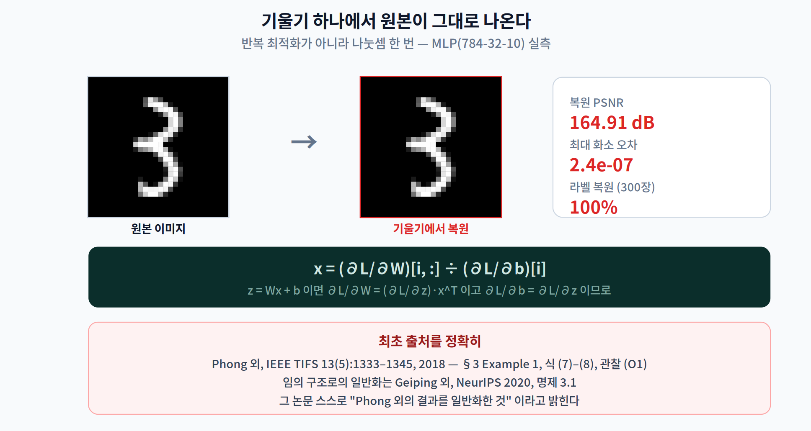
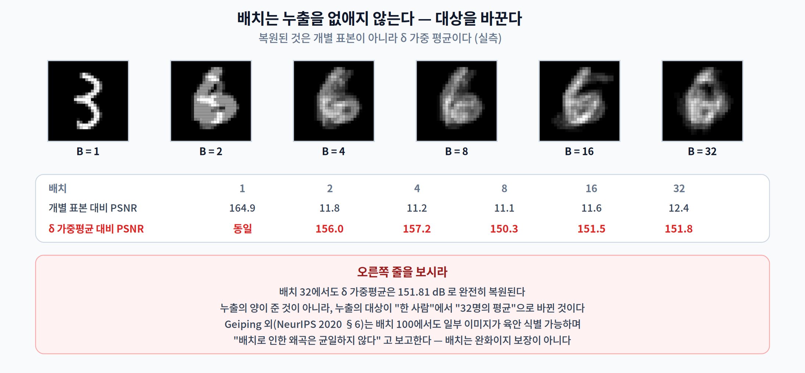
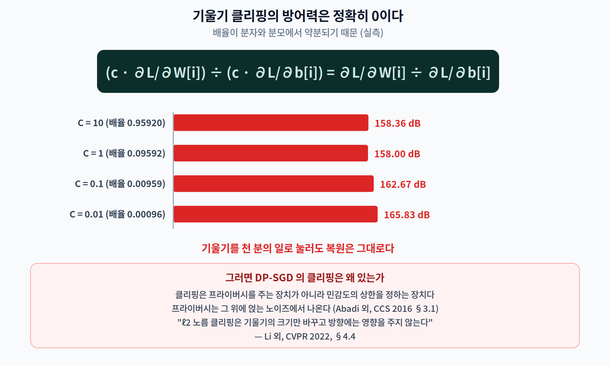
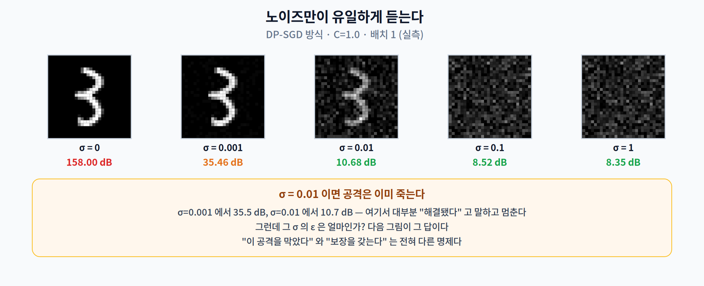
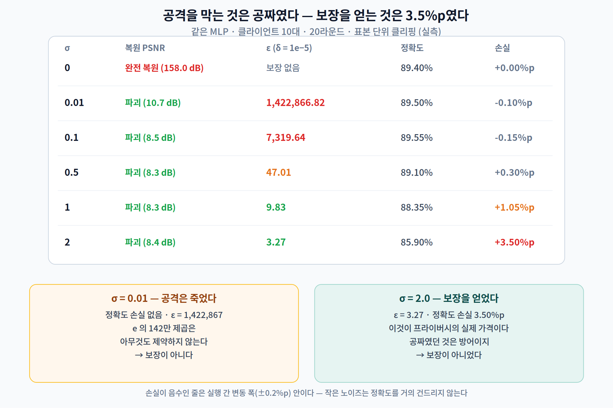
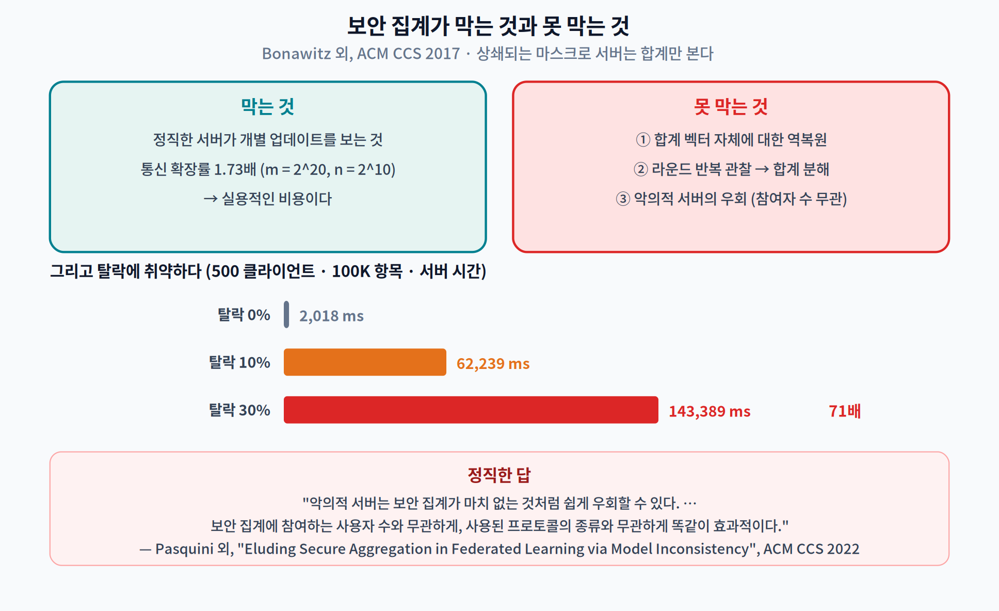

# 12주차 2교시. 무엇이 새어 나가는가

> **오늘의 질문** — 1교시에서 우리는 데이터 대신 **기울기**를 보냈다. 그 문장을 다들 "그러니까 안전하다"로 읽는다. 정말인가? 이번 시간에는 그 기울기를 받아서 **원본 이미지를 되돌려 놓는다.** 반복 최적화가 아니라 **나눗셈 한 번**이다.

---

## 2.1 기울기 하나에서 이미지를 꺼낸다 (16분)

### 먼저 종이 위에서

입력 $x$ 를 받는 선형층 하나를 생각하자.

$$z = Wx + b$$

역전파가 계산하는 두 기울기를 나란히 써 보면 이렇게 된다.

$$\frac{\partial L}{\partial W} = \frac{\partial L}{\partial z}\, x^{\top}, \qquad \frac{\partial L}{\partial b} = \frac{\partial L}{\partial z}$$

가중치 기울기는 **"무언가 × $x$"** 이고, 편향 기울기는 **바로 그 "무언가"** 다. 그러면 나누면 된다.

$$\boxed{\;x = \frac{\partial L / \partial W[i, :]}{\partial L / \partial b[i]}\;}$$

**최적화가 아니다. 추정이 아니다. 나눗셈이다.**

이 관찰의 최초 출처는 Phong 외의 2018년 논문이다. [1] 논문은 이것을 관찰 (O1) 로 적어 놓았다.

> *"$\eta_k / \eta = x_k$ 임을 관찰하라. 따라서 $\eta_k$ 와 $\eta$ 가 클라우드 서버에 공유되면 **$x_k$ 는 완전히 누출된다.**"*
> — Phong 외, *IEEE Trans. Inf. Forensics Security*, 13(5), 2018, §3 식 (7)–(8) 및 관찰 (O1)

임의 구조·임의 손실함수로의 일반화는 Geiping 외의 NeurIPS 2020 논문 **명제 3.1** 이다. [2] 그 논문은 스스로를 "Phong 외 Example 3 의 일반화"라고 밝히고 있다.

> **인용 주의.** 이 결과를 Geiping·Fowl·Boenisch 에 **최초 귀속시키면 틀린다.** Fowl 외의 "Robbing the Fed" 나 Boenisch 외의 trap weights 는 **악의적 서버가 모델을 조작하는 능동 공격**으로, 별개의 기여다.

### 실제로 해 본다

MLP(784 → 32 → 10), 파라미터 25,450개. MNIST 이미지 한 장의 기울기를 계산하고, 위 나눗셈을 한 번 한다.

```python
g = torch.autograd.grad(F.cross_entropy(model(x), y), model.parameters())
i = int(g[1].abs().argmax())          # |dL/db| 가 가장 큰 행 — 수치적으로 가장 안정
x_hat = g[0][i] / g[1][i]             # 이게 전부다
```



| | 값 |
|---|---:|
| 복원 PSNR | **164.91 dB** |
| 최대 화소 오차 | **2.4 × 10⁻⁷** |
| 라벨 복원 (300장) | **300 / 300 = 100%** |

**164.9 dB 는 "비슷하다"가 아니다. float32 의 표현 한계까지 같다는 뜻이다.** 화소 하나의 오차가 천만 분의 2.4다.

### 라벨은 왜 그렇게 쉽게 새는가

소프트맥스 교차엔트로피에서 마지막 층 편향의 기울기는 $\partial L/\partial b_L = p - \text{onehot}(y)$ 다. 확률 $p$ 는 전부 양수이므로, **정답 클래스 성분만 음수가 된다.** 음수인 자리를 찾으면 끝이다.

iDLG 가 이것을 정리했다. [3]

> *"비음수 활성 함수(ReLU, Sigmoid 등)를 쓰면 $\nabla W_L^i$ 와 $g_i$ 의 부호가 같다. 따라서 대응하는 $\nabla W_L^i$ 가 음수인 정답 라벨을 그냥 식별할 수 있다. … 이 규칙은 **모델 구조와 파라미터에 무관하며**, 임의로 초기화된 파라미터의 어떤 학습 단계에서도 성립한다."*

> **인용 주의 두 가지.** ① iDLG 는 **arXiv 프리프린트**(2001.02610)이고 학회 게재 이력이 없다. ② 이 규칙은 **배치 크기 1**, **교차엔트로피 + 원-핫 라벨** 조건에서 성립한다. "어떤 배치에서든 라벨이 샌다"고 말하면 틀린다.

> **한 줄 정리:** "데이터 대신 기울기를 보낸다"는 문장에서 **"대신"이 성립하지 않는다.** 선형층 하나만 있으면 기울기는 입력을 float32 정밀도로 담고 있다.

---

## 2.2 그러면 무엇이 방어가 되는가 (10분)

여기서 학생들이 즉시 내놓는 두 가지 답이 있다. 둘 다 실측해 보자.

### "배치를 키우면 되지 않나요"

배치 $B$ 에서는 $\partial L/\partial W = \sum_b \delta_b x_b^{\top}$ 이므로, 나눗셈이 돌려주는 것은 개별 표본이 아니라 **$\delta$ 가중 평균**이다.



| 배치 $B$ | **개별 표본** 대비 PSNR | **가중평균** 대비 PSNR |
|---:|---:|---:|
| 1 | **164.91 dB** | (동일) |
| 2 | 11.81 dB | **155.96 dB** |
| 4 | 11.18 dB | **157.18 dB** |
| 8 | 11.14 dB | **150.33 dB** |
| 16 | 11.55 dB | **151.51 dB** |
| 32 | 12.39 dB | **151.81 dB** |

**오른쪽 열을 보시라.** 배치 32에서도 복원은 **여전히 완벽하다.** 다만 복원되는 대상이 "한 사람의 이미지"에서 "32명의 가중 평균"으로 바뀌었을 뿐이다. **누출의 양이 준 것이 아니라 누출의 대상이 바뀐 것이다.**

그리고 문헌은 더 나쁜 소식을 준다. Geiping 외는 CIFAR-100 **배치 100** 의 평균 기울기에서도 일부 이미지가 육안으로 식별 가능하게 복원됨을 보이고, 이렇게 적는다. [2]

> *"배치로 인한 왜곡은 **균일하지 않다.** 모든 이미지가 똑같이 왜곡되어 거의 복원 불가능해질 것으로 기대할 수 있으나, 실제로는 어떤 이미지는 심하게 왜곡되고 어떤 이미지는 대상을 여전히 쉽게 알아볼 정도로만 왜곡된다."*

Huang 외의 정량 평가도 같은 결론이다 — 배치 32에서 평균 LPIPS 는 0.45로 나빠지지만 **최선 사례는 0.18로 여전히 인식 가능**하다. [4]

> **주장하지 말 것:** "배치를 키우면 개별 표본은 복원 불가능하다." 반증된 주장이다. 배치는 **완화이지 보장이 아니다.**

### "기울기를 클리핑하면 되지 않나요"

클리핑은 기울기 벡터 전체에 상수 $c = \min(1, C/\lVert g \rVert)$ 를 곱한다. 그런데 우리 식은 나눗셈이다.

$$\frac{c \cdot \partial L/\partial W[i,:]}{c \cdot \partial L/\partial b[i]} = \frac{\partial L/\partial W[i,:]}{\partial L/\partial b[i]}$$

**$c$ 가 약분된다.** 실측으로 확인해 보자.



| 클리핑 임계 $C$ | 실제 배율 $c$ | 복원 PSNR |
|---:|---:|---:|
| 10.0 | 0.959 | 158.36 dB |
| 1.0 | 0.0959 | 158.00 dB |
| 0.1 | 0.00959 | 162.67 dB |
| **0.01** | **0.00096** | **165.83 dB** |

기울기를 **천 분의 일로** 눌러도 복원은 그대로다. 오히려 미세하게 더 잘 나온다(수치적 우연이다).

이것도 문헌에 있다. Li 외는 CVPR 2022 에서 이렇게 적는다. [5]

> *"기울기 클리핑 연산이 IG 공격에 미치는 영향이 매우 작음을 발견했다. **ℓ2 노름으로 클리핑하는 것은 기울기의 크기만 바꾸고 각도 정보(즉 방향)에는 영향을 주지 않기 때문이다.**"*

그리고 DP-SGD 원논문에서 클리핑의 역할이 무엇인지 보면 이유가 분명해진다 — 클리핑은 **프라이버시를 주는 장치가 아니라 민감도의 상한을 정하는 장치**다. [6] 프라이버시는 그 위에 얹는 노이즈에서 나온다.

> **한 줄 정리:** 배치는 **누출의 대상**을 바꾸고, 클리핑은 **아무것도 바꾸지 않는다.** 남은 것은 노이즈뿐이다.

---

## 2.3 차등 프라이버시 — "막았다"와 "보장한다"는 다르다 (14분)

노이즈를 넣어 보자. DP-SGD 방식대로 클리핑한 뒤 $\mathcal{N}(0, \sigma^2 C^2)$ 를 더한다.



| $\sigma$ | 복원 PSNR |
|---:|---:|
| 0 | 158.00 dB |
| 0.001 | 35.46 dB |
| **0.01** | **10.68 dB** |
| 0.1 | 8.52 dB |
| 1.0 | 8.35 dB |

**$\sigma = 0.01$ 이면 공격은 이미 죽는다.** 아주 작은 노이즈다. 여기서 대부분의 사람이 "해결됐다"고 말하고 멈춘다.

### 그런데 ε 은 얼마인가

정확도와 $\varepsilon$ 을 같이 재 보자. 같은 MLP, 클라이언트 10대, 20라운드, $\delta = 10^{-5}$.

> **구현 주의 — 이 실험은 표본 단위 클리핑을 쓴다.** DP-SGD 는 **표본마다** 기울기를 잘라야 한다. 배치 기울기를 자르면 그것은 DP-SGD 가 아니고 형식적 보장도 없다. 원논문이 이 대비를 명시한다. [6]
> *"비프라이버시 목적의 SGD 에서는 보통 **평균을 낸 뒤에 클리핑해도 충분하지만**"* — 즉 DP 에서는 그러면 안 된다는 뜻이다. 우리는 `torch.func.vmap` 으로 표본별 기울기를 만들어 잘랐다.



| $\sigma$ | 복원 | **$\varepsilon$** ($\delta=10^{-5}$) | 정확도 | 손실 |
|---:|---|---:|---:|---:|
| 0 | **완전 복원** (158 dB) | 보장 없음 | 89.40% | — |
| **0.01** | 파괴 (10.7 dB) | **1,422,867** | 89.50% | **0.00%p** |
| 0.1 | 파괴 (8.5 dB) | **7,320** | 89.55% | 0.00%p |
| 0.5 | 파괴 (8.3 dB) | **47.0** | 89.10% | 0.30%p |
| 1.0 | 파괴 (8.4 dB) | **9.83** | 88.35% | 1.05%p |
| **2.0** | 파괴 (8.4 dB) | **3.27** | 85.90% | **3.50%p** |

**두 번째 줄과 마지막 줄을 나란히 보시라.**

> $\sigma = 0.01$ — 공격은 죽었고 정확도 손실은 **0** 이다. 그런데 $\varepsilon = 1{,}422{,}867$ 이다.
> $\sigma = 2.0$ — $\varepsilon = 3.27$ 로 내려왔고, 대가는 **3.50%p** 다.

$\varepsilon = 1.4$ 백만이 무슨 뜻인가. 차등 프라이버시의 정의는 두 인접 데이터셋에서 출력 확률의 비가 $e^{\varepsilon}$ 이하라는 것이다. $e^{1422867}$ 은 **아무것도 제약하지 않는다.** 그것은 보장이 아니라 보장의 형식만 갖춘 숫자다.

> **이번 주의 핵심 문장.** **"이 공격을 막았다"와 "보장을 갖는다"는 전혀 다른 명제다.** 전자는 특정 공격·특정 설정에 대한 경험적 관측이고, 후자는 임의의 적대자에 대한 최악의 경우 상한이다.

Kairouz 외의 서베이가 이 구분을 정면으로 적어 놓았다. [7]

> *"이런 특성들이 모든 학습 데이터를 중앙화하는 것에 비해 실질적인 프라이버시 개선을 제공할 수는 있지만, **이 기본 연합 학습 모델에는 여전히 형식적인 프라이버시 보장이 존재하지 않는다.**"*

> **한 줄 정리:** 공격을 막는 것은 **거의 공짜**였다($\sigma$=0.01, 손실 0). 보장을 얻는 것은 **3.5%p** 였다($\sigma$=2.0, $\varepsilon$=3.27). 둘을 같은 것으로 말하지 말자.

---

## 2.4 보안 집계 — 무엇을 막고 무엇을 못 막나 (6분)

"서버가 개별 업데이트를 못 보게 하면 되지 않나요?" 그것이 **보안 집계(secure aggregation)** 다. 클라이언트끼리 짝을 지어 서로 상쇄되는 마스크를 씌우면, 서버는 **합계만** 볼 수 있다. [8]

### 비용은 얼마인가

| 항목 | 클라이언트 | 서버 |
|---|---|---|
| 계산 | $O(n^2 + mn)$ | $O(mn^2)$ |
| 통신 | $O(n + m)$ | $O(n^2 + mn)$ |

통신 확장률은 $m = 2^{20}$, $n = 2^{10}$ 에서 **1.73배**, $n = 2^{14}$ 에서 3.62배로 실용적이다. 문제는 **탈락(dropout)** 이다. 100K 항목 벡터·500 클라이언트 기준 서버 시간이

| 탈락률 | 서버 시간 |
|---:|---:|
| 0% | 2,018 ms |
| 10% | **62,239 ms** |
| 30% | **143,389 ms** |

**탈락 30%면 서버 시간이 71배가 된다.** 탈락한 클라이언트마다 다른 모든 클라이언트의 짝 마스크를 벗겨 내야 하기 때문이다. 1주차부터 이어진 이야기가 여기서도 반복된다 — **비용은 평균이 아니라 최악에서 온다.**

### 그런데 이것이 역복원을 막는가



정직한 답은 **"부분적으로만"** 이다. 세 가지 이유가 있다.

1. **집계된 합계 벡터 자체가 공격 대상이다.** 보안 집계는 결과에 노이즈를 넣지 않는다. 참여자가 적으면 2.2 의 "가중 평균 복원"이 그대로 적용된다. [4]
2. **라운드를 반복 관찰하면 합계를 분해할 수 있다.** Lam 외는 참가자 행렬을 복원해 수천 명 규모에서 개별 업데이트를 되살렸다. [9]
3. **악의적 서버는 그냥 우회한다.** Pasquini 외는 사용자마다 **다른 모델을 배포하는** 것만으로 보안 집계를 무력화한다. [10]

> *"악의적 서버는 보안 집계가 마치 없는 것처럼 쉽게 우회할 수 있다. … 두 공격은 **보안 집계에 참여하는 사용자 수와 무관하게** 개별 학습 데이터에 대한 정보를 추론할 수 있으며 … **사용된 보안 집계 프로토콜의 종류와 무관하게 똑같이 효과적이다.**"*
> — Pasquini 외, ACM CCS 2022

> **인용 주의.** 이 논문의 정확한 제목은 *"Eluding Secure Aggregation in Federated Learning **via Model Inconsistency**"* 다. 그리고 Boenisch 외의 EuroS&P 2023 논문은 **보안 집계를 깬 논문이 아니다** — 서버가 가중치를 조작해 배치 100에서 ImageNet 데이터의 50% 이상을 복원하는 별개의 능동 공격이며, 저자들 스스로 보안 집계 우회는 Pasquini 에게 귀속시킨다.

> **한 줄 정리:** 보안 집계는 **정직한 서버가 개별 업데이트를 보는 것**을 막는다. 그 이상은 막지 못한다.

---

## 2.5 [논문 읽기 · 규제] 조건과 법 (4분)

### 이 분야 수치가 둔갑하는 방식

| 자주 도는 말 | 실제 |
|---|---|
| "FedAvg 는 통신을 10~100배 줄인다" | **조건이 붙는다.** MNIST CNN 은 IID 에서 34.8배지만 **병리적 비-IID 에서는 최고 2.8배**이고 일부 설정은 **0.5배 — 오히려 느리다**. CIFAR-10 의 64.3배는 FedSGD 가 아니라 **중앙집중 SGD 대비**이며(FedSGD 대비는 4.8배) 그 실험은 **IID 전용**이다 [11] |
| "비-IID 면 정확도가 55% 떨어진다" | KWS 데이터셋·클래스 1개 분할·작은 배치 조건의 값이다. **MNIST 는 6.5~11.3%** 다. 그리고 그 출처는 **프리프린트**다 |
| "디리클레 분할은 Hsu 외가 제안" | 최초는 **Yurochkin 외, ICML 2019**(α=0.5 고정). Hsu 외는 α 를 연속 범위로 확장했고 **프리프린트**다 |
| "DP-SGD 는 ε=2 에서 MNIST 97%" | 원논문은 **(2, 10⁻⁵) → 95%**, 97%는 **ε=8** 이다. 모델도 CNN 이 아니라 **DP-PCA(60차원)+은닉층 1000유닛 FFN** 이다 [6] |
| "Apple 은 ε=1~2 로 DP 를 쓴다" | 그것은 **1회 기부당** 값이다. 독립 분석은 macOS 10.12.3 의 **하루 허용 손실 합계가 16**이고 예산이 매일 갱신된다고 보고했다(프리프린트) |
| "iDLG 는 배치에서도 라벨을 복원" | **배치 1** 결과다 |
| "DLG 는 표준 ResNet 에서 동작" | 논문이 **ReLU 를 Sigmoid 로 바꾸고 stride 를 제거**했다고 밝힌다. 그리고 **배치 ≤ 8, 해상도 ≤ 64×64** 가 논문 자신이 적은 한계다 [12] |

### 그러면 법적으로는 어떤가

**GDPR** — 연합 학습을 썼다고 데이터가 익명이 되지는 않는다. EDPB 의견 28/2024(2024년 12월 18일 채택) ¶31 은 이렇게 판단한다. [13]

> *"AI 모델이 학습 데이터로부터 식별된 또는 식별 가능한 자연인에 관한 정보를 생성하도록 의도적으로 설계되지 않았더라도, **학습 데이터셋의 정보(개인정보 포함)가 모델의 파라미터에 '흡수(absorbed)'된 채로 남아 있을 수 있다.** … 합리적으로 사용될 가능성이 있는 수단으로 그러한 개인정보를 모델로부터 얻을 수 있다면, **그 모델은 익명이 아니라고 결론지을 수 있다.**"*

> **주의.** 이 의견서는 **연합 학습을 직접 다루지 않는다.** "EDPB 가 연합 학습에 대해 판단했다"고 말하면 안 된다.

**우리 「개인정보 보호법」** — 구조를 정확히 알아 두자.

| 구분 | 법적 지위 | 근거 |
|---|---|---|
| **가명정보** | **여전히 개인정보다.** 통계작성·과학적 연구·공익적 기록보존 목적에 한해 동의 없이 처리 가능 | 제2조 제1호 **다목**, 제28조의2 |
| **익명정보** | **법 적용에서 제외**된다 | 제58조의2 |

제58조의2 전문은 이렇다.

> *"이 법은 시간ㆍ비용ㆍ기술 등을 합리적으로 고려할 때 다른 정보를 사용하여도 더 이상 개인을 알아볼 수 없는 정보에는 적용하지 아니한다."*

**연합 학습의 모델 업데이트가 이 중 무엇인가?** 개인정보보호위원회의 확정된 유권해석이 없다. 다만 오늘 2.1 에서 우리가 직접 보였듯 **기울기에서 원본 입력이 해석적으로 복원된다.** 그러면 "다른 정보를 사용하여도 더 이상 개인을 알아볼 수 없는" 이라는 제58조의2 요건을 **연합 학습 그 자체만으로 충족한다고 보기는 어렵다.**

> **주장하지 말 것:** "연합 학습 업데이트는 가명정보다" / "익명정보다". 둘 다 근거 없는 단정이다. **"사안별로 재식별 가능성을 평가해야 하며 현재 확정된 유권해석은 없다"** 가 방어 가능한 유일한 서술이다.

> **한 줄 정리:** 이 분야에서 수치를 인용할 때는 **데이터셋·분할 방식·배치·기준선**을, 법을 말할 때는 **가명과 익명의 구분**을 반드시 함께 적어야 한다.

---

### 2교시 정리
- 선형층 기울기에서 입력이 **나눗셈 한 번**으로 나온다 — 실측 **PSNR 164.91 dB**, 최대 화소 오차 **2.4×10⁻⁷**. 최초 출처는 **Phong 외 (TIFS 2018) 관찰 (O1)** 이다.
- 라벨은 마지막 층 편향 기울기의 **부호**로 샌다 — 실측 **300/300 = 100%**.
- **배치는 누출을 없애지 않는다.** 배치 32에서도 가중평균은 **151.81 dB** 로 완전히 복원된다. 누출의 **대상**이 바뀔 뿐이다.
- **클리핑의 방어력은 정확히 0이다.** 배율이 나눗셈에서 약분된다 — $C$=0.01(배율 0.001)에서도 **165.83 dB**.
- **공격을 막는 것은 공짜였다** ($\sigma$=0.01, 손실 0). **보장을 얻는 것은 3.50%p** 였다($\sigma$=2.0, $\varepsilon$=3.27). $\sigma$=0.01 의 $\varepsilon$ 은 **1,422,867** — 보장이 아니다.
- 보안 집계는 **정직한 서버**만 막는다. 악의적 서버는 **참여자 수와 무관하게** 우회한다.
- 법적으로 **가명정보는 여전히 개인정보**이고, 법 적용이 배제되는 것은 **익명정보**뿐이다.

### 오늘의 용어
- **기울기 역전 (gradient inversion)** — 공유된 기울기로부터 학습 데이터를 복원하는 공격.
- **관찰 (O1)** — 선형층에서 $\partial L/\partial W[i,:] \big/ \partial L/\partial b[i] = x$ 라는 닫힌 형태의 복원식 [1].
- **표본 단위 클리핑 (per-example clipping)** — DP-SGD 의 필수 요건. 배치 기울기를 자르는 것은 DP-SGD 가 아니다.
- **$\varepsilon$ (프라이버시 예산)** — 인접 데이터셋에서 출력 확률의 비가 $e^{\varepsilon}$ 이하. **값이 크면 보장이 아니다.**
- **user-level DP** — 연합 학습에서 인접성은 "한 레코드"가 아니라 **"한 사용자의 모든 레코드"** 기준이다.
- **보안 집계 (secure aggregation)** — 상쇄되는 마스크로 서버가 합계만 보게 하는 프로토콜.
- **Local / Central / Distributed DP** — 클라이언트가 노이즈를 넣는가 / 신뢰받는 서버가 넣는가 / 작게 넣고 보안 집계로 합쳐 중앙 수준을 회복하는가.

### 함께 생각해 볼 문제
1. 2.2 에서 배치 32의 "가중 평균"이 151.81 dB 로 복원됐다. **그 가중치 $\delta_b$ 는 무엇에 의해 정해지는가?** 어떤 표본이 평균을 지배하게 되는가?
2. $\sigma$=0.01 은 우리 공격을 막았다. **다른 공격도 막을까?** 막지 못하는 공격의 예를 하나 설계해 보라.
3. **11주차와 잇기** — 11주차에서 우리는 파티션 경계마다 드는 비용을 $k \cdot c$ 로 셌다. 연합 학습에서 그 $c$ 는 네트워크다. 12주차의 통신량을 11주차의 왕복세와 같은 형태로 쓸 수 있는가?
4. 보안 집계의 탈락 30%에서 서버 시간이 71배가 됐다. **이것을 8주차의 "최악에서 오는 비용"과 비교**해 보라. 어떤 구조가 같은가?
5. 여러분 연구실 데이터로 연합 학습을 한다면, **가명정보와 익명정보 중 어느 쪽을 주장할 것인가?** 그 주장을 뒷받침하려면 무엇을 측정해야 하는가?

### 더 읽어보기
- [1] L. T. Phong, Y. Aono, T. Hayashi, L. Wang, and S. Moriai, "Privacy-preserving deep learning via additively homomorphic encryption," *IEEE Trans. Inf. Forensics Security*, vol. 13, no. 5, pp. 1333–1345, 2018. — **§3 Example 1, 식 (7)–(8), 관찰 (O1). 이 주차에서 가장 먼저 읽을 것.**
- [2] J. Geiping, H. Bauermeister, H. Dröge, and M. Moeller, "Inverting gradients — How easy is it to break privacy in federated learning?," in *Proc. NeurIPS*, 2020. — **명제 3.1 이 일반화. §6 의 "배치 왜곡은 균일하지 않다".**
- [3] B. Zhao, K. R. Mopuri, and H. Bilen, "iDLG: Improved deep leakage from gradients," *arXiv:2001.02610*, 2020. — **프리프린트다.**
- [4] Y. Huang *et al.*, "Evaluating gradient inversion attacks and defenses in federated learning," in *Proc. NeurIPS*, 2021.
- [5] Z. Li, J. Zhang, L. Liu, and J. Liu, "Auditing privacy defenses in federated learning via generative gradient leakage," in *Proc. IEEE/CVF CVPR*, 2022. — **§4.4 클리핑이 왜 안 통하는가.**
- [6] M. Abadi *et al.*, "Deep learning with differential privacy," in *Proc. ACM CCS*, 2016, pp. 308–318. — **§3.1 표본 단위 클리핑, §5.2 실제 ε·정확도.**
- [7] P. Kairouz *et al.*, "Advances and open problems in federated learning," *Found. Trends Mach. Learn.*, vol. 14, no. 1–2, pp. 1–210, 2021. — **정식 출판된 서베이다(프리프린트 아님). §4 를 볼 것.**
- [8] K. Bonawitz *et al.*, "Practical secure aggregation for privacy-preserving machine learning," in *Proc. ACM CCS*, 2017, pp. 1175–1191.
- [9] M. Lam, G.-Y. Wei, D. Brooks, V. J. Reddi, and M. Mitzenmacher, "Gradient disaggregation: Breaking privacy in federated learning by reconstructing the user participant matrix," in *Proc. ICML*, 2021.
- [10] D. Pasquini, D. Francati, and G. Ateniese, "Eluding secure aggregation in federated learning via model inconsistency," in *Proc. ACM CCS*, 2022.
- [11] H. B. McMahan *et al.*, "Communication-efficient learning of deep networks from decentralized data," in *Proc. AISTATS*, PMLR vol. 54, 2017, pp. 1273–1282. — **Table 2·3 을 직접 볼 것.**
- [12] L. Zhu, Z. Liu, and S. Han, "Deep leakage from gradients," in *Proc. NeurIPS*, 2019, pp. 14747–14756. — **§5.3 이 논문 자신의 한계.**
- [13] European Data Protection Board, "Opinion 28/2024 on certain data protection aspects related to the processing of personal data in the context of AI models," 2024. — **¶31, ¶43.**
- 「개인정보 보호법」 제2조, 제28조의2, 제58조의2. (국가법령정보센터)

### 교수님을 위한 Tip
**2.1 은 이번 학기 전체에서 학생 반응이 가장 큰 지점입니다.** 순서를 지켜 주십시오 — ① 먼저 칠판에 $\partial L/\partial W = \delta x^{\top}$, $\partial L/\partial b = \delta$ 두 줄만 쓰고 **"그러면 어떻게 하죠?"** 라고 물으십시오. 답이 나오면 ② 그때 복원 이미지를 여십시오. 학생이 스스로 나눗셈을 떠올린 뒤에 그림을 보면 효과가 완전히 다릅니다.

**2.2 의 두 반박은 반드시 학생에게서 나오게 하십시오.** "배치를 키우면?", "클리핑하면?" 은 거의 항상 나옵니다. 나오지 않으면 교수님이 대신 제기하시고 실측으로 답하십시오. 특히 **클리핑 표는 $C$=0.01 줄만 가리고** 보여 주다가 여는 것이 좋습니다.

**2.3 의 ε=1,422,867 은 칠판에 그대로 쓰십시오.** 그리고 "$e$ 의 142만 제곱이 무엇을 제약합니까?" 라고 물으십시오. 이 한 줄이 이번 주차 전체를 요약합니다.

**2.5 의 법 부분은 단정하지 마십시오.** 학생들이 "그래서 연합 학습 쓰면 합법인가요?"라고 물으면, **"가명이냐 익명이냐를 사안별로 입증해야 하고, 오늘 우리가 한 복원 실험이 바로 그 입증의 반대편 증거"** 라고 답하시는 것이 정확합니다.
