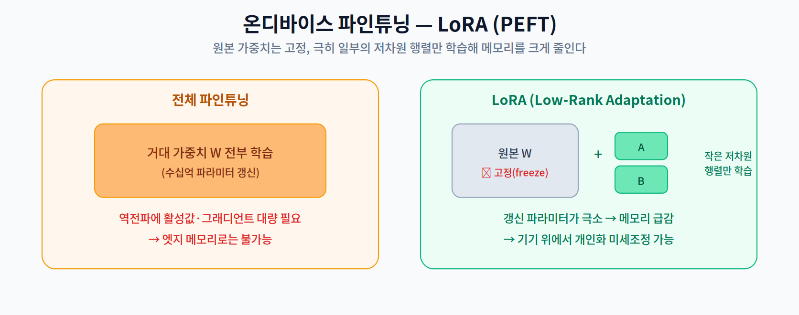
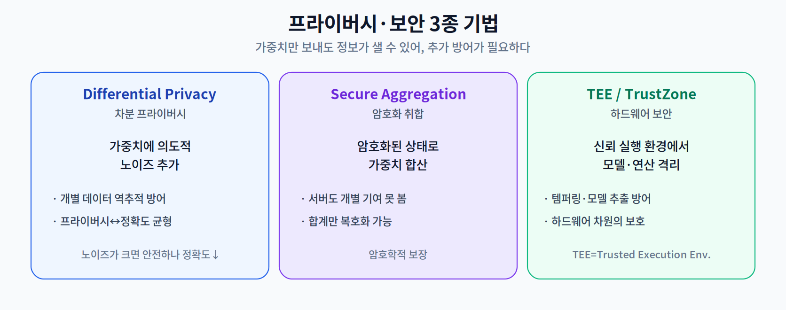

# 12주차 2교시. 온디바이스 파인튜닝과 시스템 보안

**강의 목표** — 제한된 임베디드 자원에서 학습(역전파)을 수행하는 기술과, 적대적 공격으로부터 온디바이스 모델을 보호하는 법을 학습한다.

1교시가 "어떻게 데이터를 안 모으고 학습하나(FL)"였다면, 2교시는 "기기 위에서 어떻게 효율적으로 학습하고, 어떻게 프라이버시·보안을 지키나"이다.

---

## 2.1 온디바이스 파인튜닝 — LoRA / PEFT (20분)

기기 위에서 학습하려면 **역전파(Backpropagation)** 를 해야 하는데, 이는 추론보다 훨씬 무겁다. 역전파는 활성값(Activation)을 보존해야 해서 **메모리가 폭발**하기 때문이다.

- **Memory-efficient Training** — 온디바이스 학습의 1차 장벽은 역전파의 메모리다. 이를 줄이는 여러 기법이 연구된다.
- **PEFT (Parameter-Efficient Fine-Tuning)** — 모델 전체가 아니라 **극히 일부 파라미터만** 학습하는 접근이다. 대표가 **LoRA(Low-Rank Adaptation)** 로, 원본 가중치 $W$ 는 **고정(freeze)** 한 채, 작은 저차원 행렬 $A, B$ 만 학습해 그 변화량을 더한다($W + BA$). 갱신할 파라미터가 극소라 엣지에서도 개인화 미세조정이 가능하다(10주차 On-device LoRA의 심화).

> 한 줄 정리: 온디바이스 학습의 핵심 장벽은 역전파 메모리이며, LoRA(PEFT)로 극소 파라미터만 학습해 이를 돌파한다.

---

## 2.2 Differential Privacy (15분)

연합 학습이 원본 데이터를 안 보내더라도, **가중치(그래디언트)에서 원본 정보가 역추적**될 수 있다. 이를 막는 대표 기법이 **차분 프라이버시(Differential Privacy, DP)** 다.

핵심은 가중치 업데이트를 일정 크기로 자른(clip) 뒤 **의도적인 노이즈를 추가**해, 특정 개인의 데이터가 결과에 미친 영향을 통계적으로 가리는 것이다. 그러면 공격자가 가중치를 봐도 개별 데이터를 되짚어낼 수 없다.

대가는 **정확도**다. 노이즈가 크면 프라이버시는 강해지지만 모델 정확도가 떨어진다. 즉 **프라이버시 ↔ 정확도**의 트레이드오프를 조절하는 것이 DP 설계의 핵심이다.

> 한 줄 정리: 차분 프라이버시는 가중치에 노이즈를 더해 개별 데이터 역추적을 막되, 프라이버시와 정확도의 균형을 조절한다.

---

## 2.3 Secure Aggregation과 하드웨어 보안 (20분)

- **Secure Aggregation(보안 취합)** — 각 기기의 가중치를 **암호화된 상태로 합산**한다. 서버는 오직 **합계만** 복호화할 수 있고, 개별 기기의 기여는 볼 수 없다. 암호학적으로 개인 기여를 보호한다.
- **적대적 공격 방어(Adversarial Attack on Edge)** — 엣지 기기는 물리적으로 노출되어, 하드웨어 레벨의 **템퍼링(변조)** 이나 **모델 추출(model extraction)** 공격에 취약하다.
- **TEE / TrustZone** — **신뢰 실행 환경(TEE, Trusted Execution Environment)** 은 프로세서 내부의 격리된 보안 영역에서 모델과 연산을 실행해, OS가 뚫려도 모델·데이터를 보호한다. ARM **TrustZone**이 대표적이다.

> 한 줄 정리: Secure Aggregation은 암호화 합산으로, TEE/TrustZone은 하드웨어 격리로 온디바이스 학습의 프라이버시·보안을 강화한다.

---

## 2.4 정리 (5분)

### 12주차 핵심 키워드
- **FedAvg** — 분산된 기기 가중치를 가중 평균해 글로벌 모델을 만드는 알고리즘.
- **Non-IID Data** — 기기마다 통계 특성이 달라 FL 성능을 저하시키는 원인.
- **LoRA** — 원본 가중치는 고정, 일부 저차원 행렬만 학습해 온디바이스 학습 메모리를 줄이는 기법.
- **Differential Privacy** — 수학적 노이즈로 데이터 프라이버시를 보장하는 기법.

> 교수님을 위한 Tip: 온디바이스 AI의 종착지가 단순 추론이 아니라 **현장에서 스스로 진화하는 학습**임을 강조하라. 연합 학습·온디바이스 파인튜닝은 그 비전의 핵심이며, 대학원 연구 주제로도 풍부하다.

---

### 2교시 복습 질문
1. 온디바이스 학습에서 역전파가 메모리를 많이 쓰는 이유와, LoRA가 이를 줄이는 원리는?
2. 원본 데이터를 안 보내는데도 프라이버시가 샐 수 있는 이유와, DP의 방어 방식은?
3. Secure Aggregation과 TEE는 각각 어느 계층(소프트웨어/하드웨어)에서 보호하는가?
