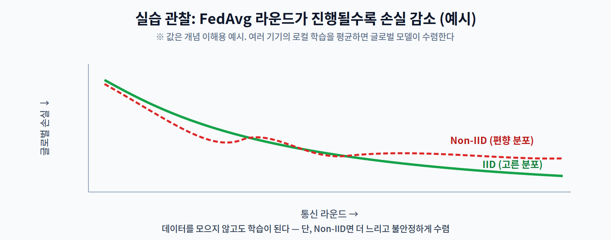

# 12주차 3교시. FedAvg 시뮬레이션

**실습 목표** — 여러 기기의 로컬 학습을 **데이터를 모으지 않고** 평균해 하나의 글로벌 모델을 만드는 **FedAvg**를 직접 구현한다. 순수 NumPy로 연합 학습의 핵심 순환을 손으로 돌린다.

> 준비물: 파이썬 + `numpy`. 실무용 프레임워크는 **Flower(FLWR)** 나 **PySyft**가 있지만, 여기서는 원리를 위해 직접 구현한다.

---

## 3.1 FedAvg 시뮬레이션 (25분)

간단한 선형 회귀를 여러 클라이언트(기기)에 나눠 두고, 각자 로컬 학습한 뒤 서버가 가중 평균하는 한 사이클을 구현한다.

```python
import numpy as np
rng = np.random.default_rng(0)

d = 5                                   # 특징 차원
w_true = rng.normal(size=d)             # (실제로는 아무도 모르는) 정답 가중치

def make_client(n):                     # 각 기기의 '로컬 데이터'
    X = rng.normal(size=(n, d))
    y = X @ w_true + 0.1 * rng.normal(size=n)
    return X, y

K = 10                                  # 기기 10대
clients = [make_client(int(rng.integers(50, 150))) for _ in range(K)]
N = sum(len(y) for _, y in clients)     # 전체 데이터 수

def local_train(w, X, y, lr=0.05, steps=5):   # 기기에서의 Local SGD
    for _ in range(steps):
        grad = X.T @ (X @ w - y) / len(y)
        w = w - lr * grad
    return w

def global_loss(w):                     # (평가용) 전체 평균 MSE
    return np.mean([np.mean((X @ w - y) ** 2) for X, y in clients])

w = np.zeros(d)                         # 글로벌 모델 초기값
for r in range(1, 21):                  # 20 통신 라운드
    updates = [local_train(w.copy(), X, y) for X, y in clients]   # ① 각 기기 로컬 학습
    # ② FedAvg: 데이터 크기(n_k)로 가중 평균 → w ← Σ (n_k/N)·w_k
    w = sum(len(y) * wk for wk, (X, y) in zip(updates, clients)) / N
    if r % 5 == 0:
        print(f"round {r:2d}: global MSE = {global_loss(w):.4f}")
```

핵심은 **`local_train`은 각 기기 안에서만 데이터를 보고**, 서버는 오직 **가중치 `w_k`만** 받아 평균한다는 점이다. 원본 데이터 `X, y`는 절대 서버로 가지 않는다 — 이것이 연합 학습이다.



> 관찰 포인트: 라운드가 늘수록 `global MSE`가 감소한다. **데이터를 한곳에 모으지 않았는데도** 모델이 학습된다는 것이 FedAvg의 마법이다.

---

## 3.2 Non-IID 영향 관찰 (15분)

현실의 기기는 데이터 분포가 제각각이다(1교시 Non-IID). 이를 흉내 내 수렴이 어떻게 나빠지는지 본다.

```python
# 각 기기가 '자기만의 편향된 정답'을 갖도록 만들어 Non-IID 흉내
#  ※ 여기서는 기기마다 라벨 규칙(w_local)이 다른 '개념 이질성'으로 흉내낸다
#    (1교시의 '고양이만/자동차만' 같은 특징 분포 편향과 취지는 같다).
def make_client_noniid(n, bias):
    w_local = w_true + bias * rng.normal(size=d)   # 기기마다 조금씩 다른 정답 규칙
    X = rng.normal(size=(n, d))
    y = X @ w_local + 0.1 * rng.normal(size=n)
    return X, y

rng = np.random.default_rng(0)          # 공정 비교 위해 재시드
clients = [make_client_noniid(int(rng.integers(50, 150)), bias=0.8) for _ in range(K)]
N = sum(len(y) for _, y in clients)
# 위 3.1의 학습 루프를 그대로 다시 실행해 global MSE를 비교
```

관찰의 핵심:

1. IID(고른 분포)에서는 글로벌 손실이 매끄럽게 낮은 값(≈노이즈 바닥)까지 준다.
2. **Non-IID(편향 분포)** 에서는 각 기기가 서로 다른 목표로 학습돼, 손실이 **더 높은 지점에서 수렴(plateau)** 한다(이 예제는 곡선 자체는 매끄럽지만 훨씬 높은 바닥에서 멈춘다). 실제 FL처럼 로컬 스텝이 많고 확률적이면 진동·발산까지 나타날 수 있다(위 그림의 일반적 경향).
3. 그래서 FL 연구의 큰 축이 "Non-IID를 어떻게 다룰 것인가"이다(클라이언트 선택, 정규화, 개인화).

> 관찰 포인트: `bias` 값을 0(IID)→0.8(강한 Non-IID)로 바꿔가며 최종 `global MSE`를 비교하면, Non-IID가 수렴을 얼마나 방해하는지 수치로 확인된다.

---

## 3.3 과제 및 학기말 프로젝트 마무리 (10분)

1. **수렴 곡선** — IID와 Non-IID(`bias=0, 0.4, 0.8`)에서 라운드별 `global MSE`를 기록해 그래프로 비교한다.
2. **로컬 스텝 실험** — `local_train`의 `steps`를 1→10으로 바꾸면 수렴·통신 라운드 수가 어떻게 변하는지 관찰한다(통신 효율과 연결).
3. **개념 연결** — 이 시뮬레이션에 Differential Privacy를 넣는다면 어디에 노이즈를 더해야 할지, 2교시 개념으로 서술한다.
4. **학기말 프로젝트 마무리** — 13주차 논문 세미나 순서를 정비하고, 14주차 최종 캡스톤 결과물(정확도·지연 개선·프로파일링)의 배포 검증을 준비한다.

> 교수님을 위한 Tip: 실무 프레임워크 **Flower(FLWR)** 로 같은 실험을 돌리면 실제 클라이언트-서버 통신까지 볼 수 있다. 다만 이 NumPy 시뮬레이션만으로도 "데이터를 안 모으고 학습한다"는 핵심 직관은 충분히 전달된다.

---

### 3교시 정리
- 순수 NumPy로 FedAvg(로컬 학습 → 가중 평균)를 구현해, 데이터를 모으지 않는 학습을 확인했다.
- Non-IID가 수렴을 방해함을 실험으로 관찰했다.
- 다음은 13주차 최신 연구 동향·학술 세미나로, 한 학기 기술을 학문적으로 종합한다.
