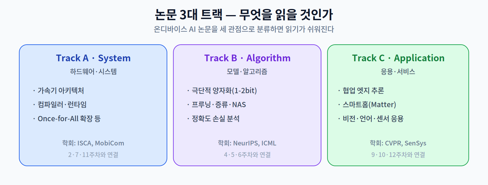
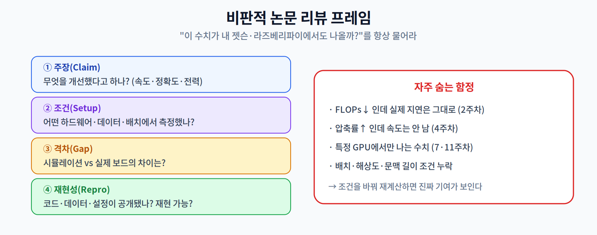

# 13주차 2교시. 논문 리뷰 방법과 융합 연구

**강의 목표** — 탑티어 논문을 체계적으로 분류·비평하고, 한 학기 기술을 종합해 융합 연구 아이디어를 도출하는 방법을 익힌다.

1교시가 "무엇이 최신인가"였다면, 2교시는 "그 논문들을 어떻게 읽고, 어떻게 나의 연구로 잇는가"이다.

---

## 2.1 논문 3대 트랙 (20분)

온디바이스 AI 논문은 많지만, 세 관점으로 분류하면 읽기가 쉬워진다.

- **Track A · System** — 하드웨어·시스템 관점. 가속기 아키텍처, 컴파일러·런타임, Once-for-All의 확장 등(2·7·11주차). 대표 학회: ISCA, MobiCom.
- **Track B · Algorithm** — 모델·알고리즘 관점. 1~2비트 극단적 양자화(LLM PTQ, 학습 후 양자화), 프루닝·증류·NAS, 정확도 손실 원인 분석 등(4·5·6주차). 대표 학회: NeurIPS, ICML.
- **Track C · Application** — 응용·서비스 관점. 다중 오프라인 기기 간 협업 추론(Collaborative Edge Inference), 스마트홈(Matter) 생태계, 비전·언어·센서 응용 등(9·10·12주차). 대표 학회: CVPR, SenSys.

논문을 만나면 먼저 "이건 어느 트랙인가"를 물으면, 그 논문이 무엇을 개선하려는지 빠르게 파악할 수 있다.

> 한 줄 정리: 온디바이스 AI 논문은 System·Algorithm·Application 세 트랙으로 분류하면 핵심 기여가 빠르게 보인다.

---

## 2.2 비판적 논문 리뷰 방법 (20분)

대학원 연구의 핵심은 논문을 **비판적으로** 읽는 것이다. 수치를 그대로 믿지 말고, 조건과 재현성을 따져야 한다.

네 가지를 순서대로 점검한다.

1. **주장(Claim)** — 무엇을 얼마나 개선했다고 하는가(속도·정확도·전력).
2. **조건(Setup)** — 어떤 하드웨어·데이터셋·배치 크기에서 측정했는가.
3. **격차(Gap)** — 시뮬레이션 수치와 실제 임베디드 보드의 결과가 다를 수 있다.
4. **재현성(Reproducibility)** — 코드·데이터·설정이 공개되어 재현 가능한가.

이 강의에서 배운 통찰이 여기서 무기가 된다: "FLOPs가 줄어도 지연은 그대로일 수 있다(2주차)", "압축률이 높아도 속도는 안 날 수 있다(4주차)", "특정 GPU에서만 나는 수치일 수 있다(7·11주차)".

> 한 줄 정리: 논문은 주장·조건·격차·재현성의 네 렌즈로 비판적으로 읽고, 조건을 바꿔 재계산하면 진짜 기여가 드러난다.

---

## 2.3 융합 연구 브레인스토밍 (15분)

마지막으로, 한 학기 기술을 **교수님의 전공 분야(지능형 IoT 플랫폼·서비스)와 접목**해 실무 연구 아이디어를 도출한다. 예를 들어:

- 스마트 팩토리 센서에 **시계열 파운데이션 모델 + 4비트 양자화**(1.2 + 5주차)를 결합한 이상 감지.
- **연합 학습 + 차분 프라이버시**(12주차)로 병원 간 데이터를 공유하지 않는 의료 AI.
- **Green AIoT + TinyML**(1.3 + 8주차)로 무전원 환경 모니터링 센서.

### 13주차 핵심 키워드
- **Foundation Model for IoT** — 센서 데이터를 범용 처리하기 위한 대형 사전학습 모델.
- **Activation Sparsity** — 입력에 따라 불필요한 연산 경로를 동적으로 차단하는 기술.
- **Intermittent Computing** — 전력이 불안정한 초저전력 환경을 극복하는 컴퓨팅 패러다임.
- **Collaborative Edge Inference** — 여러 엣지 기기가 연산을 나눠 처리하는 협업 추론 기법.

> 교수님을 위한 Tip: 융합 아이디어는 "이 강의의 기법 2개 + 교수님의 도메인 1개"의 조합으로 유도하면 학생들이 구체적인 연구 주제를 쉽게 떠올린다.

---

### 2교시 복습 질문
1. 논문 3대 트랙을 각각 한 문장으로 설명하라.
2. 비판적 리뷰의 네 렌즈(주장·조건·격차·재현성)를 실제 논문에 적용해보라.
3. 이 강의 기법 2개와 특정 도메인을 결합한 융합 아이디어를 하나 제안하라.
