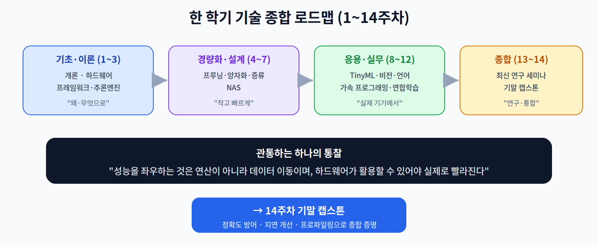

# 13주차 3교시. 논문 세미나와 수치 현실성 검증

**목표** — 학생들이 지정 논문을 발표·토론하고, 논문의 **성능 수치가 실제 엣지 하드웨어에서도 성립하는지** 직접 계산해 검증한다. 한 학기의 시스템 관점을 논문 비평에 적용하는 시간이다.

> 준비물: 파이썬(계산용), 미리 배정된 탑티어 논문 2~3편.

---

## 3.1 논문 발표·질의응답 (25분)

학생당 15~20분 발표 + 질의응답. 2교시의 3대 트랙에서 논문을 배정한다.

- **Track A (System):** "Once-for-All" 확장, 하드웨어 인지형 자동 최적화 등.
- **Track B (Algorithm):** 1~2비트 극단적 양자화(LLM PTQ), 정확도 손실 원인 분석 등.
- **Track C (Application):** Matter 생태계의 다중 기기 협업 추론(Collaborative Edge Inference) 등.

**발표 템플릿(권장)** — 2교시의 비판적 리뷰 프레임을 그대로 따른다.

1. 문제와 주장(Claim) — 무엇을, 얼마나 개선했나
2. 방법 — 어느 트랙의 어떤 기법인가
3. 실험 조건(Setup) — 하드웨어·데이터·배치
4. 비판적 평가 — 격차(시뮬 vs 실제)·재현성·한계
5. 나의 관점 — 개선/확장 아이디어

> 질의응답 포인트: "이 논문의 기법이 내가 가진 Raspberry Pi/Jetson에서도 논문 수치만큼 나올까?"를 항상 묻는다.

---

## 3.2 수치 현실성 검증 실습 (15분)

논문이 "고성능 GPU에서 초당 N토큰"을 주장할 때, **같은 모델을 엣지에 올리면 얼마나 나올까?** 10주차의 메모리-대역폭 근사로 직접 계산한다.

```python
def tokens_per_sec(model_gb, bw_gbps):
    # 10주차: 생성은 메모리-바운드 → 속도 ≈ 대역폭 / 모델크기 (이론 상한)
    return bw_gbps / model_gb

model_gb = 3.5                      # 4비트로 양자화한 7B 모델(10주차)
devices = {                        # 기기별 대략적 메모리 대역폭(GB/s, 예시)
    "서버 GPU(A100급)": 2000,
    "노트북(DDR5)":     50,
    "Jetson Orin":      100,
    "라즈베리파이 5":     17,
}
print("같은 4비트 7B 모델의 기기별 예상 tokens/sec (근사, 상한):")
for name, bw in devices.items():
    print(f"  {name:<16} BW={bw:>5} GB/s -> ~{tokens_per_sec(model_gb, bw):6.1f} t/s")
```

전형적 출력(개략):

| 기기 | 대역폭(GB/s) | 예상 tokens/sec(상한) |
|------|:--:|:--:|
| 서버 GPU(A100급) | 2000 | ~571 |
| 노트북(DDR5) | 50 | ~14 |
| Jetson Orin | 100 | ~29 |
| 라즈베리파이 5 | 17 | ~5 |

관찰의 핵심:

1. 논문이 서버 GPU에서 자랑한 수백 tokens/sec는, **같은 모델이라도 라즈베리파이에서는 한 자릿수**로 떨어진다.
2. 원인은 성능이 곧 **메모리 대역폭**에 종속되기 때문이다(2·10주차). 알고리즘이 아니라 **기기**가 상한을 정한다.
3. 그래서 논문을 읽을 때는 "어떤 하드웨어에서 낸 수치인가"를 반드시 확인해야 한다.

> 관찰 포인트: 이것이 비판적 리뷰의 실전이다. 논문의 화려한 수치를 **본인 타깃 기기의 대역폭으로 재계산**하면, 실제 배포에서 무엇을 기대할 수 있는지 냉정하게 판단할 수 있다. (대역폭 값은 예시이며, 실제 스펙으로 바꿔 계산할 것.)

---

## 3.3 기말 프로젝트 안내 (10분)



14주차 최종 캡스톤 발표를 앞두고 평가지표를 다시 정리한다.

- **정확도(Accuracy) 방어율** — 경량화 후에도 정확도를 얼마나 지켰는가.
- **타깃 보드에서의 지연(Latency) 개선율** — 실제 기기에서 얼마나 빨라졌는가.
- **하드웨어 프로파일링 결과 제시** — 11주차 방식으로 병목과 개선을 데이터로 증명(필수).

즉 기말 프로젝트는 "실제 IoT 환경의 문제를, 이 강의에서 배운 경량화·가속·측정으로 해결했음"을 **수치로 증명**하는 것이다.

> 교수님을 위한 Tip: 로드맵 그림을 띄워 한 학기를 한눈에 되짚어라. "성능을 좌우하는 것은 연산이 아니라 데이터 이동이며, 하드웨어가 활용할 수 있어야 실제로 빨라진다"는 관통 통찰을 마지막으로 각인시키면, 학생들이 개별 기법을 하나의 관점으로 통합하게 된다.

---

### 3교시 정리
- 3대 트랙으로 논문을 발표·비평하고, 비판적 리뷰 프레임을 실전 적용했다.
- 논문 수치를 본인 타깃 기기의 대역폭으로 재계산해 현실성을 검증했다.
- 한 학기를 종합해, 14주차 기말 캡스톤(정확도·지연·프로파일링)으로 나아간다.
