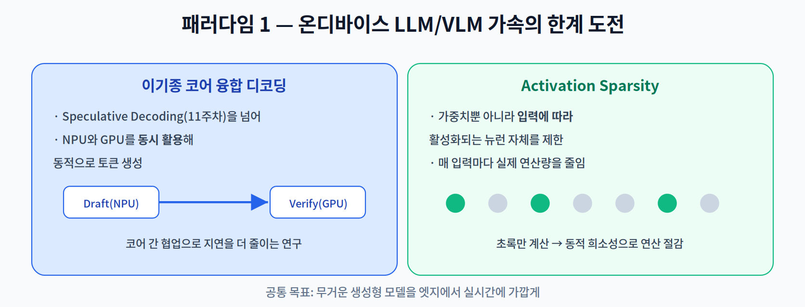
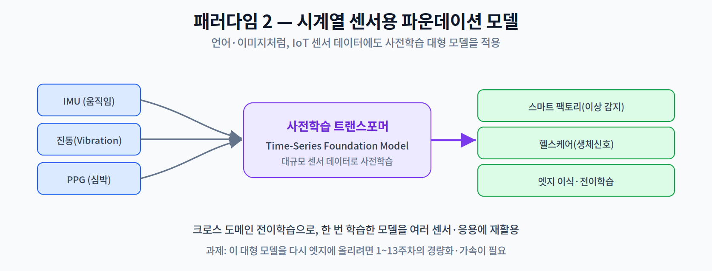
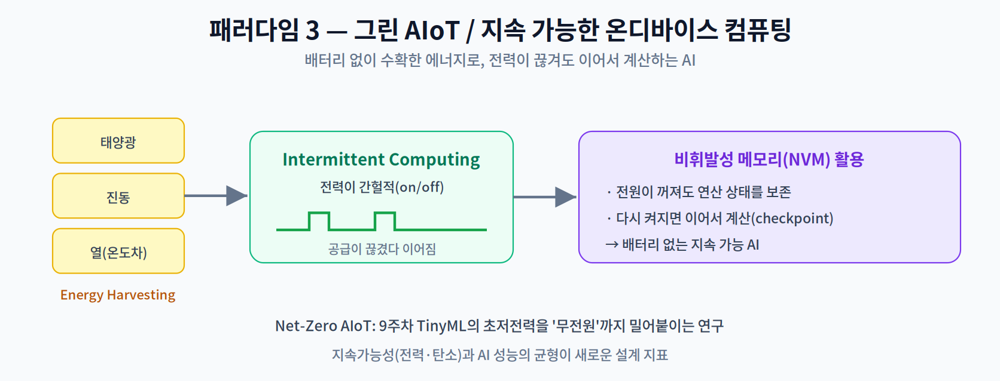

# 14주차 1교시. 온디바이스 AI 최신 연구 패러다임

**강의 목표** — 최근 1~2년간 학계·산업계에서 가장 주목받는 온디바이스 AI의 한계 돌파 기술을 조망한다.

한 학기 동안 배운 기술 스택(경량화·하드웨어 가속·연합 학습 등)의 학문적 깊이를 완성하는 주차다. 대학원 과정의 핵심인 **독립적 연구 역량**을 위해, 최신 탑티어 학회(NeurIPS·CVPR·MobiCom·ISCA 등)에서 부각된 **3대 패러다임**을 중심으로 살펴본다.

---

## 1.1 패러다임 1: 온디바이스 LLM/VLM 가속의 한계 도전 (20분)

11주차에서 본 On-Device LLM을 더 밀어붙이는 연구들이다.

- **이기종 코어 융합 디코딩** — 11주차의 Speculative Decoding을 넘어, **NPU와 GPU 같은 이기종 코어를 동시에 활용**해 동적으로 토큰을 생성하는 연구다. 작은 코어가 초안을, 큰 코어가 검증을 맡는 식으로 협업해 지연을 더 줄인다.
- **Activation Sparsity(활성 희소성)** — 4주차의 프루닝이 **가중치**를 지웠다면, 이것은 **입력에 따라 실제로 활성화되는 뉴런 자체를 실시간으로 제한**한다. 매 입력마다 계산할 연산을 동적으로 줄이는 접근으로, 생성형 모델의 연산량을 크게 낮춘다.

> 한 줄 정리: 온디바이스 LLM 가속의 최전선은 이기종 코어 협업과 입력별 동적 희소성(Activation Sparsity)이다.

---

## 1.2 패러다임 2: 시계열 센서 데이터를 위한 파운데이션 모델 (20분)

언어(GPT)·이미지(ViT)에 이어, **IoT 센서 데이터**에도 대형 사전학습 모델을 적용하려는 흐름이다.

- **Time-Series Foundation Models** — IMU(움직임), 진동, PPG(심박) 같은 시계열 센서 데이터를 대규모로 **사전학습(Pre-trained)** 한 트랜스포머 모델이다. 언어 모델이 방대한 텍스트로 학습되듯, 방대한 센서 데이터로 범용 표현을 학습한다.
- **크로스 도메인 전이학습** — 한 번 학습한 모델을 스마트 팩토리(이상 감지)·헬스케어(생체 신호) 등 여러 도메인에 전이해 재활용한다.

다만 이 대형 모델을 다시 **엣지에 올리려면** 1~13주차의 경량화·양자화·가속이 그대로 필요하다. 즉 최신 연구도 이 강의의 기초 위에 서 있다.

> 한 줄 정리: 센서용 파운데이션 모델은 IoT 데이터를 범용 사전학습하지만, 엣지 배포엔 여전히 이 강의의 경량화 기술이 필요하다.

---

## 1.3 패러다임 3: 그린 AIoT / 지속 가능한 온디바이스 컴퓨팅 (15분)

9주차 TinyML의 초저전력을 극단(무전원)까지 밀어붙이는 연구다.

- **Energy Harvesting** — 배터리 대신 태양광·진동·열(온도차)에서 에너지를 **수확**해 작동한다.
- **Intermittent Computing(간헐적 컴퓨팅)** — 수확 에너지는 공급이 **끊겼다 이어지므로**, 전원이 꺼져도 연산 상태를 **비휘발성 메모리(NVM)** 에 보존했다가 다시 켜지면 이어서 계산한다.
- **Net-Zero AIoT** — 지속가능성(전력·탄소)과 AI 성능의 균형을 새로운 설계 지표로 삼는다.

> 교수님을 위한 Tip: 세 패러다임 모두 이 강의의 주제(가속·경량화·저전력)의 '최전선 확장'임을 강조하라. 학생들이 "내가 배운 기술이 최신 연구와 어떻게 이어지는가"를 체감하면, 독립 연구로 나아갈 동기가 생긴다.

---

### 1교시 복습 질문
1. Activation Sparsity가 4주차 프루닝과 다른 점은?
2. 센서용 파운데이션 모델을 엣지에 올릴 때 여전히 필요한 기술은?
3. Intermittent Computing에서 NVM이 하는 역할은?
