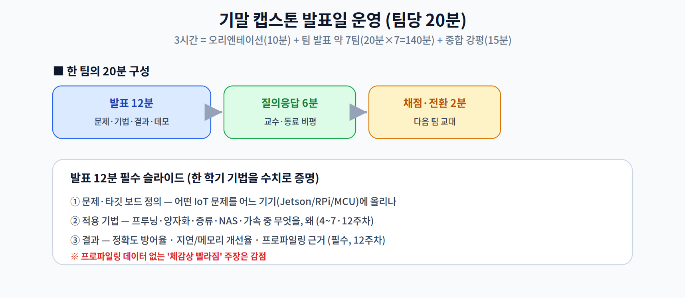
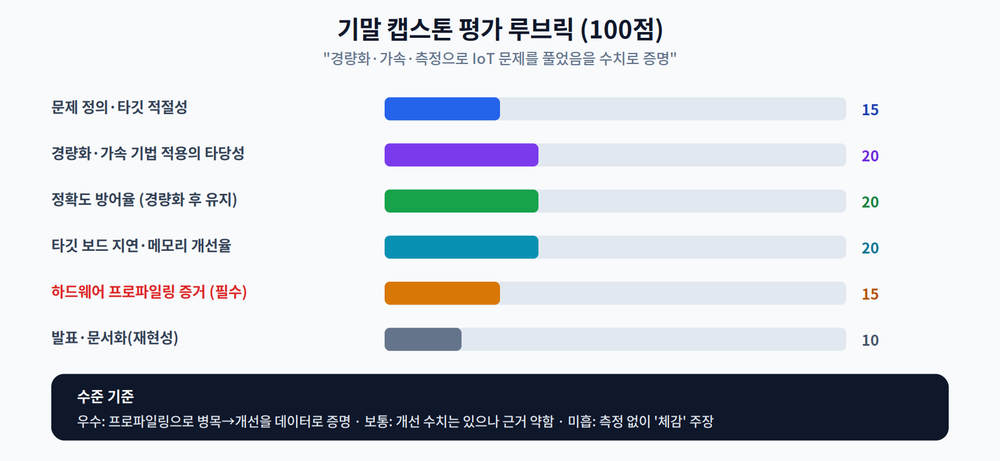

# 15주차. 기말 캡스톤 발표 및 평가

> Final Capstone Project Presentation & Evaluation
> 주당 3시간 · 발표·평가 중심 · 팀당 20분

## 이 주차의 목적

한 학기 동안 배운 경량화(4~6주차)·설계 탐색(7주차)·하드웨어 가속(2·12주차)·측정(12주차)을 **하나의 실제 IoT 문제**에 통합해 적용하고, 그 결과를 **수치로 증명**하는 마무리 시간이다. 14주차 3교시에서 예고한 대로, 평가의 핵심은 "얼마나 그럴듯한가"가 아니라 "타깃 보드에서 실제로 얼마나 좋아졌는가"이다.

관통 통찰을 마지막으로 다시 확인한다: **성능을 좌우하는 것은 연산이 아니라 데이터 이동이며, 하드웨어가 활용할 수 있어야 실제로 빨라진다.** 캡스톤은 이 통찰을 학생 스스로의 프로젝트로 입증하는 자리다.

## 학습 성과(무엇을 보이는가)
- 실제 IoT 문제를 정의하고 적절한 타깃 기기(Jetson·Raspberry Pi·MCU 등)를 선택할 수 있다.
- 문제에 맞는 경량화·가속 기법을 선택·조합하고 그 이유를 설명할 수 있다.
- 경량화 후 정확도 방어율과 타깃 보드에서의 지연·메모리 개선율을 측정해 제시할 수 있다.
- 12주차의 프로파일링으로 병목을 찾고 개선을 **데이터로** 증명할 수 있다.

---

## 1. 발표 운영 (진행 방식)

3시간을 **오리엔테이션(10분) → 팀 발표(약 7팀) → 종합 강평(15분)** 으로 운영한다. 각 팀은 20분을 배정받아 발표 12분, 질의응답 6분, 채점·전환 2분으로 진행한다. (오리엔테이션·강평 25분을 빼면 발표에 약 155분 → 20분×7팀=140분이 여유 있게 들어간다. 팀이 8팀 이상이면 오리엔테이션·강평을 줄이거나 팀당 시간을 조정한다.)

발표 12분에는 다음 세 가지가 반드시 담겨야 한다.

1. **문제·타깃 정의** — 어떤 IoT 문제를 어느 기기에 올리는가. 타깃 보드의 메모리·대역폭 제약(2·11주차)을 명시한다.
2. **적용 기법과 이유** — 프루닝·양자화·지식 증류·NAS·하드웨어 가속(4~7·12주차) 중 무엇을 왜 선택했는가.
3. **결과(수치)** — 정확도 방어율, 타깃 보드에서의 지연·메모리 개선율, 그리고 그것을 뒷받침하는 **프로파일링 근거**(12주차 방식, 필수).

> 질의응답 포인트: "그 개선 수치는 어느 하드웨어에서, 어떤 배치·해상도·문맥 길이 조건으로 측정했나?"를 반드시 묻는다. 14주차에서 익힌 비판적 리뷰 프레임(주장·조건·격차·재현성)을 동료 발표에 그대로 적용하게 한다.

---

## 2. 평가 루브릭 (100점)

| 항목 | 배점 | 무엇을 보는가 |
|------|:--:|------|
| 문제 정의·타깃 적절성 | 15 | IoT 문제가 구체적이고, 타깃 기기 선택이 제약에 부합하는가 |
| 경량화·가속 기법 적용의 타당성 | 20 | 선택한 기법이 문제에 적절하고, 조합·근거가 타당한가 |
| 정확도 방어율 | 20 | 경량화 후에도 원본 대비 정확도를 얼마나 지켰는가 |
| 타깃 보드 지연·메모리 개선율 | 20 | 실제 기기에서 지연·메모리가 얼마나 개선됐는가 |
| **하드웨어 프로파일링 증거 (필수)** | 15 | 12주차 방식으로 병목→개선을 **데이터로** 증명했는가 |
| 발표·문서화(재현성) | 10 | 설명이 명료하고, 코드·설정이 재현 가능하게 정리됐는가 |

수준 기준(각 항목 공통):

- **우수** — 프로파일링으로 병목을 찾아 개선을 데이터로 증명하고, 조건(하드웨어·배치)을 명시한다.
- **보통** — 개선 수치는 제시했으나 측정 근거·조건이 약하다.
- **미흡** — 측정 없이 "체감상 빨라졌다" 수준의 주장에 그친다.

> 교수님을 위한 Tip: 프로파일링 항목(15점, 필수)을 채점의 축으로 삼아라. 여기서 데이터가 나오면 대개 다른 항목의 수치도 신뢰할 수 있다. 반대로 프로파일링이 없으면 지연·정확도 수치의 조건을 캐물어야 한다.

---

## 3. 제출물

발표 당일까지 저장소(또는 지정 경로)에 다음을 제출한다.

1. **발표 슬라이드** — 위 3대 필수 내용(문제·기법·결과) 포함.
2. **코드·설정** — 경량화/가속 스크립트와 실행 방법(README). 재현 가능해야 한다.
3. **프로파일링 원자료** — 12주차 방식의 연산자별 측정 결과(표/그래프)와 원본 로그.
4. **결과 요약표** — 원본 vs 최적화: 정확도, 지연(타깃 보드), 메모리(Peak), 모델 크기.

> 제출 체크리스트: "원본 대비 얼마나?"라는 질문에 정확도·지연·메모리·크기 네 축 모두 숫자로 답할 수 있어야 한다.

---

## 4. 한 학기 마무리

- 캡스톤은 개별 기법(프루닝·양자화·증류·NAS·가속·연합학습)을 **하나의 관점**으로 통합하는 자리다.
- 통합의 축은 언제나 **데이터 이동과 하드웨어 활용**이다. 프로파일링이 그것을 증명한다.
- 종합 강평에서는 각 팀의 "가장 잘한 측정 한 가지"와 "다음에 개선할 조건 한 가지"를 짚어, 학생들이 독립 연구(14주차)로 나아가도록 마무리한다.
